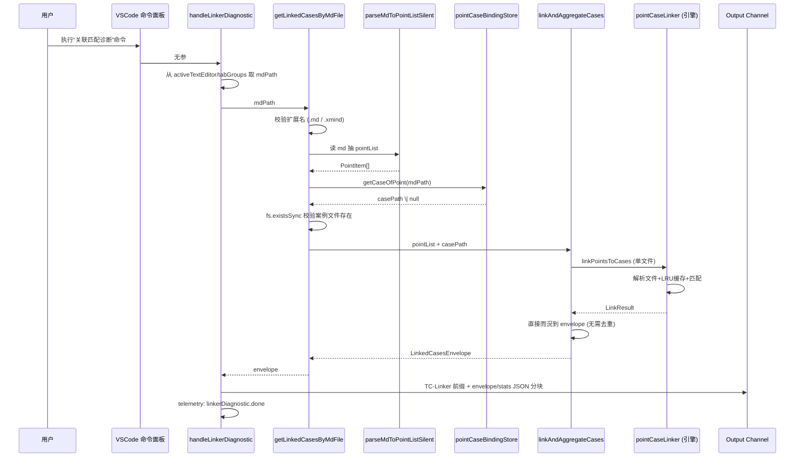
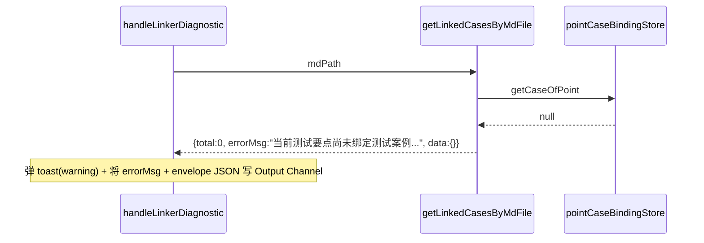
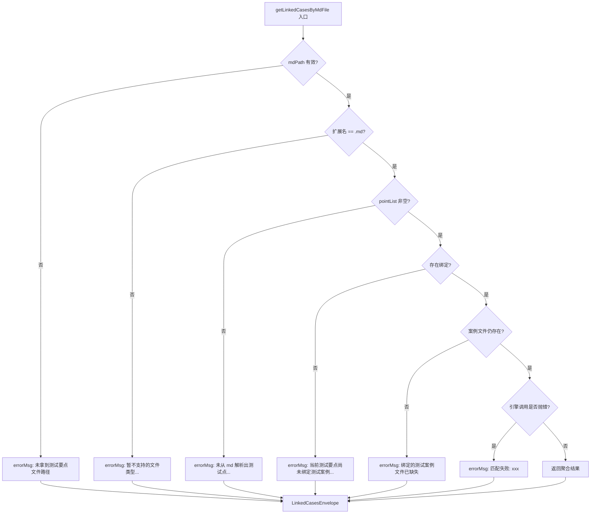

# 测试要点 ↔ 测试案例 关联匹配 — 设计文档

> 模块统称：**关联案例（Point-Case Linker）**
> 关联需求：[point-case-linker-requirements.md](../requirements/point-case-linker-requirements.md)
> 主要文件：
> - 引擎层：`src/utils/pointCaseLinker.ts`
> - 应用层：`src/handlers/linkerDiagnosticHandler.ts`
> - 绑定存储：`src/utils/pointCaseBindingStore.ts`
> - 绑定文件：`<workspace>/.plugin/.tms/point-case-bindings.json`

---

## 一、设计目标

| 目标 | 落地方式 |
|---|---|
| 分层清晰、职责单一 | 引擎层做纯计算；应用层做 IO / UI / 日志；绑定层专注读写映射配置 |
| 一处逻辑多处复用 | 匹配聚合抽成 `linkAndAggregateCases` 纯函数，右键与命令面板两个入口共用 |
| 稳定的出参契约 | 对外统一使用 `LinkedCasesEnvelope`（`{ total, errorMsg, data, stats }`） |
| 未启用能力可无痛复活 | 未绑定场景的兜底扫描函数保留在文件内，仅取消 `unused-vars` 抑制即可启用 |
| 观测友好 | 匹配耗时、命中分布、孤儿数量、脏数据信号统一上报 telemetry |

---

## 二、总体架构

### 2.1 分层视图

```mermaid
flowchart TB
    subgraph UI层
        A2[命令面板<br/>testcaseViewer.diagnosticLinker]
    end

    subgraph 命令层[命令层 · linkerDiagnosticCommand.ts]
        H2[handleLinkerDiagnostic<br/>接命令面板]
    end

    subgraph 应用层[应用层 · linkerDiagnosticHandler.ts]
        G[getLinkedCasesByMdFile<br/>业务级一站入口]
        M[parseMdToPointListSilent<br/>md→pointList 静默解析]
        L[linkAndAggregateCases<br/>匹配聚合·纯函数]
        R[（预留）locateCaseDir<br/>collectCaseFiles]
    end

    subgraph 绑定层[绑定层 · pointCaseBindingStore.ts]
        B1[getCaseOfPoint<br/>md路径→案例文件绝对路径 \| null]
        BF[(point-case-bindings.json)]
    end

    subgraph 引擎层[引擎层 · pointCaseLinker.ts]
        E2[linkPointsToCases<br/>单文件匹配]
        E3[LRU 缓存<br/>path+mtime+size 作为 key]
        E4[parseFileToRows<br/>YAML/JSON/CSV 解析]
        E1[（预留）linkPointsToCasesBatch<br/>批量并发匹配]
    end

    subgraph 存储层
        FS[(测试要点 .md)]
        CF[(测试案例 yaml/json/csv)]
    end

    A1 --> H1 --> G
    A2 --> H2
    G --> M
    G --> B1
    G --> L
    H2 --> M
    H2 --> L
    L --> E2
    E2 --> E3
    E2 --> E4
    M --> FS
    E4 --> CF
    B1 --> BF
    G -.预留.- R
    L -.预留批量.- E1
```

### 2.2 关键关系说明

- **UI 入口已收敛为命令面板单入口**（2026-07-25）：`handleLinkerDiagnostic` 经 `linkAndAggregateCases` 完成匹配聚合；历史右键入口 `handleViewLinkedCases` 已下线合并。
- **`getLinkedCasesByMdFile` 是业务级"总闸"**：一个 md 路径进 → 约定 envelope 出，任何上层（Tree View、Webview、其他 handler）都可以直接调用。
- **绑定层与引擎层完全解耦**：引擎层不关心"这些案例文件是怎么来的"，绑定层不关心"匹配算法如何做"。
- **全链路 1:1 语义**：一个测试要点 md **最多**绑定一个测试案例文件，反之亦然。因此：
  - 绑定层对外仅暴露 `getCaseOfPoint(mdPath): string | null`，直接返回单值
  - `linkAndAggregateCases(pointList, filePath)` 参数为**单个文件路径字符串**，内部直接调用引擎的 `linkPointsToCases`（单文件）
  - `handleLinkerDiagnostic` 命令面板亦强制单选 md 和 case 文件
  - 引擎层仍然保留 `linkPointsToCasesBatch` 能力（当前未启用），供未来可能的演进使用

---

## 三、核心链路时序

### 3.1 右键"查看关联案例"完整时序



### 3.2 失败短路时序（未绑定示例）



---

## 四、数据契约

### 4.1 对外出参 `LinkedCasesEnvelope`

```ts
interface LinkedCasesEnvelope {
    total: number;                                    // 命中总条数
    errorMsg: string;                                 // 无错为空串
    data: Record<string, LinkedCaseItem[]>;           // key: `${pointId}_${pointName}`
    stats?: {
        totalRecords: number;                         // 案例文件总记录数
        typeCount: { type1; type2; type3 };           // 分类型命中
        totalOrphan: number;                          // 孤儿案例数
        totalStripped: number;                        // 尾号剥离次数
        duplicatePointIds?: string[];                 // 脉数据信号：重复的 pointId
        multiHitCases?: string[];                     // 脉数据信号：同 case 被多个 point 命中
    };
}

interface LinkedCaseItem {
    testcase_id: string;
    caseName: string;
    caseDetail: string;         // 【前置条件】...【预期结果】...
    type: 1 | 2 | 3;            // 匹配强度
    filePath: string;           // 案例源文件绝对路径
}
```

### 4.2 契约表格

| 场景 | `total` | `errorMsg` | `data` |
|---|---|---|---|
| 匹配成功 | > 0 | `""` | 有内容 |
| 命中为零但流程正常 | 0 | `""` | `{}` |
| md 路径缺失 / 非 .md 后缀 / 未解出点 / 未绑定 / 文件缺失 | 0 | 非空提示语 | `{}` |
| 引擎抛错 | 0 | `"匹配失败: xxx"` | `{}` |

### 4.3 绑定语义（1:1）

| 维度 | 约束 |
|---|---|
| 一个测试要点 md | **最多**绑定 1 个测试案例文件 |
| 一个测试案例文件 | **最多**归属 1 个测试要点 md |
| 写入侧约束 | 若传入列表 > 1 直接抛错拒绝 |
| 对外接口 | `getCaseOfPoint(mdPath)` / `getPointOfCase(casePath)`，直接返回单值或 `null` |

---

## 五、关键代码说明

### 5.1 业务级一站入口 `getLinkedCasesByMdFile`

**位置**：[linkerDiagnosticHandler.ts](../../src/handlers/linkerDiagnosticHandler.ts)
**定位**：唯一暴露给业务方的"一个 md 进、envelope 出"入口。

```ts
export async function getLinkedCasesByMdFile(
    mdPath: string,
): Promise<LinkedCasesEnvelope> {
    // 1) 入参校验
    if (!mdPath || typeof mdPath !== 'string') {
        return { total: 0, errorMsg: '未拿到测试要点文件路径', data: {} };
    }
    // 1.1) 扩展名分派（当前仅支持 .md；预留 .xmind 等未来扩展）
    const ext = path.extname(mdPath).toLowerCase();
    if (ext !== '.md') {
        return {
            total: 0,
            errorMsg: `暂不支持的测试要点文件类型：${ext || '(无后缀)'}，当前仅支持 .md`,
            data: {},
        };
    }

    // 2) md → pointList
    const pointList = await parseMdToPointListSilent(mdPath);
    if (pointList.length === 0) {
        return { total: 0, errorMsg: '未从 md 解析出测试点，请检查表头格式...', data: {} };
    }

    // 3) 读绑定 → 唯一的案例文件绝对路径（1:1）
    const casePath = getCaseOfPoint(mdPath);
    if (!casePath) {
        return {
            total: 0,
            errorMsg: '当前测试要点尚未绑定测试案例，请选择文件右键绑定后再试',
            data: {},
        };
    }

    // 4) 校验案例文件在磁盘上仍存在
    try {
        if (!fs.existsSync(casePath) || !fs.statSync(casePath).isFile()) {
            return { total: 0, errorMsg: '绑定的测试案例文件已缺失', data: {} };
        }
    } catch {
        return { total: 0, errorMsg: '绑定的测试案例文件已缺失', data: {} };
    }

    // 5) 调底层单文件匹配 + 聚合
    return linkAndAggregateCases(pointList, casePath);
}
```

**设计要点**：
1. **顺序五步、层层短路**：任一步失败即短路返回统一 envelope，调用方只需检查 `errorMsg` 一处。
2. **扩展名分派铺路**：`.md` 硬校验既能防止误传其他文件，也为未来 `.xmind` 走另一条解析分支预留扩展点。
3. **不弹任何 UI**：所有错误统一收敛到 `errorMsg`，UI 弹与不弹交给调用方决定。
4. **单值语义**：1:1 语义下绑定层返回 `string | null`，缺失即报错，不再有"多文件过滤"这一层。

---

### 5.2 匹配聚合纯函数 `linkAndAggregateCases`

**位置**：[linkerDiagnosticHandler.ts](../../src/handlers/linkerDiagnosticHandler.ts)
**定位**：无 IO、无 VSCode 依赖、纯函数。方便未来在 Tree View / Webview / 单测中复用。

```ts
export async function linkAndAggregateCases(
    pointList: PointItem[],
    filePath: string,
): Promise<LinkedCasesEnvelope> {
    // 入参校验（错误消息统一中文提示、面向最终用户）
    if (!Array.isArray(pointList) || pointList.length === 0) {
        return { total: 0, errorMsg: '未传入任何测试要点', data: {} };
    }
    if (!filePath || typeof filePath !== 'string') {
        return { total: 0, errorMsg: '未传入测试案例文件', data: {} };
    }

    // 单文件匹配
    let r;
    try {
        r = await linkPointsToCases(filePath, pointList);
    } catch (err: any) {
        return { total: 0, errorMsg: `匹配失败: ${err?.message || err}`, data: {} };
    }

    // 聚合成约定格式（单文件场景下无需去重，直接透传）
    const data: Record<string, LinkedCaseItem[]> = {};
    for (const [pointKey, cases] of Object.entries(r.byPoint)) {
        data[pointKey] = cases.map(c => ({
            testcase_id: c.testcase_id,
            caseName: c.caseName,
            caseDetail: c.caseDetail,
            type: c.type,
            filePath,
        }));
    }

    return {
        total: r.stats.matchedRecords,
        errorMsg: '',
        data,
        stats: {
            totalRecords: r.stats.totalRecords,
            typeCount: { ...r.stats.matchedByType },
            totalOrphan: r.stats.orphanRecords,
            totalStripped: r.stats.strippedParentIds,
            duplicatePointIds: r.stats.duplicatePointIds,
            multiHitCases: r.stats.multiHitCases,
        },
    };
}
```

**设计要点**：
1. **1:1 参数语义**：`filePath` 为**单个字符串**；如需 N:1 批量匹配，请另加批量函数，不要在此扩参数，避免语义漂移。
2. **单文件无需去重**：直接把 `byPoint` 透传到 envelope，代码从 40+ 行压缩到 8 行。
3. **`filePath` 挂在 item 上**：让 UI 端可以追溯每条案例的来源。
4. **异常边界收敛**：引擎抛错时以 envelope 形式返回，调用方永远不需要 try/catch。
5. **脏数据信号透出**：把引擎的 `duplicatePointIds` / `multiHitCases` 透传到 `stats`，供上层做数据质量治理提示。
6. **中文表头 CSV 兼容**：在调引擎前调用 `detectCsvHeaderOptions(filePath)`，把 `LinkOptions` 的字段名指向中文列，详见 §5.2.1。

---

### 5.2.1 中文表头 CSV 兼容 `detectCsvHeaderOptions`

**位置**：[linkerDiagnosticHandler.ts](../../src/handlers/linkerDiagnosticHandler.ts)
**定位**：轻量嗅探函数，仅在应用层生效，**零改引擎、零改 parser**。

**背景**：底层引擎按英文字段名（`parent_id` / `path` / `testcase_id` / `name`）取值；如果案例文件是「中文表头 CSV」（如 `examples/case_example.csv`），首行会是 `testcase_id,名称,路径,...`，直接用英文字段取值全部为空 → **0 命中**。

```ts
/** 中文 CSV 表头到引擎字段的映射：只覆盖 linker 需要的四个字段 */
const CN_HEADER_ALIAS = {
    caseNameField: ['名称', '用例名称', '案例名称', '测试案例名称'],
    pathField:     ['路径', '用例路径', '案例路径'],
    caseIdField:   ['用例编号', '案例编号', 'testcase_id'],
    parentIdField: ['父点编号', '所属要点', 'parent_id'],
};

function detectCsvHeaderOptions(filePath: string): Partial<LinkOptions> | undefined {
    if (!/\.csv$/i.test(filePath)) return undefined;      // 仅处理 .csv
    // 读首行 ≤ 8KB
    const fd = fs.openSync(filePath, 'r');
    const buf = Buffer.alloc(8192);
    const n = fs.readSync(fd, buf, 0, buf.length, 0);
    fs.closeSync(fd);
    const firstLine = buf.slice(0, n).toString('utf-8').split(/\r?\n/)[0] || '';
    const headers = firstLine.split(',').map(h => h.trim().replace(/^"|"$/g, ''));
    if (!headers.some(h => /[\u4e00-\u9fff]/.test(h))) return undefined;  // 无中文 → 短路

    const out: Partial<LinkOptions> = {};
    for (const key of Object.keys(CN_HEADER_ALIAS)) {
        const hit = CN_HEADER_ALIAS[key].find(a => headers.includes(a));
        if (hit) out[key] = hit;
    }
    return Object.keys(out).length > 0 ? out : undefined;
}

// 在 linkAndAggregateCases 中的调用点：
const csvOpts = detectCsvHeaderOptions(filePath);
r = await linkPointsToCases(filePath, pointList, csvOpts ?? {});
```

**设计要点**：
1. **仅在应用层生效**：引擎、parser 零侵入；yaml/json 按约定使用英文字段，路径不受影响。
2. **只读首行**：`fs.readSync` 8KB 上限，性能开销可忽略；文件不存在或读取失败均 fallback 到默认字段名，不抛异常。
3. **别名可扩展**：`CN_HEADER_ALIAS` 是纯常量表，需要新增团队方言时直接加词即可，无需改逻辑。
4. **短路优化**：首行完全无中文 → 立即返回 `undefined`，保持英文 CSV 的默认行为。

**能力天花板**：

| 场景 | parent_id | path | 可命中类型 |
|---|:---:|:---:|:---|
| 中文 CSV（`examples/case_example.csv`） | ❌ 模板无此列 | ✅ 「路径」列 | 仅 `type=3`（path 兜底） |
| 中文 CSV + 手动加 `parent_id` 列 | ✅ | ✅ | `type=1` / `type=2` / `type=3` 全档位 |
| 英文 CSV / YAML / JSON | ✅ | ✅ | 全档位（默认行为） |

> ⚠️ 中文模板里没有 `parent_id` 列，因此只能命中 `type=3`。这是**数据模型的天花板，非代码缺陷**。如需 type=1/2，请在 CSV 模板里增加一列 `parent_id`（列名可用英文或使用中文别名「父点编号」/「所属要点」，代码已自动识别）。

---

### 5.3 md → pointList 静默解析 `parseMdToPointListSilent`

```ts
export async function parseMdToPointListSilent(mdPath: string): Promise<PointItem[]> {
    let text: string;
    try { text = await fs.promises.readFile(mdPath, 'utf-8'); }
    catch { return []; }

    const lines = text.split(/\r?\n/);

    // ① 抽取 pointPath：优先「功能条目：xxx / yyy」，否则退化为文件名
    let pointPath = '';
    for (const line of lines) {
        const m = line.match(/功能条目\s*[:：]\s*(.+?)\s*$/);
        if (m) { pointPath = m[1].replace(/\s*[/／]\s*/g, '/').trim(); break; }
    }
    if (!pointPath) pointPath = path.basename(mdPath, path.extname(mdPath));

    // ② 抽表格：以「| 序号 | 测试点 |」为表头，取每行前两列 → pointId / pointName
    const result: PointItem[] = [];
    let inTable = false, idIdx = -1, nameIdx = -1;
    for (const raw of lines) {
        const line = raw.trim();
        if (!line.startsWith('|')) { inTable = false; idIdx = -1; nameIdx = -1; continue; }
        const cells = splitMdRow(line);
        if (!inTable) {
            // 表头列名弹性识别，兼容不同团队叫法
            const idI = cells.findIndex(c => /^(序号|编号|点号|id|pointId)$/i.test(c.trim()));
            const nameI = cells.findIndex(c => /^(测试点|测试要点|要点|名称|name|pointName)$/i.test(c.trim()));
            if (idI >= 0 && nameI >= 0) { inTable = true; idIdx = idI; nameIdx = nameI; }
            continue;
        }
        if (cells.every(c => /^:?-+:?$/.test(c.trim()))) continue;   // 跳过 --- 分隔行
        const pid = (cells[idIdx] || '').trim();
        const pname = (cells[nameIdx] || '').trim();
        if (!pid || !pname) continue;
        result.push({ pointId: pid, pointName: pname, pointPath });
    }
    return result;
}
```

**设计要点**：
1. **"静默"含义**：内部不打 Output Channel、不弹 toast；IO 失败时也不向 console 泄露，日志交给上层自行决定。适合被业务方无副作用地调用。
2. **表头列名弹性识别**：`序号 / 编号 / 点号 / id / pointId` 五选一、`测试点 / 测试要点 / 要点 / 名称 / name / pointName` 六选一，兼容不同团队的表头风格。
3. **转义竖线容忍**：`splitMdRow` 用占位符保护 `\|` 转义竖线，避免表格里出现 `\|` 被错拆列。
4. **未来演进接口**：`.xmind` 支持只需新增 `parseXmindToPointListSilent` 并按扩展名分派，`getLinkedCasesByMdFile` 内 §1.1 的扩展名分支已预留好接入点。

---

### 5.4 引擎层入口 `linkPointsToCases`（单文件）

**位置**：`src/utils/pointCaseLinker.ts`
**定位**：解析单个案例文件、执行匹配的核心入口。1:1 语义下应用层直接调用此函数。

```ts
// 关键行为（对照需求 §3.5）：
// 1. pointList 索引（pointIdMap / pointPathMap）内部一次性构建
// 2. 案例文件解析走 LRU 缓存（key = filePath + mtimeMs + size）
// 3. 单文件解析失败：抛出异常由上层聚合层转成 envelope.errorMsg
// 4. 每个案例记录只做一遍匹配：先原值 parent_id 查、命中失败再剥离尾号 -N 查
//    parent_id 完全失败才落到 path 兜底 (→ type=3)
export async function linkPointsToCases(
    filePath: string,
    pointList: PointItem[],
    options?: LinkOptions,
): Promise<LinkResult>;

// 【预留】批量并发版本（当前未启用）
export async function linkPointsToCasesBatch(
    filePaths: string[],
    pointList: PointItem[],
    options?: LinkOptions & { concurrency?: number },
): Promise<Record<string, LinkResult>>;
```

**匹配决策矩阵**（对应需求 §3.2）：

| parent_id 命中 | path 命中 | 归属结论 |
|:---:|:---:|:---|
| ✅ 精确 | ✅ 精确 | 落到同点，`type = 1`（最强） |
| ✅ 精确 | ❌ 或不同点 | 落到 parent_id 所指点，`type = 2` |
| ❌ | ✅ | 落到 path 所指点，`type = 3`（兜底） |
| ❌ | ❌ | 视为孤儿，累加 `orphanRecords` |

**LRU 缓存**：key = `filePath + mtimeMs + size`，容量 64，文件保存即自动失效；`clearLinkerCache()` 提供测试/热更手动清理。

> **⚠️ 缓存实时性说明**：LRU 用 mtimeMs 判定失效，因此
> - 外部工具（脚本、Git）改动案例文件 → mtime 变了 → 自动重解析，✅ 安全
> - VSCode 内编辑但**未保存** → mtime 未变，读到的是磁盘旧内容 → 请**保存后再查看关联案例**

---

### 5.5 绑定层 `getCaseOfPoint`

**位置**：[pointCaseBindingStore.ts](../../src/utils/pointCaseBindingStore.ts)
**定位**：唯一负责读写 `<workspace>/.plugin/.tms/point-case-bindings.json` 的模块。

```ts
// 1:1 语义下的核心接口：
export function getCaseOfPoint(pointAbsPath: string): string | null;
export function getPointOfCase(caseAbsPath: string): string | null;

// 写入侧（内部保证 1:1 不变性）：
export function setPointCases(pointAbsPath: string, cases: string[]): void;
```

**契约**：
- **入参**：测试要点 md 的绝对路径
- **出参**：对应的**唯一**测试案例文件绝对路径；无绑定或读文件失败均返回 `null`
- **不做**：不做存在性校验（交给调用方按需 stat，避免多次 IO）
- **写入侧不变性**：`setPointCases(pointAbsPath, cases)` 若 `cases.length > 1` 直接抛错，从源头保证 1:1

---

### 5.6 预留能力：兜底扫描

保留在 [linkerDiagnosticHandler.ts](../../src/handlers/linkerDiagnosticHandler.ts) 内的两个函数，标注 `@ts-eslint-disable-line unused-vars`：

```ts
function locateCaseDir(mdPath: string): string | null;     // 向上找「测试案例」目录
async function collectCaseFiles(dir: string, out: string[]): Promise<void>;  // 递归收集 yaml/yml/json/csv
```

**启用方式**（一段代码即可复活）：

```ts
// 在 getLinkedCasesByMdFile 里 casePath 为 null 的分支中：
const caseDir = locateCaseDir(mdPath);
if (caseDir) {
    const scanned: string[] = [];
    await collectCaseFiles(caseDir, scanned);
    if (scanned.length > 0) {
        // 兜底扫描下会得到多个候选文件；如需保持 1:1 语义，
        // 可再从中挑选一个（比如按 md 文件名同名匹配），仍调用单文件版本：
        return linkAndAggregateCases(pointList, scanned[0]);
    }
}
```

---

## 六、错误与异常路径



**契约要点**：任何路径下都返回同一形状的 `LinkedCasesEnvelope`；调用方永远只需要检查 `envelope.errorMsg` 与 `envelope.total`。

**中文 CSV 特殊约束**：
- 中文 CSV 命中类型受限（仅 `type=3`）不会走 errorMsg 分支，而是**成功返回**且 `stats.typeCount.type3 > 0`；
- 若中文 CSV 完全无「路径」列 → 全部记录变孤儿，`envelope.total == 0` 且 `stats.totalOrphan == totalRecords`，UI 层可据此提示用户补 `parent_id` 或 `路径` 列。

---

## 七、性能与缓存

| 指标 | 说明 |
|---|---|
| 索引构建 | O(P)，pointList 索引在单次调用开头一次性构建 |
| 匹配 | O(C × k)，C 为案例记录数，k 为 `parent_id` 多值数（多数为 1） |
| IO 并发度 | 1:1 语义下每次仅解析一个案例文件，无并发意义 |
| 缓存 | LRU=64，`filePath + mtimeMs + size` 复合 key，文件保存后即失效 |
| 参考耗时（热调用） | P=1000 × C=10000 < 30 ms（不含首次 IO） |
| 缓存实时性 | 依赖 mtimeMs；VSCode 内未保存的编辑不生效，请先保存 |

---

## 八、埋点事件（关联案例部分）

### 8.1 事件全景

按发出方分为三层，各事件间通过 `mdFile` / `caseFile` / `fileExt` 关联串起完整链路：

```
┌───────────── 应用层（linkerDiagnosticCommand.ts） ─────────────┐
│  linkerDiagnostic.done           命令面板诊断完成                     │
│  linkerDiagnostic.linkerError    命令面板诊断遇到 errorMsg（Error）   │
└───────────────────────────────────────────────────────────────┘
                     │ 每次 linkPointsToCases 调用都会级联下面 1~3 个事件
                     ▼
┌───────────── 引擎层（pointCaseLinker.ts） ─────────────────────┐
│  pointCaseLinker.done            单文件匹配完成（必发）               │
│  pointCaseLinker.duplicatePointId 输入含重复 pointId（Error，条件发）  │
│  pointCaseLinker.multiHitCase    同 case 被多点命中（Error，条件发）   │
│  pointCaseLinker.fileError       预留：批量下单文件解析失败            │
└────────────────────────────────────────────────────────────────┘
```

> **约定**：`sendTelemetryEvent` 用于正常业务事件；`sendTelemetryErrorEvent` 用于错误/告警事件（后端告警面板会单独观察）。所有字段均为 **String 类型**（Telemetry SDK 要求）。

### 8.2 事件字段详表

#### `linkerDiagnostic.done`（应用层 · 正常事件）
**位置**：[linkerDiagnosticCommand.ts](../../src/handlers/linkerDiagnosticCommand.ts) · `handleLinkerDiagnostic` 出口
**触发**：命令面板"关联匹配诊断"流程完整走完

| 字段 | 类型 | 含义 |
|---|---|---|
| `mdFile` | string | md 文件名 |
| `caseFile` | string | 用户选择的案例文件名 |
| `matchedPointKeys` | string | envelope.data 里的 point 键数（“有命中的要点数”、≤ pointList 总数）|
| `totalRecords` | string | 案例文件总记录数 |
| `matched` | string | 命中的记录数 |
| `elapsedMs` | string | 端到端耗时（ms）|

#### `linkerDiagnostic.linkerError`（应用层 · 错误事件）
**位置**：[linkerDiagnosticCommand.ts](../../src/handlers/linkerDiagnosticCommand.ts)
**触发**：诊断流程中 envelope 出现 `errorMsg`

| 字段 | 类型 | 含义 |
|---|---|---|
| `errorMessage` | string | 来自 `telemetryErrProps(new Error(envelope.errorMsg))` 展开的 Error.message |
| `stackHead` | string | Error 栈顶部行，用于定位抛点 |
| `mdFile` | string | md 文件名（`path.basename(mdPath)`），用于统计“哪些要点文件更易触发错误” |
| `elapsedMs` | string | 端到端耗时（ms），用于区分“快速短路错误”与“匹配中途抛错” |

#### `pointCaseLinker.done`（引擎层 · 正常事件）
**位置**：[pointCaseLinker.ts:639](../../src/utils/pointCaseLinker.ts) · `emitTelemetry`
**触发**：**每次** `linkPointsToCases` 匹配完成（应用层每次调用都会发一次）

| 字段 | 类型 | 含义 | 备注 |
|---|---|---|---|
| `fileExt` | string | 案例文件扩展名 | `.yaml` / `.yml` / `.json` / `.csv` |
| `pointCount` | string | 传入的 pointList 长度 | |
| `totalRecords` | string | 案例文件解析后的总记录数 | |
| `matchedRecords` | string | 至少命中一次的记录数 | |
| `orphanRecords` | string | 完全未命中的记录数（既没 parent_id 也没 path 命中） | 关键治理指标 |
| `type1` | string | type=1（parent_id + path 同点）命中数 | 最强匹配 |
| `type2` | string | type=2（仅 parent_id 命中）命中数 | |
| `type3` | string | type=3（仅 path 兜底）命中数 | **中文 CSV 场景的默认档位** |
| `strippedParentIds` | string | 触发 `-N` 尾号剥离规则的记录数 | 用于观察 parent_id 拆分行为占比 |

#### `pointCaseLinker.duplicatePointId`（引擎层 · 错误事件，条件发）
**位置**：[pointCaseLinker.ts:651](../../src/utils/pointCaseLinker.ts)
**触发**：`result.stats.duplicatePointIds.length > 0`

| 字段 | 含义 |
|---|---|
| `fileExt` | 案例文件扩展名 |
| `dupCount` | 重复 pointId 的种类数 |

#### `pointCaseLinker.multiHitCase`（引擎层 · 错误事件，条件发）
**位置**：[pointCaseLinker.ts:657](../../src/utils/pointCaseLinker.ts)
**触发**：`result.stats.multiHitCases.length > 0`（同一 testcase_id 被多个 point 命中）

| 字段 | 含义 |
|---|---|
| `fileExt` | 案例文件扩展名 |
| `caseCount` | 跨点重命中的 case 数量 |

#### `pointCaseLinker.fileError`（引擎层 · 错误事件，预留）
**位置**：[pointCaseLinker.ts:394](../../src/utils/pointCaseLinker.ts) · `linkPointsToCasesBatch` 中
**触发**：**当前 1:1 语义下不会发出**，为批量并发版本预留。放开 1:1 约束后每个坏文件产生一条。

### 8.3 常用观测视角

| 目标 | 观测方式 |
|---|---|
| **功能使用频次** | `linkerDiagnostic.done` count / 用户 / 天 |
| **失败率** | `linkerDiagnostic.linkerError` count ÷ `linkerDiagnostic.done` count |
| **失败模式分布** | `linkerDiagnostic.linkerError` 按 `errorMessage` 归类（未绑定 / 非 md / 引擎抛错 …）|
| **匹配质量档位分布** | `pointCaseLinker.done` 按 `fileExt` 分组，看 `type1:type2:type3` 比例 |
| **中文 CSV 用户占比** | `pointCaseLinker.done` 中 `fileExt=".csv"` 且 `type3 > 0 && type1 == 0` 的占比 |
| **数据质量长期告警** | `pointCaseLinker.duplicatePointId` + `pointCaseLinker.multiHitCase` 的日均量 |
| **性能观测** | `linkerDiagnostic.done` 的 `elapsedMs` 分位数（P50/P95/P99） |
| **孤儿记录率** | `pointCaseLinker.done` 的 `orphanRecords ÷ totalRecords`，>50% 提示 md/case 大纲脱节 |

### 8.4 中文 CSV 场景埋点解读

由于中文 CSV 模板缺 `parent_id` 列，`pointCaseLinker.done` 会呈现固定形态，**不属于异常**：

```
fileExt = ".csv"
type1 = "0"
type2 = "0"
type3 = "N"     ← 全部落到 path 兜底
strippedParentIds = "0"
```

若观测到 CSV 用户的 `orphanRecords / totalRecords` 显著偏高，说明用户模板里连"路径"列也缺失或格式不匹配，可作为**产品侧引导补列**的信号。

---

## 九、后续演进方向

| 方向 | 关键改动点 |
|---|---|
| **XMind 测试要点支持** | 新增 `parseXmindToPointListSilent`，在 `getLinkedCasesByMdFile` 的扩展名分支里增加 `.xmind` case |
| **Tree View 徽标** | 在 Tree Node 渲染阶段调用 `getLinkedCasesByMdFile`，把 `envelope.total` 挂到 description 上 |
| **反向查询** | 引擎层已提供 `byCase`，只需增加一个 `getPointOfCase(caseId)` 便捷函数 |
| **兜底扫描复活** | 在 `casePath == null` 分支替换为 `locateCaseDir + collectCaseFiles`，其他不变 |
| **批量并发版本恢复** | 若未来放开 1:1 约束，可复用引擎层预留的 `linkPointsToCasesBatch` |
| **中文表头别名扩充** | 直接在 `CN_HEADER_ALIAS` 常量表里追加词条即可；若未来需覆盖 YAML/JSON 中文键，把 `detectCsvHeaderOptions` 的扩展名判断放宽即可 |
| **`parent_id` 中文列首类支持** | 在 CSV 模板中增加中文列（如「父点编号」），代码已自动识别，无需改动 |

---

## 十、附录：目录与文件索引

| 文件 | 角色 |
|---|---|
| [src/handlers/linkerDiagnosticHandler.ts](../../src/handlers/linkerDiagnosticHandler.ts) | 应用层 · 两个命令入口 + 三个公共方法 |
| [src/utils/pointCaseLinker.ts](../../src/utils/pointCaseLinker.ts) | 引擎层 · 匹配算法 + LRU 缓存 |
| [src/utils/pointCaseBindingStore.ts](../../src/utils/pointCaseBindingStore.ts) | 绑定层 · bindings 文件读写 |
| `<workspace>/.plugin/.tms/point-case-bindings.json` | 运行时存储 · md → 案例文件映射 |
| [docs/requirements/point-case-linker-requirements.md](../requirements/point-case-linker-requirements.md) | 引擎层需求文档 |
| `src/test/pointCaseLinker.test.ts` | 引擎层单元测试（19 项） |
| `src/test/pointCaseLinker.integration.test.ts` | 引擎层真实样例集成验证（yaml/json/csv 三类共 1000 条） |
| `src/test/linkerDiagnosticHandler.chineseCsv.test.ts` | 应用层中文表头 CSV 兼容验证（type=3 兜底 + 英文回归） |
| `examples/case_example.csv` | 中文表头 CSV 示例模板 |
