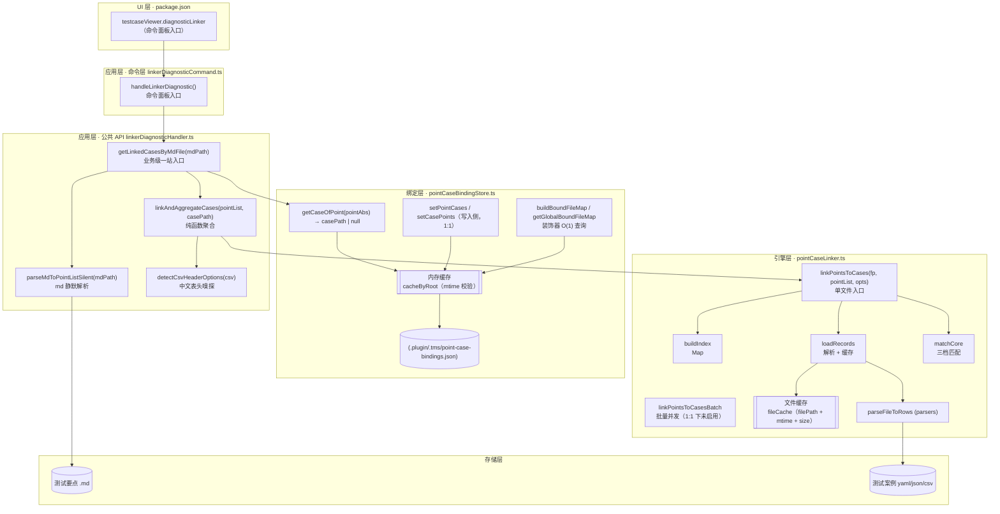
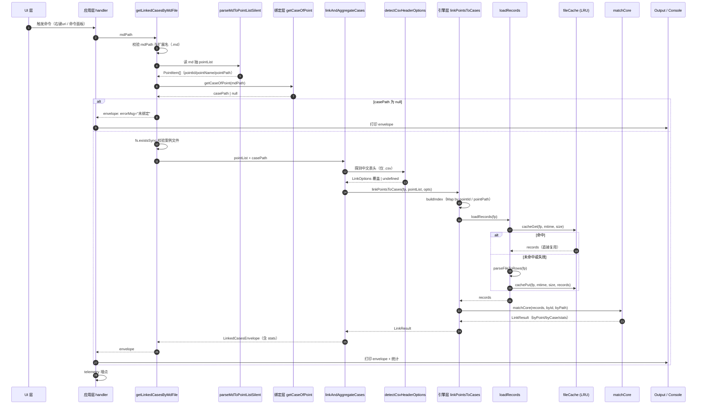
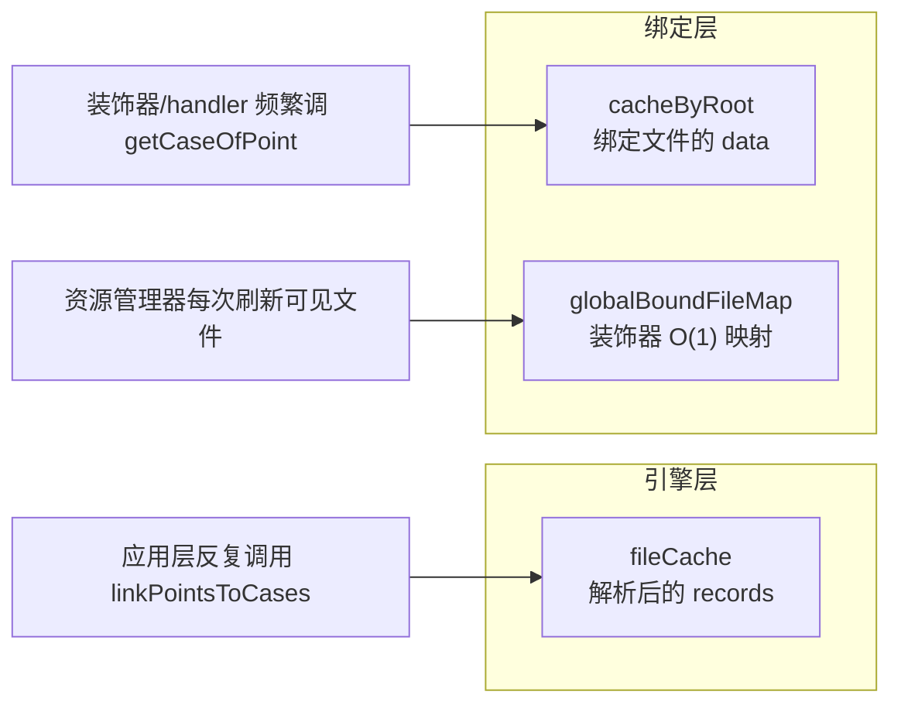
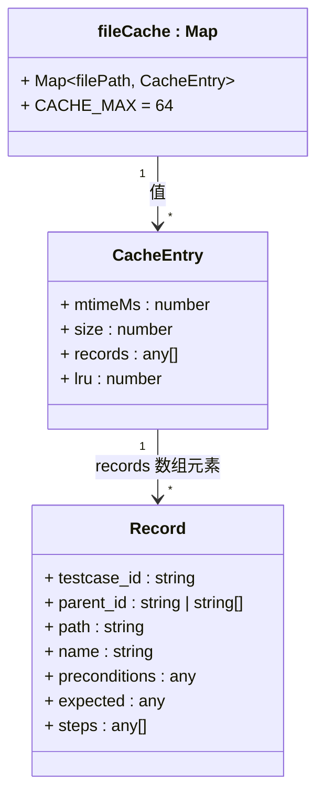
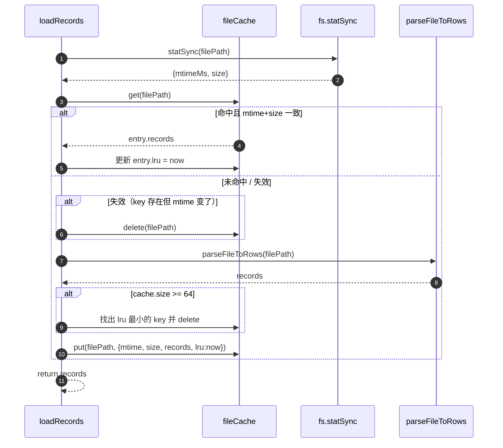

# 测试要点 ⇄ 测试案例 关联匹配模块 · 架构与实现逻辑

> 面向读者：既服务于 code reviewer / 新成员快速了解，也服务于未来接手的开发者深挖细节。  
> 姐妹文档：[point-case-linker-design.md](./point-case-linker-design.md)（侧重**契约与设计约束**）  
> 本文档定位：**架构分层 + 数据流 + 每层内部实现逻辑 + 缓存机制**

---

## 一、模块全景

关联匹配模块解决的核心问题：**「测试要点 md」 与 「测试案例 yaml/json/csv」之间的自动映射与匹配**。围绕这个目标，模块被切成四层，边界清晰、职责单一：



**四层职责一览：**

| 层 | 文件 | 关注点 | 不做什么 |
|---|---|---|---|
| **UI 层** | `package.json` | 命令注册、菜单/命令面板 when 条件 | 任何业务逻辑 |
| **应用层** | `src/handlers/linkerDiagnosticHandler.ts` | md 解析、编排调用、聚合成 envelope、Output/Console 输出、埋点 | 不做匹配算法，不直接读写绑定文件 |
| **绑定层** | `src/utils/pointCaseBindingStore.ts` | 读写 `.plugin/.tms/point-case-bindings.json`、维护 1:1 语义、O(1) 装饰器查询 | 不关心匹配算法，不解析 md/case 文件 |
| **引擎层** | `src/utils/pointCaseLinker.ts` | 索引构建、案例文件解析（含 LRU 缓存）、三档匹配算法、脏数据信号统计、埋点 | 不弹 UI、不读绑定关系、不知道 md 是什么 |

> **一句话总结**：应用层是**编排者**、绑定层是**关系管家**、引擎层是**匹配计算器**、存储层是**只读事实**。

---

## 二、核心数据流

以最常见的调用路径（右键"查看关联案例" / 命令面板"关联匹配诊断"）为例，展示 md → envelope 全过程：



### 关键节点解读

| 步骤 | 关键逻辑 |
|---|---|
| ② mdPath 校验 | 空值 / 非 `.md` 后缀直接短路，返回统一 errorMsg |
| ③ md 静默解析 | 抽"功能条目"作 pointPath 前缀 + 抽 markdown 表格取 `pointId / pointName`，全过程不弹 UI |
| ⑤ 绑定查询 | 走绑定层的内存缓存（mtime 校验），一般 O(1)，落盘 IO 只在缓存失效时发生 |
| ⑦ 案例文件存在性 | 用 `fs.existsSync + statSync.isFile()` 一次系统调用完成 |
| ⑧ 中文表头嗅探 | 只读首行 ≤8KB，判断是否为中文 CSV，是则改写 `LinkOptions` 字段名 |
| ⑩ 索引构建 | 一次遍历 pointList 建两张 Map（pointId → 点、归一化 pointPath → 点） |
| ⑪⑫ 缓存命中 | 用 `filePath + mtime + size` 复合校验，热调用几乎零成本 |
| ⑬ 匹配核心 | 一次遍历 records，先 parent_id 命中（含 -N 尾号剥离 fallback），失败再走 path 兜底 |

---

## 三、每层实现逻辑

### 3.1 UI 层：命令与菜单

**位置**：[package.json](../../package.json) 的 `contributes.commands`；[src/extension.ts](../../src/extension.ts) 的 `registerCommand`。

- `testcaseViewer.diagnosticLinker`：无参，从命令面板触发，直接读取当前激活编辑器里的 `.md` / `.xmind`（必须位于 `测试任务/<任务名>/测试大纲/` 下）+ 绑定关系。

命令在 [extension.ts](../../src/extension.ts) 中的注册会先发一条 `command.executed` 埋点，再调 handler。

> 历史上曾存在 `testcaseViewer.viewLinkedCases`（右键入口），已于 2026-07-25 合并到 `diagnosticLinker`，命令/handler/埋点均已下线。

---

### 3.2 应用层：编排 + 聚合

应用层拆分为两个文件（2026-07-25 重构）：
- **命令入口**：[src/handlers/linkerDiagnosticCommand.ts](../../src/handlers/linkerDiagnosticCommand.ts)（仅 `handleLinkerDiagnostic` + Output Channel 相关辅助）
- **公共 API**：[src/handlers/linkerDiagnosticHandler.ts](../../src/handlers/linkerDiagnosticHandler.ts)（三个可复用公共方法 + 一个嗅探函数 + 类型定义）

#### 3.2.1 `handleLinkerDiagnostic()` — 命令面板入口
- 从 `vscode.window.activeTextEditor.document.uri.fsPath` 取 mdPath，不命中时从 `tabGroups.activeTab.input.uri` 兜底（兼容 xmind 自定义编辑器场景）
- 三重校验：非空、`.md` / `.xmind` 后缀、命中正则 `测试任务/<任务名>/测试大纲/xxx.(md|xmind)`
- 调 `getLinkedCasesByMdFile(mdPath)` → envelope：绑定读取、案例文件存在性校验、匹配聚合都在公共方法内一次完成
- 从 envelope 首个 item 的 `filePath` 回溯 casePath 用于日志展示（1:1 语义下所有 item 的 filePath 相同）
- **输出规格**：TC-Linker 前缀 + JSON 分块（envelope 完整 JSON + stats 完整 JSON），无人类可读摘要杂音
- Output Channel 自动弹出（`ch.show(true)`），面板名为 `TestCase Linker 诊断`
- 发埋点 `linkerDiagnostic.done` / `linkerDiagnostic.linkerError`
- **无**「是否清缓存」QuickPick、**无**完成后 toast（如需观察真实解析耗时，请保存 md/case 触发 mtime 变化让 `fileCache` 自然失效）

#### 3.2.2 `getLinkedCasesByMdFile(mdPath)` — 业务级一站入口
公共方法之首，**"一个 md 进 → envelope 出"**。层层短路，任何错误路径都返回同形状 envelope（`{ total: 0, errorMsg, data: {} }`），调用方永远只需检查 `errorMsg` 与 `total`。

流程五步：
1. 入参校验（空值 / 非字符串）
2. 扩展名分派（当前仅 `.md`，未来 `.xmind` 走另一分支）
3. `parseMdToPointListSilent` 抽 pointList，空则报错
4. `getCaseOfPoint` 读绑定，无绑定则报错
5. 校验案例文件在磁盘上仍存在，最后调 `linkAndAggregateCases`

#### 3.2.4 `linkAndAggregateCases(pointList, filePath)` — 纯函数聚合
无 IO、无 VSCode 依赖，可在任何环境（单测、Webview、Tree View）复用。

- 入参校验（pointList 空 / filePath 空）
- 调 `detectCsvHeaderOptions(filePath)` 探测中文表头（仅 `.csv`）
- 调引擎 `linkPointsToCases(filePath, pointList, csvOpts ?? {})`
- 引擎抛错 → 转成 `{ total: 0, errorMsg: '匹配失败: xxx', data: {} }`
- 引擎成功 → 把 `byPoint` 透传成 `LinkedCasesEnvelope.data`，把 `filePath` 挂到每条 item 上（供 UI 追溯来源）
- `stats` 里透传引擎的脏数据信号（`duplicatePointIds` / `multiHitCases`）

#### 3.2.5 `parseMdToPointListSilent(mdPath)` — md 静默解析
两步走：

1. **抽 pointPath 前缀**：匹配 `功能条目\s*[:：]\s*(.+?)$`，交给 `normalizePointPath` 归一化（`\` / `／` / `·` → `/`、折叠连续斜杠、去首尾斜杠）；找不到则退化为文件名去后缀。
2. **抽 markdown 表格**：以 `|` 开头的行进入表格模式，表头列名弹性识别（`序号 / 编号 / 点号 / id / pointId` 五选一识别 pointId 列，`测试点 / 测试要点 / 要点 / 名称 / name / pointName` 六选一识别 pointName 列），后续每行拼出 `pointPath = normalizePointPath(funcPrefix + '/' + pname)`。

**关键容错**：
- 转义竖线 `\|` 用占位符保护，避免被误拆列
- 表头分隔行 `| --- |` 自动跳过
- pointId 为空可用 pointName 兜底（保证仅有名称的要点也能通过 path 匹配 type=2）

#### 3.2.6 `detectCsvHeaderOptions(csv)` — 中文表头嗅探
底层引擎默认按英文字段名（`parent_id / path / testcase_id / name`）取值。当案例文件是"中文表头 CSV"（如 `名称,路径,前置条件,...`），引擎会全部取空 → 0 命中。

嗅探函数只做一件事：**读 CSV 首行 ≤ 8KB → 判断有无中文 → 匹配到中文列名则返回 `Partial<LinkOptions>` 覆盖字段名**。

| 引擎字段 | 中文别名候选 |
|---|---|
| `caseNameField` | 名称 / 用例名称 / 案例名称 / 测试案例名称 |
| `pathField` | 路径 / 用例路径 / 案例路径 |
| `caseIdField` | 用例编号 / 案例编号 / testcase_id |
| `parentIdField` | 父点编号 / 所属要点 / parent_id |
| `preconditionFields` | 前置条件 / 前置 / preconditions / pre_condition（数组） |
| `expectedFields` | 预期结果 / 预期 / expected / expectedResult（数组） |

**能力天花板**：中文 CSV 模板无 `parent_id` 列 → 仅能命中 `type=2`（path 兜底）。这是**数据模型的天花板，非代码缺陷**。

---

### 3.3 绑定层：1:1 关系持久化

**位置**：[src/utils/pointCaseBindingStore.ts](../../src/utils/pointCaseBindingStore.ts)  
**落盘文件**：`<workspaceRoot>/.plugin/.tms/point-case-bindings.json`  
**文件结构**：

```json
{
  "version": 1,
  "bindings": [
    {
      "point": "测试任务/TT001/测试大纲/登录.md",
      "cases": ["测试任务/TT001/测试案例/login.yaml"],
      "updatedAt": 1720000000000
    }
  ]
}
```

- **相对路径 + POSIX 分隔符**：跨平台稳定
- **cases 是数组但 1:1 语义强制 ≤ 1**：写入侧 `setPointCases` / `setCasePoints` 若传入长度 > 1 直接抛错
- **每条记录带 `updatedAt`**：便于治理和审计

#### 3.3.1 读缓存：`cacheByRoot`
```ts
interface CacheEntry {
    filePath: string;
    data: PointCaseBindingsFile;   // 解析后的整份数据
    mtimeMs: number;               // 文件当时的 mtime
}
const cacheByRoot = new Map<string, CacheEntry>();
```

- **key**：workspace 根目录路径
- **失效**：每次 `loadBindings(root)` 都 `fs.statSync` 拿最新 mtime，与缓存不一致就重读
- **清空入口**：`clearCache(root?)`；同时会调 `invalidateGlobalBoundFileMap()` 让装饰器缓存失效

#### 3.3.2 写入乐观锁
`saveBindings(root, data, expectedMtimeMs?)`：写盘前重新 `stat`，若磁盘 mtime ≠ 传入的基线 mtime → 抛 `ConcurrentWriteError`，让上层决定重试或提示。用于多窗口并发写入场景。

`loadBindingsWithMtime(root)` 一次性返回 `{ data, mtimeMs }`，供调用者作为乐观锁基线。

#### 3.3.3 装饰器高性能路径：`getGlobalBoundFileMap`
资源管理器上的文件小徽标（"已绑定"标记）会被 VSCode **高频调用**（每次可见文件刷新都过一遍）。为此提供聚合 O(1) 查询：

- `buildBoundFileMap(root)`：把绑定文件转成 `Map<绝对路径, {role, boundToRel, boundToName}>`
- `getGlobalBoundFileMap(force=false)`：跨所有 workspaceFolders 聚合，带 **5s TTL** 削峰
- `invalidateGlobalBoundFileMap()`：任何写入/重命名/删除后立即失效

#### 3.3.4 文件系统事件同步
- `renamePathInBindings(oldAbs, newAbs)`：重命名/移动时同步替换 point / cases 中的引用；跨 workspace 移动视为删除
- `removePathInBindings(absPath)`：文件删除时清理所有引用；空 cases 的 point 记录一并删除
- 两者都以乐观锁写入，冲突时重试一次

---

### 3.4 引擎层：索引 + 缓存 + 匹配

**位置**：[src/utils/pointCaseLinker.ts](../../src/utils/pointCaseLinker.ts)  
**主入口**：`linkPointsToCases(filePath, pointList, options)`  
**批量入口**：`linkPointsToCasesBatch(filePaths, pointList, options)`（1:1 语义下当前未启用）

主流程 4 步：

```
buildIndex → loadRecords → matchCore → emitTelemetry
```

#### 3.4.1 索引构建 `buildIndex(pointList)`
一次遍历 pointList，产出：

```ts
{
    byId:   Map<pointId, PointItem[]>,   // 支持重复 pointId 都保留
    byPath: Map<normalizedPointPath, PointItem[]>,
    duplicatePointIds: string[]          // 治理信号
}
```

**要点**：pointId 为空的点仍会进入 `byPath`（保证无编号的要点也能通过 path 匹配 type=2）。

#### 3.4.2 案例文件解析 + LRU 缓存 `loadRecords`
```ts
async function loadRecords(filePath, enableCache) {
    if (enableCache) {
        const st = fs.statSync(filePath);
        const hit = cacheGet(filePath, st.mtimeMs, st.size);
        if (hit) return hit;
        const records = await parseFileToRows(filePath);
        cachePut(filePath, st.mtimeMs, st.size, records);
        return records;
    }
    return await parseFileToRows(filePath);
}
```

缓存结构详见 §四。

#### 3.4.3 匹配核心 `matchCore(records, byId, byPath, opts)`
一次遍历 records，对每条 record 走 5 步：

1. **收集 parent_id 候选**：支持数组 / 逗号分号分隔字符串（`normalizeParentIds`）
2. **parent_id 命中**：先用原值查 `byId`，未命中则剥离末尾 `-数字` 再查（如 `LGN-001-1 → LGN-001`），命中的点连同 `type` 存入 `hits`
   - `type = 1` 当且仅当 `normalizedPath == normalizedPointPath`
   - `type = 2` 当 parent_id 命中但 path 不等或缺失
3. **path 兜底**（仅当 `hits.size === 0`）：查 `byPath`，命中的点以 `type = 3` 存入 `hits`；若 parent_id 已有命中，path 命中仅参与 **multiHit 检测**，不进 hits
4. **多命中判定**：从 hits 中挑最强 type 的第一个作为归属点；若 `hits` 内有多个不同 pointId 或 `pathHitPids` 与 `hits` 完全不相交 → 记入 `multiHitCases` 治理信号
5. **组装 CaseItem**：
   - `casePath` 走 `normalizePointPath`，与匹配保持同构
   - `caseDetail` 由 `buildCaseDetail` 组装：`【前置条件】... 【步骤描述】步骤1:xxx 【预期结果】步骤1: 【UI检查】... 【接口调用】... 【数据检查】...`，每行 `<p></p>` 包裹
   - 同一 pointKey 内按 testcase_id 去重

**决策矩阵**：

| parent_id | path | 归属结论 |
|:---:|:---:|:---|
| ✅ | ✅（同点） | `type = 1`（最强） |
| ✅ | ❌ / 不同点 | `type = 2` |
| ❌ | ✅ | `type = 3`（兜底） |
| ❌ | ❌ | 孤儿，累加 `orphanRecords` |

#### 3.4.4 埋点 `emitTelemetry`
- 正常事件：`pointCaseLinker.done`（每次匹配都发，含 fileExt / pointCount / totalRecords / matchedRecords / orphanRecords / type1-3 / strippedParentIds）
- 应用层事件：`linkerDiagnostic.done` / `linkerDiagnostic.linkerError`
- 告警事件：`pointCaseLinker.duplicatePointId`、`pointCaseLinker.multiHitCase`（脏数据信号，条件发出）

#### 3.4.5 批量入口 `linkPointsToCasesBatch`
- 索引只构建一次
- 文件解析按 `concurrency`（默认 4）并发
- 单个文件解析失败不影响其他文件，失败的文件对应 `LinkResult` 为空 + 发 `pointCaseLinker.fileError`
- **1:1 语义下当前未被应用层调用**，作为未来批量场景的能力储备

---

## 四、缓存机制专题

关联匹配模块内部有**三处**独立的缓存，用途和实现各不同。放在同一节对比，避免混淆。



### 4.1 引擎层 `fileCache`（重头戏）

**位置**：[pointCaseLinker.ts:98-137](../../src/utils/pointCaseLinker.ts)

```ts
interface CacheEntry {
    mtimeMs: number;   // 失效判据 1
    size: number;      // 失效判据 2
    records: any[];    // ★ 缓存内容：parseFileToRows 解析后的行对象数组
    lru: number;       // 最近访问时间戳
}
const CACHE_MAX = 64;
const fileCache = new Map<string, CacheEntry>();
```

**Key/Value 结构**：



**存储位置**：**扩展进程内存**，不落盘、不写工作区。

**作用域**：模块级 `Map` → 只要 Extension Host 存活就存在；重启 VSCode / 重载窗口 / 卸载插件 → 清空。

**失效与淘汰**：

| 机制 | 触发条件 | 效果 |
|---|---|---|
| **mtime + size 双校验** | 命中 key 时若 `mtimeMs` 或 `size` 与当前 `fs.statSync` 不一致 | 立即 `delete`，重新解析 |
| **LRU 淘汰** | `fileCache.size >= 64` | 遍历所有条目挑 `lru` 最小的删除 |
| **手动清空** | `clearLinkerCache()` | `fileCache.clear()` |
| **进程退出** | 窗口关闭 / 重载 / 卸载 | 随进程消亡 |

**命中/失效时序**：



**为什么需要它**：
- 关联匹配的热路径是"打开 md / 保存 md / 编辑器刷新推送"反复触发，每次都要解析同一 yaml/json/csv（IO + parse 都很贵）
- 有了缓存：md 反复变化、case 未变 → **零解析成本**；case 保存 → 自动失效重新解析
- **用户几乎感觉不到它的存在**；诊断入口移除了「是否清缓存」QuickPick 后，如需观察真实解析耗时，请**保存 md/case 触发 mtime 变化**，或通过命令面板执行 `TestCase Viewer: Reload Window` 让整个进程重启

**已知边界**：
- ✅ 外部工具（脚本、Git）改动案例文件 → mtime 变了 → 自动重解析
- ⚠️ VSCode 内编辑但**未保存** → mtime 未变 → 读到磁盘旧内容 → 请**保存后再查看关联案例**

### 4.2 绑定层 `cacheByRoot`

**位置**：[pointCaseBindingStore.ts:57-64](../../src/utils/pointCaseBindingStore.ts)

- **Key**：workspace 根目录路径
- **Value**：`{ filePath, data: 完整绑定 JSON, mtimeMs }`
- **失效**：每次 `loadBindings` 都 `statSync` 拿新 mtime，与缓存对比
- **写入侧同步刷新**：`saveBindings` 写盘成功后立刻更新缓存 + `invalidateGlobalBoundFileMap`
- **用途**：让 `getCaseOfPoint / getBoundCasesOfPoint / getBoundPointsOfCase` 等高频接口不用每次读盘

### 4.3 绑定层 `globalBoundFileMapCache`

**位置**：[pointCaseBindingStore.ts:493-511](../../src/utils/pointCaseBindingStore.ts)

- **Value**：`Map<绝对路径 POSIX, { role, boundToRel, boundToName }>`，跨所有 workspaceFolders 聚合
- **失效**：5 秒 TTL + 显式 `invalidateGlobalBoundFileMap()`（任何写入/重命名/删除后立即调用）
- **用途**：文件小徽标装饰器高频调用，需要 O(1) 查询

### 4.4 三缓存对比

| 特性 | fileCache | cacheByRoot | globalBoundFileMap |
|---|---|---|---|
| 层 | 引擎 | 绑定 | 绑定 |
| Value 语义 | 案例文件解析结果 | 整份绑定 JSON | 已绑定文件 O(1) 元信息 |
| 失效判据 | mtime + size | mtime | 5s TTL + 显式 invalidate |
| 容量上限 | 64（LRU 淘汰） | 无（每 workspace 一条） | 无（每 5s 重建） |
| 落盘 | 否 | 否 | 否 |
| 清空入口 | `clearLinkerCache()` | `clearCache(root?)` | `invalidateGlobalBoundFileMap()` |

---

## 五、扩展点与演进方向

| 扩展方向 | 落地点 |
|---|---|
| **支持 `.xmind` 测试要点** | `getLinkedCasesByMdFile` 里的扩展名分派处，新增 `parseXmindToPointListSilent`，其它不变 |
| **Tree View 徽标显示命中数** | Tree Node 渲染阶段调 `getLinkedCasesByMdFile`，把 `envelope.total` 挂到 description 上 |
| **反向"看某 case 属于哪个 point"** | 直接消费引擎的 `LinkResult.byCase`（已提供 `{pointKey, type}` 反查） |
| **未绑定场景兜底扫描** | 应用层已保留 `locateCaseDir` + `collectCaseFiles`（当前 `@ts-eslint-disable unused-vars`），改一段代码即可复活 |
| **批量并发匹配复活** | 若放开 1:1 约束，直接调用引擎已就绪的 `linkPointsToCasesBatch` |
| **新增中文表头别名** | 在 `CN_HEADER_ALIAS` 常量表追加词条即可，无需改逻辑 |

---

## 附录 A：代码位置速查

| 定位 | 文件 | 关键符号 |
|---|---|---|
| 命令注册 | [src/extension.ts](../../src/extension.ts) | `testcaseViewer.diagnosticLinker` |
| 应用层 · 命令入口 | [src/handlers/linkerDiagnosticCommand.ts](../../src/handlers/linkerDiagnosticCommand.ts) | `handleLinkerDiagnostic` |
| 应用层 · 公共 API | [src/handlers/linkerDiagnosticHandler.ts](../../src/handlers/linkerDiagnosticHandler.ts) | `getLinkedCasesByMdFile` / `linkAndAggregateCases` / `parseMdToPointListSilent` |
| 中文 CSV 嗅探 | 上文公共 API 文件 | `detectCsvHeaderOptions` / `CN_HEADER_ALIAS` |
| 引擎层单文件 | [src/utils/pointCaseLinker.ts](../../src/utils/pointCaseLinker.ts) | `linkPointsToCases` |
| 引擎层批量 | 同上 | `linkPointsToCasesBatch` |
| 引擎层缓存 | 同上 | `fileCache` / `cacheGet` / `cachePut` / `clearLinkerCache` |
| 引擎层索引/匹配 | 同上 | `buildIndex` / `matchCore` / `normalizePointPath` |
| 绑定层核心 | [src/utils/pointCaseBindingStore.ts](../../src/utils/pointCaseBindingStore.ts) | `getCaseOfPoint` / `setPointCases` / `setCasePoints` |
| 绑定层缓存 | 同上 | `cacheByRoot` / `globalBoundFileMapCache` |
| 绑定层文件同步 | 同上 | `renamePathInBindings` / `removePathInBindings` |
| 绑定文件路径 | 运行时 | `<workspaceRoot>/.plugin/.tms/point-case-bindings.json` |

## 附录 B：单测清单

| 单测 | 覆盖 |
|---|---|
| [src/test/pointCaseLinker.test.ts](../../src/test/pointCaseLinker.test.ts) | 引擎层 19 项：基础三档匹配、parent_id 数组/字符串/尾号剥离、path 归一化、重复 pointId、multiHit、缓存命中 |
| [src/test/pointCaseLinker.integration.test.ts](../../src/test/pointCaseLinker.integration.test.ts) | 引擎层真实样例集成验证：yaml/json/csv 三类共 1000 条案例 + 200 个点，验证缓存命中 |
| [src/test/linkerDiagnosticHandler.chineseCsv.test.ts](../../src/test/linkerDiagnosticHandler.chineseCsv.test.ts) | 应用层：中文表头 CSV → type=2 兜底命中 + 英文表头回归 |

## 附录 C：常见问题排查

| 现象 | 可能原因 | 排查步骤 |
|---|---|---|
| envelope.total = 0 且 errorMsg 空 | 全部记录变孤儿 | 看 `stats.totalOrphan` 是否等于 `totalRecords`；进一步看 md 的 pointPath 与 case 的 path 是否同构 |
| CSV 命中全为 type=2 | 中文表头 CSV 无 parent_id 列 | 属于**数据模型天花板**，非缺陷；如需 type=1/3 请在 CSV 加 `parent_id` 或"父点编号"列 |
| 编辑后查看仍是旧内容 | fileCache 用 mtime，未保存不失效 | **保存 md / case 后再查看**（诊断命令已不再提供"清缓存"选项） |
| 绑定文件被外部改动没生效 | cacheByRoot 用 mtime，被外部改会自动失效 | 若立即需要生效，可 `Reload Window` 或调 `clearCache()` |
| 装饰器徽标延迟 | globalBoundFileMap 有 5s TTL | 属于设计，写入侧已 `invalidate`；正常场景延迟 <1 秒 |

## 附录 D：与姐妹文档的分工

| 文档 | 定位 | 什么时候看 |
|---|---|---|
| **本文档** `point-case-linker-module.md` | 架构分层、数据流、每层实现、缓存机制 | 新人上手 / 需要理解"代码为什么这么写" |
| [`point-case-linker-design.md`](./point-case-linker-design.md) | 设计约束、契约、埋点全景、演进方向 | 修改代码前 / 写业务集成前查契约 |
| [`../requirements/point-case-linker-requirements.md`](../requirements/point-case-linker-requirements.md) | 需求原文 | 讨论产品需求变更时 |
