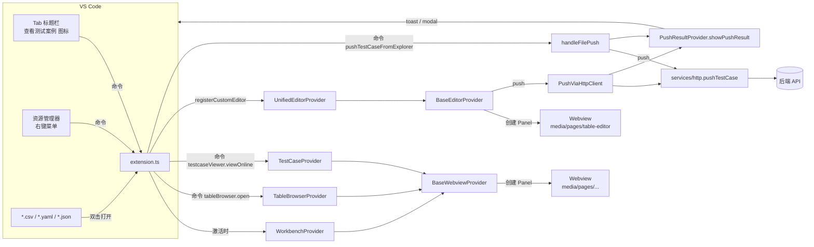
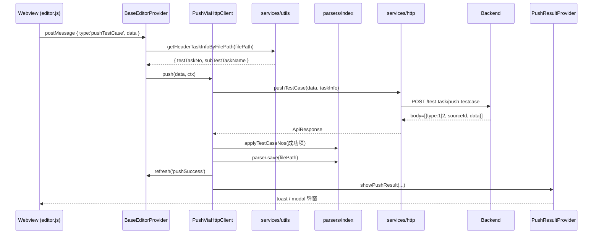
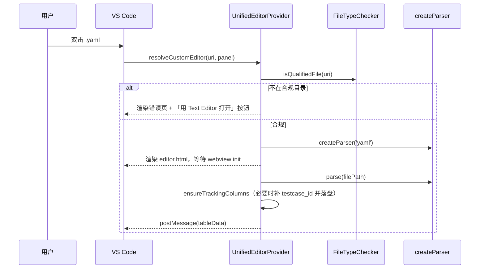
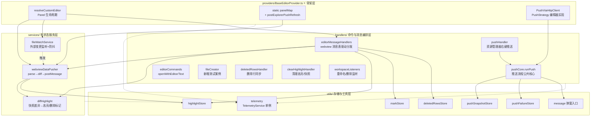

# TestCase Viewer 项目说明文档

> VS Code 扩展：在工作区内浏览 / 编辑 / 推送测试案例文件（CSV / YAML / JSON），并对接后端任务管理系统。

---

## 1. 项目概览

| 维度 | 说明 |
|---|---|
| 扩展名 | `testcase-viewer` |
| 主入口 | `out/extension.js`（由 `src/extension.ts` 编译） |
| 激活时机 | `onStartupFinished`（VS Code 启动完成后） |
| 注册的自定义编辑器 | `testcaseViewer.unifiedEditor`（CSV / YAML / YML / JSON 四类） |
| 后端通信 | HTTP + 可选 SM2 时间戳签名 |
| 单元测试 | `vitest` |

### 核心能力
1. **自定义编辑器**：表格化展示与编辑 CSV / YAML / JSON 测试案例；保存即落盘。
2. **测试案例推送**：把当前文件 / 选中行推送到后端，按 `testcase_id` 回写 `testCaseNo`。
3. **在线案例查询**：从后端拉取已推送案例，配合本地文件做对比浏览。
4. **批量浏览/导入**：通过「表格浏览器」批量选取多个 CSV 中的行后导入。

---

## 2. 目录结构

```
workbench/
├─ src/                                # 扩展端 (Node.js / TypeScript)
│  ├─ extension.ts                     # ⭐ 扩展入口：activate / 命令注册 / 全局异常兜底
│  ├─ providers/                       # 各类 Provider（编辑器/独立 Panel/树视图）
│  │  ├─ BaseEditorProvider.ts         # ⭐ 自定义编辑器骨架（Panel 生命周期 + PushStrategy 契约）
│  │  ├─ UnifiedEditorProvider.ts      # 统一编辑器（CSV/YAML/JSON 全用它）
│  │  ├─ BaseWebviewProvider.ts        # 独立 Webview Panel 基类
│  │  ├─ WorkbenchProvider.ts          # 工作台首页
│  │  ├─ TableBrowserProvider.ts       # 表格浏览器
│  │  ├─ TestCaseProvider.ts           # 在线测试案例查看
│  │  ├─ BindTaskProvider.ts           # 全局任务绑定树视图
│  │  ├─ PushResultProvider.ts         # 推送结果统一弹窗
│  │  └─ common/
│  │     └─ FileTreeService.ts         # 合规目录文件树构建
│  ├─ handlers/                        # 命令与消息编排（无状态、可测）
│  │  ├─ pushCore.ts                   # ⭐ 推送流程公共核心（编辑器 / 资源管理器共用）
│  │  ├─ pushHandler.ts                # 资源管理器右键推送入口
│  │  ├─ editorMessageHandlers.ts      # 编辑器 webview 消息表驱动分发
│  │  ├─ editorCommands.ts             # openWithEditor / openWithText 命令
│  │  ├─ fileCreator.ts                # 新增测试案例（CSV/YAML/JSON）
│  │  ├─ deletedRowsHandler.ts         # 主动同步已删除行
│  │  ├─ clearHighlightHandler.ts      # 清理文件高亮及相关缓存
│  │  └─ workspaceListeners.ts         # 工作区文件重命名/删除监听
│  ├─ parsers/                         # 文件解析器
│  │  ├─ file-parser.ts                # 接口定义
│  │  ├─ csv-parser.ts                 # CSV 实现
│  │  ├─ yaml-parser.ts                # YAML 实现（支持明细子表）
│  │  ├─ json-parser.ts                # JSON 实现（支持明细子表）
│  │  └─ index.ts                      # 工厂 + testcase_id/testCaseNo 处理
│  ├─ services/                        # 有状态、跨模块可复用的服务
│  │  ├─ http.ts                       # 后端 HTTP 封装 + SM2 签名
│  │  ├─ storage.ts                    # 本地配置/查询参数读写
│  │  ├─ utils.ts                      # 路径合规校验 / stackHead / buildErrorProps 等
│  │  ├─ webviewDataPusher.ts          # ⭐ Webview 数据推送器（parse→diff→postMessage）
│  │  ├─ fileWatchService.ts           # 单文件外部变更监听（自保存守护 + 防抖）
│  │  └─ diffHighlight.ts              # 快照差异 → 高亮/删除/新增 标记的公共逻辑
│  ├─ utils/                           # 无副作用工具 & 单例存储
│  │  ├─ telemetry.ts                  # ⭐ TelemetryService 单例埋点服务
│  │  ├─ commands.ts                   # 当前任务信息业务入口
│  │  ├─ message.ts                    # 弹窗/toast/modal 唯一入口
│  │  ├─ headerLabels.ts               # 表头中文别名映射
│  │  ├─ extensionHelpers.ts           # 命令 handler 通用小工具
│  │  ├─ storageInitializer.ts         # 存储初始化 & 孤儿清理
│  │  ├─ pushSnapshotStore.ts          # 推送后文件快照（差异高亮基线）
│  │  ├─ pushFailureStore.ts           # 推送失败行的跨会话持久化
│  │  ├─ pushDataMapper.ts             # 推送字段映射
│  │  ├─ pushResponse.ts               # 后端推送响应解析
│  │  ├─ highlightStore.ts             # 单元格差异高亮持久化
│  │  ├─ markStore.ts                  # 用户手动颜色标记持久化
│  │  ├─ deletedRowsStore.ts           # 已删除行追踪持久化
│  │  ├─ taskInfoStore.ts              # 任务绑定持久化 (task-bindings.json)
│  │  └─ fileIdentifier.ts             # 「命令创建」文件标识
│  ├─ types/index.ts                   # 全局类型定义
│  └─ test/                            # vitest 单测
│
├─ media/                              # 前端资源（webview 加载）
│  ├─ common/                          # 通用组件 / 样式 / 工具
│  └─ pages/                           # 各业务页面 (workbench/table-browser/table-editor/testcase)
│
├─ package.json                        # 扩展声明：commands / customEditors / configuration
├─ tsconfig.json
├─ vitest.config.ts
└─ mock-server.js                      # 本地 mock 后端，便于离线调试
```

> 工作区内还存在 `C001_测试/测试任务/...` 等示例目录，仅作演示数据。

---

## 3. 模块协作图

### 3.1 总体协作



### 3.2 推送链路（关键路径）



### 3.3 文件打开链路



### 3.4 BaseEditorProvider 拆分（本次重构重点）

早期 `BaseEditorProvider.ts` 曾是一个 1500+ 行的"上帝类"，同时承载：Panel 生命周期、消息分发、文件监听、数据推送、快照差异比对、推送流程编排、埋点等所有职责。为了控制单文件复杂度并让核心流程可复用于「资源管理器右键推送」场景，我们按"公共逻辑下沉、UI/编排上浮"的原则将其拆分为如下模块：



#### 拆分前后职责对照

| 关注点 | 拆分前（单文件内） | 拆分后 |
|---|---|---|
| Panel 生命周期 / keepEditor / panelMap | ✅ 保留在 `BaseEditorProvider` | ✅ 保留在 `BaseEditorProvider`（仅骨架） |
| Webview 消息 dispatch（init/save/pushTestCase/…） | 内联 `switch` | ➡️ [`handlers/editorMessageHandlers.ts`](../../src/handlers/editorMessageHandlers.ts)（表驱动） |
| parse → diff → postMessage 数据推送 | `pushDataToWebview()` 内联 300+ 行 | ➡️ [`services/webviewDataPusher.ts`](../../src/services/webviewDataPusher.ts) |
| 文件外部变更监听 + 自保存守护 + 防抖 | 内联 `fs.watch` + 计时器 | ➡️ [`services/fileWatchService.ts`](../../src/services/fileWatchService.ts) |
| 快照差异 → 高亮/删除/新增标记 | 内联比对 | ➡️ [`services/diffHighlight.ts`](../../src/services/diffHighlight.ts)（并导出 `EditorSession` 类型） |
| 推送主流程编排（校验/过滤/回写/失败聚合） | `PushViaHttpClient.push` 内联 400+ 行 | ➡️ [`handlers/pushCore.ts`](../../src/handlers/pushCore.ts) 的 `runPush()`（编辑器 & 资源管理器共用） |
| 资源管理器右键推送 | `extension.ts` 内联 | ➡️ [`handlers/pushHandler.ts`](../../src/handlers/pushHandler.ts) |
| 打开方式切换 / 新增用例 / 删除行同步 / 清理高亮 | `extension.ts` 内联 | ➡️ [`handlers/editorCommands.ts`](../../src/handlers/editorCommands.ts) / [`fileCreator.ts`](../../src/handlers/fileCreator.ts) / [`deletedRowsHandler.ts`](../../src/handlers/deletedRowsHandler.ts) / [`clearHighlightHandler.ts`](../../src/handlers/clearHighlightHandler.ts) |
| 埋点 | 顶层函数 `sendTelemetryEvent(...)` | ➡️ `TelemetryService` 单例（见 5.10） |

#### 关键设计原则

1. **`BaseEditorProvider` 只做骨架**：Panel 生命周期、`panelMap` 注册、可见性/重命名钩子、错误页兜底。业务操作全部下沉到 `handlers/` 或 `services/`。
2. **公共核心 `runPush()` 唯一化**：编辑器内推送（`PushViaHttpClient`）与资源管理器右键推送（`pushHandler`）都是 `runPush()` 的调用方，只通过 `hooks` 注入各自的 UI 反馈（webview postMessage / 弹窗）。修 bug、加统计、改重试策略——只改一处。
3. **`services/` 层可独立测试**：`webviewDataPusher` / `fileWatchService` / `diffHighlight` 均通过构造函数注入依赖（`log` / `session` / `getLastSelfSaveAt`），不再持有 Provider 引用，便于打桩。
4. **`utils/` 层无副作用 & 存储分离**：所有跨会话状态（快照/失败/高亮/标记/删除行/任务绑定）拆到独立 `*Store.ts`，同名前缀便于查找；埋点走 `TelemetryService` 单例。
5. **拆分不改行为，只改归属**：函数签名/返回值/落盘时序保持一致，重构完成后 46/46 单测继续通过；未来新增「另一种推送渠道」只需实现 `PushStrategy`，不动 `runPush`。

#### 一次典型的编辑器内推送数据流

```
Webview ──postMessage(pushTestCase)──▶ editorMessageHandlers.dispatch
                                              │
                                              ▼
                                    PushViaHttpClient.push
                                              │
                                              ▼
                                    pushCore.runPush（唯一核心）
                              ┌───────────────┼──────────────────┐
                              ▼               ▼                  ▼
                     services/http     pushSnapshotStore   pushFailureStore
                              │
                              ▼
                    webviewDataPusher.push('pushSuccess')
                              │
                              ▼
                     diffHighlight → highlightStore
                              │
                              ▼
                          Webview 收到最新 tableData
```

---

## 4. 关键约定

### 4.1 目录约定（强约束）

| 层级 | 名称（中文 / 英文） |
|---|---|
| L1 | `测试任务` / `testtask` |
| L2 | `<testTaskNo>_<subTestTaskName>`（半角下划线分隔） |
| L3 | `测试案例` / `testcase` |
| L4 | `*.csv` / `*.yaml` / `*.yml` / `*.json` |

> 仅在该结构下的文件会被识别为合规文件，才能进入自定义编辑器、参与推送、出现在表格浏览器中。

### 4.2 推送追踪列

| 列名 | 含义 | 写入时机 |
|---|---|---|
| `testcase_id` | 行的稳定唯一 ID（`MA` 前缀 + crypto 随机 hex） | 第一次打开文件时由 `ensureTrackingColumns` 生成并立即落盘 |
| `testCaseNo` | 后端返回的案例编号 | 推送成功后由 `applyTestCaseNos` 按 `testcase_id` 回写 |

- `testcase_id` 列固定插在最前；`testCaseNo` 列固定插在 `testcase_id` 右侧。
- YAML / JSON 同时把这两个字段写回 `sourceData`，避免 save 重建嵌套结构时丢失。
- 受保护列：`testcase_id` 以及其他配置为受保护的列，**禁止删除 / 重命名 / 编辑**，仅 `ensureTrackingColumns` 可写入。

### 4.3 任务信息（`testTaskNo` / `subTestTaskName`）唯一来源

- **唯一来源：`task-bindings.json`**（全局存储路径下）。已移除从路径类推导任务信息的逻辑，统一由绑定配置提供。
- 业务入口：`getTaskInfoByFilePath`（严格，推送场景） / `getHeaderTaskInfoByFilePath`（宽松，表头展示）。
- 后续调整只需修改绑定配置读写逻辑或联动插件，不再与路径格式耦合。
- 全局绑定列表仅展示**当前工作区内**的绑定项，避免跨工作区混淆。

### 4.4 后端响应约定

`pushTestCase` 接口返回结构：

```jsonc
{
  "returnCode": "SUC0000",
  "body": [
    { "type": 1, "sourceId": "<testcase_id>", "data": "<testCaseNo>" }, // 成功
    { "type": 2, "sourceId": "<testcase_id>", "data": "<errorMsg>" }    // 失败
  ]
}
```

- `type === '1'` → 成功，`data` 即为 `testCaseNo`
- `type === '2'` → 失败，`data` 是错误描述

---

## 5. 设计要点

### 5.1 自定义编辑器：每个 Panel 独立 Session

- `BaseEditorProvider.resolveCustomEditor` 内部为每个 panel 创建独立的 `EditorSession`：
  ```ts
  interface EditorSession {
      type: FileType;
      parser: FileParser;
      originalSourceData: any;
      cachedTableData: any;
  }
  ```
- 避免 Provider 单例下多 panel 共享缓存而互相覆盖。

### 5.2 预览 Tab 防覆盖

VS Code 单击文件默认进入「预览 Tab」，相同位置只有 1 个 tab 槽位。多文件相继打开时会出现“tab 互相覆盖”的现象。
扩展端通过 `workbench.action.keepEditor` 立即将当前 tab 固化为永久 tab：

```ts
await vscode.commands.executeCommand('workbench.action.keepEditor');
```

### 5.3 退化策略：失败明细的展示

`PushResultProvider.showPushResult` 决策表：

| 场景 | 视觉 | 交互 |
|---|---|---|
| 全部成功 | `information` toast | 自动消失 |
| 部分成功 | `warning` 模态对话框 | Esc 关闭；可一键复制失败明细 |
| 全部失败 | `error` 模态对话框 | 同上 |
| 失败 > 50 条 | 弹窗只列前 50；提供「查看输出面板」按钮 | 全量明细写入 `测试案例推送` OutputChannel |

### 5.4 SM2 签名

- `services/http.addSm2Signature` 读取 `app-config.json` 的 `sm2PublicKey`，对当前时间戳加密，注入 `X-Timestamp` / `X-Signature` 请求头。
- 若未配置公钥则跳过签名（不影响 mock 调试）。
- 日志输出会自动脱敏 `Authorization` / `X-Signature`。

### 5.5 错误页与按钮事件

`services/utils.buildErrorHtml` 支持注入按钮事件：

```ts
buildErrorHtml(message, title, [{ label: '用文本编辑器打开', action: 'openTextEditor', primary: true }]);
```

按钮点击后会通过 `vscode.postMessage({ type: action })` 派发到扩展端，扩展端通常调用 `vscode.openWith` 改用其他编辑器打开文件，避免用户陷入死锁。

### 5.6 单元格多行编辑与行高

- **多行编辑浮窗**：双击单元格进入编辑时，若行被拖高或原本就是多行内容，**`textarea` 会以 `position:fixed` 挂在 `document.body` 上**，实时随 td 位置同步。这是为了绕开 `.xs-td` 上的 `overflow/clip` 以及 CSS `height:100%` 限制，从而能完整展示多行内容并支持滚动。关闭编辑时 remove DOM + 解绑 scroll/resize 监听，无泄露。
- **行高交互**：拖动行号格下方分割线调节行高，双击分割线自适应，双击行号格恢复默认高；多行内容默认以省略号显示，双击行号可展开一行查看全部内容。
- **状态隔离**：列宽 / 行高 / 展开状态 按文件路径隔离存储，切换 Tab 不互相干扰。

### 5.7 标记与筛选

- 单元格右键可手动打上颜色标记，用于人工关注某些行 / 区域。
- 工具栏提供「仅看标记」筛选开关，与仅看失败 / 仅看已修改 / 仅看新增 / 仅看已删除、同为互斥状态。
- 标记动作纳入 `pushHistory()`，支持 `Ctrl/Cmd + Z`撤销、`Ctrl/Cmd + Y` / `Ctrl/Cmd + Shift + Z` 重做，Mac 上 `Cmd+Y` 已修复不响应问题。

### 5.8 推送失败持久化与优先高亮

- 推送失败后会记录失败时间戳，用于后续**优先高亮**同一行最近一次失败；未推送成功前失败状态**跨会话保留**（随文件描述一同营造）。
- 本批推送成功的行会从失败集合中移除；未参与本批的历史失败行保持高亮。
- 发布记录以 `testcase_id` 为键，避免行序变动后丢失状态。

### 5.9 网络错误中文化

`services/http.makeRequest` 把 Node 的 `ECONNREFUSED` / `ETIMEDOUT` / `ENOTFOUND` / `ECONNRESET` 翻译为可读文案，并在编辑器内推送时配合「打开配置 / 查看帮助」按钮一键引导用户启动本地 mock-server。

### 5.10 遥测服务单例化（TelemetryService）

`utils/telemetry.ts` 已从「零散顶层函数」升级为**单例服务类**，对外只导出一个常量：

```ts
import { TelemetryService } from '../utils/telemetry';

TelemetryService.sendTelemetryEvent('editor.opened', { targetFile });
TelemetryService.sendTelemetryErrorEvent('push.failed', { errorMessage });
```

关键约定：

| 项 | 说明 |
|---|---|
| 生命周期 | `extension.ts` 里 `TelemetryService.init(context)` 一次；不需要外部再次触碰 |
| 状态封装 | `_queue / _flushTimer / _sessionId / _failureCount` 全部为类私有字段，不再暴露模块级变量 |
| 用户开关 | `vscode.env.isTelemetryEnabled=false` 时全部静默丢弃 |
| Dev 静默 | `NODE_ENV=development` 或未配置 `telemetryUrl/apiUrl` → 仅 `console.log('[telemetry][dev] ...')` |
| 上报通道 | `POST ${telemetryBase}/api/v1/track`，Header `X-Telemetry-Token` |
| Token 优先级 | `cfg.telemetryToken`（后端下发） > 内置 `BUILTIN_TELEMETRY_TOKEN` |
| 队列/退避 | 5s 定时批量（≤20 条/批），连续失败 ≥3 次退避到 30s；队列上限 200 条 |
| 单条上限 | 8KB，超出自动截断 |

对外暴露方法（全部为实例方法，通过单例调用）：

- `init(context)` — activate 时调用一次
- `sendTelemetryEvent(name, props?)` — 普通事件
- `sendTelemetryErrorEvent(name, props?)` — 业务错误
- `sendTelemetryException(name, props?)` — 异常事件
- `trackTiming(name, fn, props?)` — 包裹异步耗时并自动上报 `costMs / execResult`
- `flush()` — 立即清空队列上报（测试/收尾用）

> **规范**：新增埋点点位一律通过 `TelemetryService.xxx()` 调用；不要再从 `utils/telemetry` 解构任何顶层函数——它们已不再导出。

---

## 6. 命令与配置

### 6.1 命令

| 命令 ID | 入口 | 作用 |
|---|---|---|
| `workbench.open` | 启动时自动打开 | 打开「工作台」首页 |
| `tableBrowser.open` | 内部 | 打开「表格浏览器」 |
| `testcaseViewer.viewOnline` | 编辑器标题栏图标 | 查看在线测试案例 |
| `testcaseViewer.openWithEditor` | — | 强制使用自定义编辑器打开 |
| `testcaseViewer.openWithText` | — | 强制使用文本编辑器打开 |
| `testcaseViewer.pushTestCaseFromExplorer` | 资源管理器右键 | 推送测试案例（支持多选） |

### 6.2 配置项

| 配置项 | 默认值 | 说明 |
|---|---|---|
| `testcaseViewer.apiUrl` | `http://localhost:8081` | 后端 API 地址 |

> 此外 `<globalStorage>/app-config.json` 中可放：`authToken` / `userId` / `userName` / `sm2PublicKey`，由扩展运行时读取。

---

## 7. 本地开发

```bash
# 安装依赖
npm i

# 编译
npm run compile

# 监听
npm run watch

# 单元测试
npm test

# 启动本地 mock 后端（另起终端）
node mock-server.js
```

按 F5 在 VS Code 内启动 Extension Development Host 调试。

---

## 8. 扩展指引（FAQ）

### Q1. 想新增一种文件格式（例如 XML）？
1. `src/parsers/` 下新增 `xml-parser.ts`，实现 `FileParser` 接口。
2. `src/parsers/index.ts` 的 `createParser` / `detectFileType` 增加分支。
3. `src/services/utils.ts` 的 `FILE_PATTERNS` 增加正则。
4. `package.json` 的 `customEditors.selector` 与右键菜单 `when` 增加扩展名匹配。
5. `UnifiedEditorProvider.FileTypeChecker.isQualifiedFile` 增加分支。

### Q2. 想换 `testTaskNo` 的解析规则？
绑定信息统一由 `task-bindings.json` 提供，路径推导逻辑已移除。调整绑定读写请参考 `services/storage.ts` 中的绑定管理 API；推送严格校验走 `getTaskInfoByFilePath`，表头展示宽松走 `getHeaderTaskInfoByFilePath`。

### Q3. 想新增一个独立 Webview Panel？
1. 在 `src/providers/` 下继承 `BaseWebviewProvider`，实现 6 个抽象方法（getPanelId / getPanelTitle / getViewColumn / getHtmlPath / getScriptPath / handleMessage）。
2. 在 `media/pages/<your-page>/` 下放对应 `index.html` + `main.js`。
3. 在 `extension.ts` 中实例化并注册一个 `vscode.commands.registerCommand` 调用 `provider.show()`。

### Q4. 想增加新的推送策略（例如经过另一服务）？
- 实现 `PushStrategy.push`，让 `UnifiedEditorProvider.pushStrategy` 指向新实现即可，`BaseEditorProvider` 调用方不动。

---

## 9. 文件级速查表（每个 TS 文件已带文件头注释，详见源码）

### 9.1 providers/ — Panel 生命周期与视图入口

| 文件 | 一句话职责 |
|---|---|
| `extension.ts` | 扩展入口；`activate/deactivate`；命令注册；把命令委托给 `handlers/` |
| `providers/BaseEditorProvider.ts` | 自定义编辑器骨架 + `PushStrategy` 接口 + `PushViaHttpClient`；只做 Panel 生命周期，业务下沉到 handlers/services |
| `providers/UnifiedEditorProvider.ts` | 唯一编辑器子类（兼容 CSV/YAML/JSON）+ `FileTypeChecker` |
| `providers/BaseWebviewProvider.ts` | 独立 Webview Panel 基类（HTML 模板替换 / 消息派发 / disposables） |
| `providers/WorkbenchProvider.ts` | 工作台首页 Webview |
| `providers/TableBrowserProvider.ts` | 表格浏览器 Webview，配合 `FileTreeService` |
| `providers/TestCaseProvider.ts` | 在线测试案例 Webview |
| `providers/BindTaskProvider.ts` | 全局任务绑定树视图；管理 `task-bindings.json` |
| `providers/PushResultProvider.ts` | 推送结果统一弹窗（toast / modal / 输出面板） |
| `providers/common/FileTreeService.ts` | 合规目录下的 CSV 文件树构建 |

### 9.2 handlers/ — 命令与消息编排

| 文件 | 一句话职责 |
|---|---|
| `handlers/pushCore.ts` | ⭐ 推送流程公共核心 `runPush()`：编辑器 & 资源管理器右键推送共用 |
| `handlers/pushHandler.ts` | 资源管理器右键「推送测试案例」入口，调用 `runPush()` |
| `handlers/editorMessageHandlers.ts` | 编辑器 webview 消息表驱动分发（init/save/pushTestCase/…） |
| `handlers/editorCommands.ts` | `openWithEditor` / `openWithText` 命令实现 |
| `handlers/fileCreator.ts` | 「新增测试案例」CSV/YAML/JSON 文件创建 |
| `handlers/deletedRowsHandler.ts` | 主动同步已删除行 |
| `handlers/clearHighlightHandler.ts` | 清理文件高亮/失败标记/快照/删除追踪/手动标记 |
| `handlers/workspaceListeners.ts` | 工作区文件重命名/删除监听 |

### 9.3 services/ — 有状态服务

| 文件 | 一句话职责 |
|---|---|
| `services/http.ts` | 后端 HTTP 封装 / SM2 签名 / 错误中文化 |
| `services/storage.ts` | 全局存储 (`app-config.json` / `query-params.json`) 读写 |
| `services/utils.ts` | nonce / escapeHtml / buildErrorHtml / 路径合规 / UUID / stackHead / buildErrorProps |
| `services/webviewDataPusher.ts` | ⭐ `parse → diff → 组装 Data 帧 → postMessage` 的完整数据推送器 |
| `services/fileWatchService.ts` | 单文件外部变更监听（自保存守护 + 150ms 防抖） |
| `services/diffHighlight.ts` | 快照差异 → 高亮/删除/新增标记；同时导出 `EditorSession` 类型 |

### 9.4 utils/ — 工具与存储

| 文件 | 一句话职责 |
|---|---|
| `utils/telemetry.ts` | ⭐ `TelemetryService` 单例埋点服务 |
| `utils/commands.ts` | 当前任务信息业务入口 (`getCurrentTaskInfo`) |
| `utils/message.ts` | 弹窗/toast/modal 统一入口 |
| `utils/headerLabels.ts` | 表头「英文 key → 中文别名」映射加载 |
| `utils/extensionHelpers.ts` | 命令 handler 通用工具（`getActiveFileUri` / `isTestCaseFile` / `telemetryErrProps`） |
| `utils/storageInitializer.ts` | 存储初始化 & 孤儿记录清理 |
| `utils/pushSnapshotStore.ts` | 推送后文件快照存储（差异高亮基线） |
| `utils/pushFailureStore.ts` | 推送失败行的跨会话持久化 |
| `utils/pushDataMapper.ts` | 推送字段映射 |
| `utils/pushResponse.ts` | 后端推送响应解析 |
| `utils/highlightStore.ts` | 单元格差异高亮持久化 |
| `utils/markStore.ts` | 用户手动颜色标记持久化 |
| `utils/deletedRowsStore.ts` | 已删除行追踪持久化 |
| `utils/taskInfoStore.ts` | `task-bindings.json` 读写 |
| `utils/fileIdentifier.ts` | 「命令创建」文件标识（`.plugin/.tms/testcase-viewer/created-files.json`） |

### 9.5 parsers/ 与 types/

| 文件 | 一句话职责 |
|---|---|
| `parsers/file-parser.ts` | `FileParser` 接口与 `FileParseResult` 类型 |
| `parsers/csv-parser.ts` | CSV 解析 / 写回 |
| `parsers/yaml-parser.ts` | YAML 解析 / 写回（多明细子表） |
| `parsers/json-parser.ts` | JSON 解析 / 写回（多明细子表） |
| `parsers/index.ts` | 解析器工厂 + `ensureTrackingColumns / applyTestCaseNos / parseFileToRows` |
| `types/index.ts` | 全局共享类型定义 |
| `test/*.test.ts` | vitest 单元测试（46 个用例） |

---

## 10. 路线图（Roadmap，非强约束）

- [ ] WorkbenchProvider 各业务模块的真实跳转
- [ ] 推送结果输出面板支持「重新推送失败项」入口
- [ ] 编辑器内增加列校验提示
- [ ] mock-server 同步真实后端字段约束
