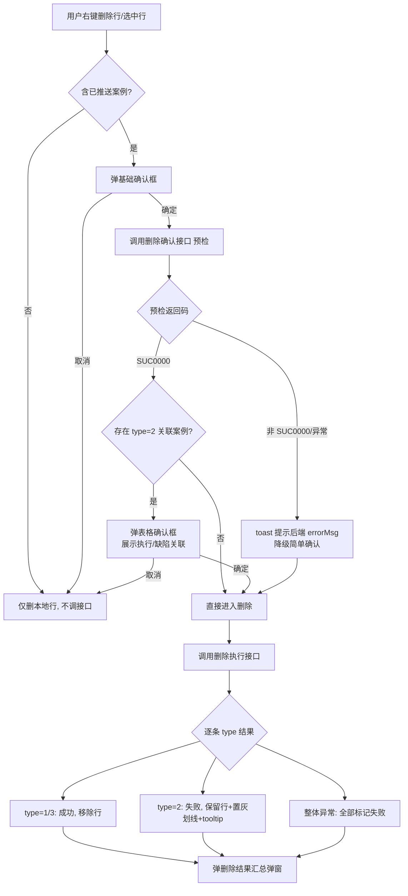
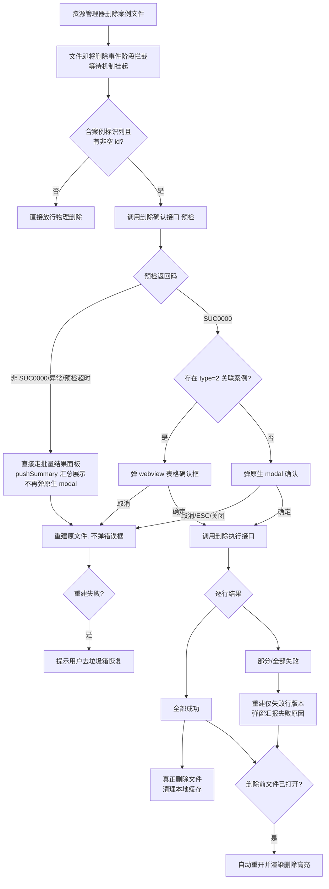
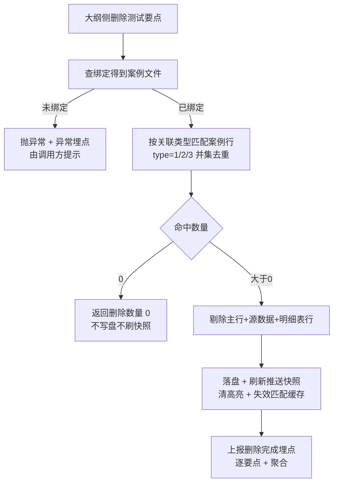

# 删除案例功能需求文档

> 文档视角：业务 / 用户（测试人员、案例编辑者、测试负责人）
> 适用范围：用户对「测试案例」发起删除时，插件与 TMS 平台之间的**同步删除链路**及对应的本地兜底、确认交互、结果反馈与埋点
> 说明：本文档描述「用户需要什么能力、业务规则与验收标准」，不涉及前端 / 后端具体实现方式。
> 章节约定：每个功能模块均按「需求背景与目标」「交互与功能规则」两部分展开。

---

## 1. 总体背景与目标

测试案例维护在「测试任务 / <任务> / 测试案例」目录体系下，案例经推送后已在 TMS 平台落库，并可能关联**执行记录**与**缺陷记录**。当测试人员在本插件内删除一条案例时，不能只删本地文件——否则 TMS 平台会残留"孤儿案例"且执行/缺陷关联无法释放。

当前删除案例存在三类入口，业务诉求各异：

- **编辑器内删除**（右键「删除该行 / 删除选中行」）：用户正在编辑表格，删的是"已推送的具体案例行"，需**同步删除 TMS 平台上的案例及其执行/缺陷关联**，并把成功/失败结果实时反馈回表格。
- **文件删除**（在资源管理器删除整个案例文件）：删除动作发生在编辑器之外，需拦截删除前的"物理删除"，先调线上删除接口，按"行级成功/失败"决定是真正删文件还是**只删成功行、保留失败行**，并对用户做二次确认。
- **要点删除**（在测试大纲内删除关联案例）：在测试大纲侧删除某测试要点时，把该要点关联的所有案例行从本地案例文件中移除（由要点侧逻辑触发，本文档仅描述案例文件侧的清理行为）。

总体目标：保证"删本地"与"删线上"语义一致、结果可观测、失败可兜底，且任何异常都不阻断用户正常的删除操作或文件操作。

---

## 2. 术语与前提

| 术语 | 业务含义 |
|------|----------|
| 测试案例文件 | 位于「测试任务 / <任务> / 测试案例」目录体系下、被插件识别为案例的 `.csv` / `.yaml` / `.yml` / `.json` 文件 |
| testcase_id（tsId） | 案例在 TMS 平台的唯一标识（`sourceId`），是线上删除接口的入参主键 |
| 已推送案例 | 该行的 `testcase_id` 非空，即曾经成功推送过 TMS 平台，删除时需同步线上 |
| 本地未推送行 | 该行的 `testcase_id` 为空，仅存在于本地文件，删除时不涉及 TMS 平台 |
| 删除确认接口（预检） | 删除前调用的「删除确认 / 预检」接口，返回每个待删案例的关联信息（type、是否有执行/缺陷），用于决定是否需要用户二次确认 |
| 删除执行接口 | 真正执行线上删除的接口，返回逐条 `type` 结果（1 成功 / 2 失败 / 3 平台无此案例） |
| type=1 | 线上删除成功（sourceId 真实存在并已删除） |
| type=2 | 线上删除失败（存在关联阻止删除，如仍有未关闭执行/缺陷），需保留本地行 |
| type=3 | sourceId 在平台不存在，按需求仍视为"删除成功"（本地清理），仅作汇总口径区分 |
| 执行关联 / 缺陷关联 | 案例在 TMS 平台绑定的执行记录、缺陷记录；删除案例需同步释放 |
| 测试要点 / 要点文件 | 测试大纲中的条目（如 `.md` / `.xmind` 中的测试点）；要点文件与其关联案例文件通过绑定关系相连，是"要点删除"的触发来源 |
| 明细表（detailTables） | 案例文件中主行之外的子表数据（如步骤明细），与主行按索引关联；删除主行时需同步剔除对应的明细表行 |
| 线上删除案例数（onlineDeleteCount） | 编辑器内删除时，本次实际会调用 TMS 删除接口的行数（预检返回 `type=1` + `type=2` 的总和）；用于确认弹窗首段红字数字，本地新增行不计入 |
| 仅本地删除文件（hardDeleteOnly） | 批量删除场景下，某案例文件被判定为「无需线上操作」（无案例标识列 / 全部行标识为空 / 仅含样例占位 / 空文件）；此类文件仍出现在批量确认弹窗中，但不计入「需同步 TMS」统计口径 |
| 临时文件夹（临时文件） | 项目约定的临时目录，路径中任一**目录段**精确等于「临时文件」；该目录下的 `.csv/.yaml/.yml/.json` **一律不识别为测试案例**，删除时不拦截、不备份、不弹确认 |
| 批量结果面板（pushSummary） | 复用推送结果的汇总面板，删除结果统一以此形式回显（含成功/失败分档、失败原因、可点击定位）；三条删除路径的结果反馈已收敛到此面板 |

---

## 3. 功能需求

### 3.1 编辑器内删除案例（同步删除 TMS 平台案例）

#### 需求背景与目标

用户在表格编辑器内右键删除行时，删的是"已推送的具体案例"。若只删本地表格，TMS 平台会残留孤儿案例且执行/缺陷关联无法释放。本功能目标是：把本次删除的案例标识列表上报扩展端，由扩展端调用线上删除接口**同步删除 TMS 平台案例及其执行/缺陷关联**，并把成功/失败结果实时回传前端，在表格内以"置灰+划线+失败原因"标记失败行、移除成功行。

#### 交互与功能规则

- **触发入口**：编辑器内「删除该行」「删除选中行」等右键操作；仅当本次删除涉及"已推送案例"（案例标识非空）时才发起线上同步，纯本地未推送行只删本地、不调接口。
- **是否已推送的判断标准**（所有删除入口统一以此为准）：
  - 依据案例文件中的「案例标识」列（`testcase_id`）判定：该行该列**存在**且值**非空**（非 `null` / `undefined` / 空串），即视为"已推送"（线上可能存在对应案例）；否则视为"纯本地未推送行"。
  - **排除样例占位**：通过命令创建的模板文件内置一行示例数据，其「案例标识」列是占位文案（如"案例唯一标识，不可修改""TESTCASE_ID"等），虽非空但**不是真实线上标识**，判定为不可推送的样例数据，不触发线上删除。
  - **格式校验非阻断条件**：删除流程不强制校验标识格式（标准 UUID / 前缀+32 位 hex / 掩码 uuid 等合法性由推送预校验负责）；只要非空且非样例占位即走线上删除，真实存在性由后端在删除执行接口中校验。
  - 该判断结果直接决定分流：纯本地未推送行 → 仅本地物理删除、不弹确认、不调接口；已推送行 → 进入基础确认 → 预检 → 执行同步流程。
- **基础确认**：涉及已推送案例的删除，前端先以简单确认弹窗（"删除案例会同步删除 TMS 平台上的案例，此操作不可恢复。是否确定删除？"）征求用户同意；仅本地未推送行的删除不弹此确认。确认通过后才进入下面的预检流程。
- **上报内容**：前端把本次删除的案例标识列表，以及"当前表格案例标识有序快照"一并上报扩展端，供失败行计算"删除后视图行号"。
- **确认前置（预检）**：删除前调用删除确认接口。若接口返回存在 `type=2`（带执行/缺陷关联）的案例，须在确认弹窗内以表格展示这些案例（编号 / 名称 / 执行 Y·N / 缺陷 Y·N），供用户二次确认；`type=1` / `type=3` 不进表格（无需用户额外确认）。
- **口径约束（onlineDeleteCount）**：带表格的确认弹窗首段红字数字必须使用 `onlineDeleteCount`（预检返回的 `type=1` + `type=2` 之和），即"本次实际会调用 TMS 删除接口的行数"；本地未推送行、样例占位行、`type=3`（平台已不存在）**不计入**该口径。文案统一为："谨慎操作：删除案例将同步删除 TMS 平台上的 **N** 条案例，以及这些案例的执行记录和缺陷关联。"
- **表格列结构**：确认弹窗内的关联案例表格统一为 `| # | 编号 | 名称 | 执行 | 缺陷 |` 五列，与文件删除 / 批量删除完全一致；`#` 列仅作前端序号显示，不参与后端逻辑。
- **预检失败不阻断**：预检接口返回非 `SUC0000`、或接口异常、或未绑定任务时，**不阻断删除**，降级为简单确认（不展示关联表格），并以 toast 提示后端 `errorMsg`（文案已包含"删除前校验未通过，已跳过确认步骤"）。用户可能未注意到"预检被跳过"，该 toast 文案即为此兜底提示。
- **执行结果反馈**：
  - `type=1` / `type=3` → 视为删除成功，前端移除该行（不占位）；
  - `type=2` → 失败，前端保留该行并标记"删除失败"（置灰+划线），在 `#` 列以 tooltip 展示接口返回的失败原因；
  - 接口整体异常 / 网络错误 → 所有待删行兜底标记为"删除失败"，并展示接口异常原因，避免行永远停在"删除中"的 pending 态。
- **汇总弹窗**：删除完成后弹出"删除结果"汇总弹窗，罗列成功数、失败数及失败行原因（与文件删除弹窗同款样式）。

**交互流程**：



---

### 3.2 文件删除拦截（按行级成功/失败决定删文件或保留失败行）

#### 需求背景与目标

用户在资源管理器删除整个案例文件时，删除动作由 VSCode 在编辑器之外执行，无法依赖 webview 弹窗。本功能目标是：在文件被物理删除前（即 VSCode 的"文件即将删除"事件）拦截，先调线上删除接口按行同步，再根据结果决定——全部成功则真正删文件；部分/全部失败则**只删成功行、把失败行重建回文件**，并对用户做二次确认；用户取消则完整还原文件、不弹错误框。

#### 交互与功能规则

- **输入形态**：支持三种删除入口，业务规则完全一致（备份→拷回→预检→用户确认→按行分派）：
  - **单个案例文件**：用户在资源管理器右键删除一个 `.csv/.yaml/.yml/.json` 案例文件；
  - **多个案例文件**：Ctrl+A / Shift+多选后一次性删除，聚合到**批量确认弹窗**（Tab 分栏，每个文件一个 Tab；tab 标题与 pane header 均显示**相对工作区的完整路径**，用于区分不同任务下的同名文件，如两个 `login.csv`）；
  - **含案例文件的文件夹**：删除整个测试案例子目录时，插件在"文件即将删除"事件阶段**递归展开**该目录下所有案例文件，与"多个案例文件"共用同一套批量弹窗与备份/恢复流程；文件夹本身与其中的非案例文件不干预，交由 VSCode 正常删除；文件被拷回时会自动重建被 VSCode 递归 unlink 的父目录（`mkdir -p`）。
- **确认表格列结构统一**（三条删除路径硬约束）：单文件确认弹窗、批量确认弹窗内每个 Tab 的关联案例表格、编辑器内右键删除的确认弹窗，**列结构完全一致**：`| # | 编号 | 名称 | 执行 | 缺陷 |`；`#` 列仅作前端序号显示，不参与后端逻辑；`执行` / `缺陷` 列以 `Y` / `N` 显示是否有关联。
- **批量确认弹窗 header 数字口径**：header 主标题必须能一眼呈现"本次批量的构成"，格式为 `删除案例 — 共 N 个文件（M 需同步 TMS·K 案例 / P 仅本地 / Q 跳过）`：
  - `N` = 本次删除事件涉及的**全部**案例文件数（含 hardDeleteOnly 与预检失败）；
  - `M` = 预检通过且**非** hardDeleteOnly 的文件数（这些文件会调用 TMS 删除接口）；
  - `K` = 上述 `M` 个文件的**线上案例数总和**（即各文件预检返回的 `type=1` + `type=2` 合计），hardDeleteOnly 文件的本地行数**不计入**该口径；
  - `P` = hardDeleteOnly 文件数（仅删除本地文件，不涉及 TMS）；`P>0` 时风险卡追加一条"P 个文件仅删除本地（无 TMS 同步）"；
  - `Q` = 预检跳过 / 预检失败 / 无案例标识列 / 空文件的文件数（这些文件本次不会调用 TMS）。
  - 恒等式：`N = M + P + Q`。
- **hardDeleteOnly（仅本地删除）分档语义**：批量场景下，某案例文件在 will 阶段被判定为"无需线上操作"（无案例标识列 / 全部行标识为空 / 仅含样例占位 / 空文件）时，标记为 `hardDeleteOnly=true`，随其他文件一同**出现在批量确认弹窗**中：
  - 该 Tab 内不再渲染关联案例表格，pane 顶部提示"仅删除本地文件（共 <b>K</b> 行），不涉及 TMS 平台"；
  - 该文件的 `caseCount` 视为 0，不进入 header 的 `K`（线上案例数）统计，但通过 `localRowCount` 单独承载本地行数展示；
  - 用户在批量弹窗"确定删除"后，hardDeleteOnly 文件绕过预检 / 执行接口，直接放行物理删除；
  - 单文件路径下的 hardDeleteOnly 场景保持"直接放行、不弹确认"（与 §3.2 原有规则一致），仅批量路径下才在弹窗中呈现该分档。
- **拦截时机**：在"文件即将删除"事件阶段，通过事件提供的"等待完成"机制挂起删除流程，待确认与线上同步完成后再让 VSCode 执行物理删除；"文件已删除"事件阶段负责重建与弹窗。
  - **设计约束**：VSCode 的异步事件发射器以"等待所有挂起 Promise 完成"的方式收口拦截器的拒绝（rejection），即便拦截器抛出异常也只会被静默吞掉为未处理错误，**不会真正中止文件物理删除**。因此采用"先放行等待机制 + 在已删除阶段重建"的模式，而非"抛出异常中止删除"的模式。
- **无需线上操作的文件**：无案例标识列、空文件、或所有行均为本地未推送（「案例标识」列全部为空或仅含样例占位） → 单文件路径直接放行物理删除，不弹确认；批量路径下该文件仍进入批量弹窗但标记为 `hardDeleteOnly`（仅本地删除，见 §3.3 header 口径与 tab 内提示）。
- **是否已推送的判断标准**：与 §3.1 一致——以「案例标识」列是否"存在且非空且非样例占位"判定。文件删除拦截在"文件即将删除"事件阶段先解析文件，收集该列所有非空标识；若收集到的非空标识列表为空，即判定为"无需线上操作"，直接放行物理删除；否则收集这些标识进入预检与执行同步流程。
- **临时文件夹豁免**（三种入口统一）：位于「临时文件」目录段下的 `.csv/.yaml/.yml/.json` 一律不识别为测试案例，删除时**不拦截、不备份、不弹确认、不调接口**，交由 VSCode 直接物理删除；判定口径为「路径中任一目录段精确等于『临时文件』」（`临时文件夹`/`我的临时文件` 等相似名称**不命中**；仅文件名为 `临时文件.json` 也**不命中**）。此规则与推送 / 编辑器打开路径的判定完全对齐。
- **VSCode 原生删除确认的收敛**：本插件在激活时会主动关闭 VSCode 的 `explorer.confirmDelete` 原生弹窗，把删除确认权收敛到本插件的确认弹窗/原生 modal，避免出现"原生弹窗抢跑"与"用户被要求二次确认"的体验割裂。
- **二次确认（用户行为本体）**：
  - 若预检返回 `type=2` 案例 → 弹 webview 内嵌确认弹窗，以表格展示关联案例（编号 / 名称 / 执行 / 缺陷），用户点「确定删除」才继续；
  - 否则 → 弹 VSCode **原生 modal**（不依赖 webview/panel、无需超时兜底），文案为"谨慎操作：删除文件「<文件名>」会同步删除 TMS 平台上的 <N> 条案例及其关联的执行与缺陷关系，此操作不可恢复。是否确定删除？"；
  - 用户取消 / 关闭 / ESC → 标记 `isUserCancel`，did 阶段重建回原文件内容，**不弹任何"删除失败"modal**（取消≠错误）。
- **预检失败不阻断（反馈形式已收敛到 pushSummary）**：预检接口非 `SUC0000`、异常、未绑定任务、或预检硬超时（100s）时，**不再弹原生 modal 二次确认**，而是直接构造一条 `PushFileResult` 走批量结果面板（`showPushSummary`）汇总展示预检失败原因，与批量路径的"全部预检失败"（`allPrecheckFailed`）体验完全一致；文件本体保留不删。用户可从面板中点击定位到具体文件。
- **备份三级降级**（保证"取消即可完整还原"的业务承诺）：will 阶段的备份具备三级降级——① 字节级 `fs.copyFileSync` 到 `os.tmpdir`（99%+ 命中，毫秒级，保留原始注释/空行/字段顺序）；② 一级失败则 fallback 为 `parser.stringify + fs.writeFileSync`（内容级，损失注释/顺序但结构完整）；③ 序列化仍失败则仅保留内存快照（`restoreTableData/restoreSourceData`），did 阶段用 `parser.save` 兜底重建。任意一级成功即可保证用户在任意确认阶段取消时都能恢复文件原状。
- **预检超时约束**：单个文件的预检调用采用双层超时协作——L1 HTTP 层 90s socket idle 超时、L2 硬超时 100s（`PRECHECK_HARD_TIMEOUT_MS`）；触发任一超时即归类为 `precheckFailed`，进入面板聚合展示（不阻塞其他文件、不阻塞用户操作）。
- **按行结果分派**：
  - 全部成功 → 允许 VSCode 真正删除文件，并清理本地缓存（高亮 / 失败 / 快照 / 标记 / 绑定库引用）；
  - 部分失败 / 全部失败 / 接口整体异常 → `needRestore=true`，did 阶段用 `parser.save` 重建"仅失败行"版本（删成功行、保留失败行），并弹窗汇报失败原因；重建后若删除前文件处于打开状态，自动重新打开并回传 `deleteRowsResult` 渲染删除高亮与 `#` 列 tooltip。
- **取消后重建失败兜底**：若用户取消后重建失败（文件已被真正删除），弹原生错误提示引导用户前往垃圾箱恢复。

**交互流程**：



#### 3.2.1 文件夹删除支持（对齐"多文件"批量弹窗）

用户直接删除整个测试案例子目录时，"文件即将删除"事件仅推送**文件夹本身**的 URI，不会展开其中的子文件。为保证与"删多个案例文件"的行为一致，插件在拦截阶段做两步补齐：

1. **will 阶段递归展开**：遇到目录 URI 时同步递归扫描其下所有 `.csv/.yaml/.yml/.json` 案例文件，逐个进入备份流程（备份产物写入 `os.tmpdir`），非案例文件不干预；
2. **did 阶段前缀补捞**：`event.files` 只有文件夹 URI 时，从备份表中按"文件夹路径 + `/`"前缀匹配捞出所有属于本次事件的子案例条目，与单/多文件删除路径共用同一套决策与批量弹窗（分 Tab 展示每个案例文件）；
3. **拷回时 mkdir -p**：文件夹已被 VSCode 递归 unlink 后需要拷回子文件时，恢复流程先 `mkdir -p` 重建目录树再执行 `copyFile`，避免 `ENOENT`。

**完整交互链路（以删除含 3 个案例文件的文件夹为例）**：

```mermaid
sequenceDiagram
    participant U as 用户
    participant V as VSCode
    participant W as onWillDeleteFiles
    participant D as onDidDeleteFiles
    participant M as 备份表 willBackupEntries
    U->>V: 删除文件夹「测试案例/模块A/」<br/>（内含 a.md、b.csv、sub/c.yaml）
    V->>W: files=[folderUri]
    W->>W: isCaseFile=false → isExistingDirectory=true
    W->>W: 递归收集 → [a.md, b.csv, sub/c.yaml]
    W->>M: 备份 3 个案例文件（key=文件绝对路径）
    W-->>V: resolve waitUntil（&lt;100ms）
    V->>V: 递归 unlink（3 个文件 + 子目录 + 父目录）
    V->>D: files=[folderUri]
    D->>M: folderUri 无对应条目 → 记入前缀待补捞
    D->>M: 前缀补捞：以「folderUri + sep」为前缀捞出 3 个孤儿条目
    D->>D: caseFilesInThisEvent = 3 → 进入删除决策
    Note over D: 并行拷回（先 mkdir -p 重建目录树） →<br/>并行预检 → 聚合批量弹窗（分 Tab 展示 3 文件） →<br/>用户决策 → syncDeletedRows × 3 → 真删 / 保留
    D->>U: 显示批量删除确认弹窗（3 个 Tab）
    U->>D: 确定删除
    D->>D: 全部成功真删 / 部分失败重建仅失败行版本
```

**边界与容错**：

- **文件夹内混合内容**：文件夹下同时存在 `.md`（要点文件）、`.DS_Store` 等非案例文件时不做拦截、不做备份，交由 VSCode 正常一并删除；仅案例文件走 backup/restore/预检/弹窗流程。
- **前缀匹配防误伤**：以 `path.sep` 结尾的前缀做严格前缀匹配，避免 `/a/foo` 误捞 `/a/foobar/x.yaml`。
- **深度不限、快速返回**：递归扫描使用同步 API 且吞异常（不可读目录静默跳过），单次扫描完成时间通常 &lt;50ms，绝不阻塞 `waitUntil` 超时。
- **同时选中文件与其父目录**：备份任务使用 `Set` 去重，同一案例文件不会被重复备份；批量弹窗中也只出现一个 Tab。
- **混合选择（文件+文件夹一起删）**：文件走 A 分支直接备份、文件夹走 B 分支递归展开，去重后统一进入 did 阶段决策，用户仍看到聚合后的**单一批量弹窗**。

---

### 3.3 结果反馈与失败兜底统一规则

#### 需求背景与目标

三种入口的删除结果都需"可观测、可兜底"，且对用户的提示口径一致。本功能目标是：统一成功/失败的判定与文案口径，保证任何异常都不静默、也不误报。

#### 交互与功能规则

- **成功口径**：`type=1`（线上真实删除）+ `type=3`（平台无此案例，仍算成功）均计入"删除成功"，汇总时区分（便于排查"为何本地显示删除成功但平台本就没有"）。
- **失败口径**：仅 `type=2`（关联阻止）计入失败；接口未返回某 sourceId 结果时保守按失败处理并提示"接口未返回该 sourceId"。
- **errorMsg 透传**：删除确认接口、删除执行接口返回非 `SUC0000` 时，必须把后端 `errorMsg` 透传给用户（弹窗 / toast），而非仅用前端固定文案；`errorMsg` 为空时带 `returnCode` 兜底提示。
- **不阻断原则**：预检失败、接口异常、未绑定任务等任何非致命错误，都**降级继续**而不是中止删除流程；致命异常（如文件重建失败）才以原生错误提示告知用户。
- **埋点闭环**：每次删除均上报"发起"（携带案例标识列表、任务信息）与"结果"（成功/失败数、汇总分档、**成功 testcase_id 明细**），与编辑器内删除、案例文件删除拦截的埋点事件契约一致；埋点失败不影响主流程。
- **成功 tsId 列表上报口径**：三个"删除完成"事件（`syncDeletedRows.complete` / `editor.deleteRows.synced` / `caseFileDelete.intercept.done`）统一携带以下字段用于事后审计：
  - `syncedTsIds` / `syncedTsIdsCount`：全部成功 tsId（type=1 + type=3）；
  - `deletedSuccessIds` / `deletedSuccessIdsCount`：type=1 明细（线上真实删除）；
  - `deletedSourceMissingIds` / `deletedSourceMissingIdsCount`：type=3 明细（sourceId 不存在）；
  - 单字段字符长度超上限（8000 字符）时按 `id1|id2|...(+N more)` 就近截断，并附加 `<field>Truncated='true'` 标记，Count 字段始终保留真实条数。
- **批量删除汇总事件 `caseFileDelete.batch.done`**：`handleCaseFilesDidDelete` 在 N≥2 分支处理完毕后，除逐文件的 `caseFileDelete.intercept.done`（`batch='true'`）外，再补一条整批汇总事件，包含：
  - 文件维度：`batchTotalFiles` / `batchOnlineFiles` / `batchOnlineSucceededFiles` / `batchOnlineFailedFiles` / `batchHardDeleteFiles` / `batchPrecheckFailedFiles`；
  - tsId 维度：`batchSyncedTotal` / `batchDeletedSuccessTotal` / `batchDeletedSourceMissingTotal`；
  - 明细字段：`batchSyncedTsIds` / `batchDeletedSuccessIds` / `batchDeletedSourceMissingIds`，走同一套 8000 字符截断策略并携带 `Truncated` 标记；
  - 与逐文件事件形成互补：**逐文件事件**支持"下钻到单文件"分析，**汇总事件**支持"批量规模分布 / 成功率"统计，避免后端做 session 关联。
- **埋点维度：批量标识**：所有删除相关事件（含 `intercept.done` / `userCancel` / `deleteResult` / `precheckFailed` 等）均携带 `batch: 'true' | 'false'` 字段区分单文件与批量场景，便于后端按维度聚合失败率与取消率。
- **顶层不阻断兜底**：`onDidDeleteFiles` 阶段的删除决策通过 fire-and-forget 方式触发，其顶层 catch 会捕获任意未处理异常并记录到本地日志，同时上报 `caseFileDelete.did.uncaught` 埋点事件；`finalizeHardDelete` 中真实 unlink 失败（错误码非 `ENOENT`）会向上抛出并被上层捕获，避免用户看到"文件删除失败但无提示"的静默场景。
- **pushSummary 聚合粒度**：三条删除路径的结果反馈统一以**文件**为最小聚合单元展示：批量结果面板中每个案例文件是一行，成功/失败行数在该行内以计数或子列表形式呈现；用户点击某行可直接打开对应文件定位；跨文件不做行级混合展示。
- **反馈形式对照表**（本轮已完成的三路径 × 结果四档收敛）：

  | 路径 | 全部成功 | 部分/全部失败 | 用户取消 | 预检失败（含超时） |
  |------|----------|----------------|----------|----------------------|
  | 编辑器内删除 | 汇总 modal（成功计数） | 汇总 modal + 行标记（置灰/划线/tooltip） | 无反馈（不弹提示） | toast + 降级简单确认 |
  | 单文件删除 | 批量结果面板（pushSummary） | 批量结果面板 + 文件重建为"仅失败行"版本 | 无反馈（重建原文件） | 批量结果面板（不再弹原生 modal） |
  | 批量删除 / 文件夹删除 | 批量结果面板（pushSummary） | 批量结果面板 + 文件按行重建 | 无反馈（全部文件拷回） | 批量结果面板（allPrecheckFailed 直达面板，跳过确认弹窗） |

  收敛原则：**单文件与批量的结果反馈统一走 pushSummary**（含预检失败）；仅编辑器内删除因位于表格视图上下文中，保留 modal 汇总以贴近表格操作。

---

### 3.4 要点删除关联案例（从本地案例文件移除关联行）

#### 需求背景与目标

测试大纲（`.md` / `.xmind` 等要点文件）与案例文件通过绑定关系关联。当用户在要点侧删除某个"测试要点"时，需要把该要点在其绑定案例文件中命中的**所有关联案例行**从本地案例文件移除，避免出现"幽灵行"（要点已删、案例文件还残留关联记录）。

本功能由测试大纲侧触发：当用户在测试大纲删除某个测试要点时，把该要点在其绑定案例文件中命中的关联案例行从本地案例文件移除，并同步维护推送快照、高亮等追踪存储，避免出现"幽灵行"。

#### 交互与功能规则

- **触发入口**：在测试大纲侧针对某个测试要点发起"删除关联案例"（单要点），或一次删除多个要点的关联案例（多要点）。由要点侧大纲树 / CodeLens / 命令等入口统一调用删除关联案例方法（支持单要点与多要点两种入参）。
- **绑定解析**：根据要点文件路径（`pointFilePath`）查绑定得到关联案例文件路径；若该要点未绑定任何案例文件，则抛错（视为异常，由调用方提示用户）。
- **匹配语义（与"查看关联案例"完全一致）**：复用要点-案例关联匹配引擎，按关联类型分档：
  - `type=1`：案例的父级标识命中该要点且路径归一化相等；
  - `type=2`：仅路径归一化相等（父级标识未命中）；
  - `type=3`：仅父级标识命中。
  - `pointName` **不参与匹配**（仅用于日志/分组/回显）；`pointPath` 必须是「功能条目前缀 + '/' + pointName」的**完整路径**，deleter 内部不会用 pointName 自动补齐或截断。
- **入参约束**：`pointId` 与 `pointPath` 至少一个非空；仅传 `pointName` 抛错；多要点场景下任一要点两项皆空也抛错。
- **多要点并集语义**：多个要点之间为"并集"——命中其中**任意**要点的案例都会被删除；同一案例即使同时命中多个要点，也**只剔除一次**（不会重复删除）。
- **命中 0 条**：不写盘、不刷新推送快照、不报错，返回删除数量 0（属正常"无关联案例可删"）。
- **本地落盘与追踪清理（仅在命中后执行）**：按主行索引同步剔除主表行、源数据、以及明细表中对应的子表行，重新写盘，并：
  - 全量刷新推送快照（等价于用户认可当前磁盘为新基线）；
  - 清除该文件的高亮态（删除行的高亮索引已失效）；
  - 失效关联匹配引擎的内存缓存，避免下次匹配拿到已删除记录的旧快照。
- **并发安全**：使用 per-file 异步锁，与"推送成功回写 testcase_no"共用同一把锁，避免并发覆盖同一案例文件（parse → mutate → save 三步互斥）。
- **异常兜底**：入参非法 / 未绑定 / 案例文件不存在 / 类型不支持 / 解析或保存失败，统一抛错并上报"删除关联案例异常"埋点；追踪存储刷新（快照 / 高亮）的个别失败不阻断主删除流程（仅记录日志）。

**交互流程**：



---

## 4. 验收标准

1. **编辑器内删除同步线上**：在编辑器内删除一条已推送案例，TMS 平台对应案例被同步删除；前端表格中该行被移除，汇总弹窗显示成功 1 条。
2. **编辑器内失败行保留可见**：构造一条存在执行/缺陷关联的案例（type=2）删除，前端保留该行并置灰+划线，`#` 列 tooltip 展示接口返回的失败原因，汇总弹窗显示失败 1 条。
3. **预检失败不阻断**：mock 删除确认接口返回非 `SUC0000`，编辑器内仍可按简单确认继续删除，且出现 toast 提示后端 `errorMsg`（含"已跳过确认步骤"）。
4. **文件删除按行分派**：删除一个含多条已推送案例的文件，部分行 type=2 失败时，文件被重建为"仅失败行"版本，成功行被真正删除，弹窗汇报失败原因；删除前已打开的文件重建后自动重开并渲染失败高亮。
5. **文件删除用户取消还原**：在原生 modal 点取消，文件完整保留（无任何行被删），且不弹"删除失败"modal。
6. **文件删除预检失败已收敛到 pushSummary**：mock 删除确认接口返回非 `SUC0000` 或预检硬超时（≥100s），单文件删除**不再弹原生 modal**，而是直接弹出批量结果面板（pushSummary）展示预检失败原因，与批量路径的 `allPrecheckFailed` 体验一致；文件本体保留不删。
7. **type=3 视为成功**：删除一个平台已不存在的 sourceId（type=3），本地按成功清理，汇总分档计入"平台无此案例"而非失败。
8. **本地未推送行不调接口**：删除仅含本地未推送行（案例标识为空）的文件，不触发任何线上删除接口调用，文件正常删除。
9. **errorMsg 透传**：删除执行接口返回非 `SUC0000`，弹窗/汇总中明确展示后端 `errorMsg`（非空时），而非固定文案。
10. **埋点闭环**：一次完整的编辑器内删除 / 文件删除，后台能收到对应的"发起"与"结果"事件，且携带案例标识列表与任务信息。
11. **要点删除从本地案例文件移除关联行**：在要点侧删除某测试要点的关联案例，案例文件中的关联行被移除并落盘，追踪存储（snapshot / 高亮 / linker 缓存）同步更新。
12. **要点删除匹配语义正确**：构造关联类型为 1 / 2 / 3 的三种关联案例，删除对应要点后，三种类型关联行均被移除；要点名称单独变化（父级标识与路径不变）不应影响匹配结果。
13. **要点删除多要点并集去重**：一次删除多个要点，同一案例即使同时命中多个要点，也只在文件中被剔除一次（无重复行残留、无重复删除）。
14. **要点删除命中 0 条不写盘**：要点未关联任何案例时，删除操作返回 `deletedCount: 0`，案例文件内容不变、不产生写盘与 snapshot 刷新。
15. **要点删除异常可观测**：对未绑定案例文件的要点发起删除，抛出明确异常并上报"删除关联案例异常"埋点，由调用方提示用户，且不破坏案例文件原内容。
16. **文件夹删除递归展开**：删除一个包含 N（N≥2）个已推送案例文件的测试案例子目录，插件在 will 阶段递归收集这 N 个文件并全部备份；用户看到**同一个批量弹窗**（分 N 个 Tab），完成审阅并确认后，N 个案例被同步删除、文件夹被真正 unlink。
17. **文件夹删除用户取消还原**：在批量弹窗点取消 / ESC，N 个案例文件与其父目录树被完整拷回（含 `mkdir -p` 重建目录），文件系统状态与删除前一致，不弹"删除失败"modal。
18. **文件夹删除混合内容**：删除一个既含案例文件又含非案例文件（如 `.md` 要点、`.DS_Store`）的目录时，非案例文件不进入拦截流程、不备份，随 VSCode 正常一并删除；案例文件按 §3.2 规则处理。
19. **确认表格列结构统一**：三条删除路径（编辑器内 / 单文件 / 批量）的确认弹窗表格结构均为 `| # | 编号 | 名称 | 执行 | 缺陷 |`；`#` 列仅显示前端序号，批量弹窗内**每个文件的表格独立从 1 开始编号**，不跨文件累加。
20. **编辑器内删除口径正确**：编辑器内右键删除若干行，其中含 A 条已推送、B 条本地新增、C 条平台已不存在（type=3）；确认弹窗首段红字数字为 `A - C`（即 type=1 + type=2 合计），B 条本地行与 C 条 type=3 均不计入首段数字。
21. **批量确认弹窗 header 口径正确**：一次批量删除 5 个文件——2 个走 TMS 同步（案例数分别 10 / 3）、1 个 hardDeleteOnly（本地 4 行）、2 个预检失败；header 显示 `共 5 个文件（2 需同步 TMS·13 案例 / 1 仅本地 / 2 跳过）`，风险卡追加"1 个文件仅删除本地（无 TMS 同步）"；hardDeleteOnly 文件的 tab pane 顶部显示"仅删除本地文件（共 4 行），不涉及 TMS 平台"。
22. **临时文件夹豁免**：在项目内任一深度的"临时文件"目录下（如 `<workspace>/临时文件/x.csv`、`<workspace>/子目录/临时文件/sub/y.yaml`）删除案例文件 / 文件夹 / 批量删除时，插件**完全不拦截**——无备份、无预检、无确认、无 pushSummary，全部交由 VSCode 直接物理删除；相似目录名（`临时文件夹` / `我的临时文件`）不豁免、仍走正常拦截流程。
23. **预检超时降级正确**：mock 预检接口延迟 120s 不返回，单文件删除在 100s 触发硬超时，直接走批量结果面板展示"预检超时"原因，文件保留不删；同一批量事件中的其他文件的预检不受该文件超时阻塞（各文件预检并行）。
24. **批量全部预检失败直达面板**：批量事件中所有文件预检均失败（allPrecheckFailed），**不再弹批量确认弹窗**，直接展示批量结果面板汇总失败原因；全部文件保留不删。
25. **埋点携带成功 testcase_id 列表**：完成一次删除后，对应的"完成"埋点事件（`syncDeletedRows.complete` / `editor.deleteRows.synced` / `caseFileDelete.intercept.done`）中，`syncedTsIds` / `deletedSuccessIds` / `deletedSourceMissingIds` 字段能查到本次成功的 testcase_id 明细；`Count` 字段与真实条数一致；构造 ≥1000 条 tsId 的批量成功，观察上报字段被截断为 `id1|id2|...(+N more)` 且长度不超过 8000 字符，同时携带 `Truncated='true'` 标记。
26. **批量删除汇总事件 & batch 标记**：一次批量删除 5 个文件（其中 3 个走 TMS 同步、1 个 hardDeleteOnly、1 个预检失败），完成后：（a）恰好上报 4 条 `caseFileDelete.intercept.done`（对应实际执行删除决策的文件），每条都带 `batch='true'`；单文件独立删除时该字段为 `batch='false'`。（b）额外上报 1 条 `caseFileDelete.batch.done`，其中 `batchTotalFiles=5` / `batchOnlineFiles=3` / `batchHardDeleteFiles=1` / `batchPrecheckFailedFiles=1`；`batchSyncedTotal` = 三个 TMS 文件成功 tsId 总数；`batchSyncedTsIds` 字段包含所有成功 tsId 合集（超长时截断）。

---

## 5. 与其他模块的边界

- **要点删除（从本地案例文件移除关联行）**：在测试大纲内删除关联案例，本插件把该要点关联的案例行从本地案例文件移除并维护追踪存储（见 §3.4）。它与 §3.1 / §3.2 是两条不同的触发路径：前者由测试大纲侧发起、作用于绑定案例文件中的关联行，后者由用户在编辑器内 / 资源管理器中发起、作用于被删除的具体案例。
- **推送失败度量**：删除结果的成功/失败口径与 `docs/requirements/push-failure-metrics-requirements.md` 中的失败度量口径正交，删除失败不计入推送失败。
- **埋点体系**：删除相关事件在埋点事件清单的"编辑器内删除案例""案例文件删除拦截"章节维护，本文档不重复定义事件契约。
- **本地缓存清理**：删除成功后需清理的本地态（高亮 / 失败 / 快照 / 标记 / 绑定库引用）由各 store 的 `removeXxx` 接口负责，本文档仅规定"成功即清理"的业务规则。

---

## 附录：异常场景决策树

> 原则：**非致命错误降级继续，致命错误才显式告知**；任何异常都不静默、也不阻断用户正常的删除/文件操作。

### B.1 编辑器内删除

| 异常场景 | 触发条件 | 决策 | 用户感知 |
|----------|----------|------|----------|
| 预检接口非 SUC0000 | 删除确认接口返回业务错误码 | 不阻断，降级简单确认 | toast 提示后端 errorMsg（含"已跳过确认步骤"） |
| 预检网络/接口异常 | 连接超时、解析失败 | 不阻断，降级简单确认 | toast 提示异常信息 |
| 未绑定测试任务 | 文件无任务绑定 | 不阻断，降级简单确认 | toast 提示"未绑定任务" |
| 执行接口非 SUC0000 | 删除执行接口返回业务错误码 | 全部标记失败 | 汇总弹窗展示 errorMsg |
| 执行接口逐条 type=2 | 存在关联阻止删除 | 仅该行失败，其余按各自结果 | 失败行置灰+划线+tooltip |
| 执行接口整体异常 | 网络中断、服务宕机 | 全部标记失败 | 汇总弹窗展示异常原因 |
| 接口未返回某 sourceId | 结果缺漏 | 保守按失败 | 提示"接口未返回该 sourceId" |

### B.2 文件删除拦截

| 异常场景 | 触发条件 | 决策 | 用户感知 |
|----------|----------|------|----------|
| 预检非 SUC0000 / 异常 / 未绑定 / 硬超时 100s | 预检阶段所有失败型场景 | 保留文件 + 走批量结果面板 pushSummary | 面板展示失败原因，可点击定位到文件；不再弹原生 modal |
| 用户取消 / ESC / 关闭 | 任意确认阶段 | 重建原文件 | 无错误弹窗（取消≠错误） |
| 执行全部成功 | 所有行 type=1/3 | 真正删文件 + 清缓存 | 成功通知 |
| 执行部分 / 全部失败 | 存在 type=2 / 整体异常 | 重建仅失败行版本 | 弹窗汇报失败原因 |
| 用户取消后重建失败 | 文件已被物理删除且重建异常 | 致命，显式告知 | 提示"文件已被删除且重建失败，请前往垃圾箱恢复" |
| 无案例标识 / 空文件（单文件路径） | 无需线上操作 | 直接放行物理删除 | 无确认、无弹窗 |
| 无案例标识 / 空文件（批量路径） | 无需线上操作，但需与其他文件共同呈现 | 在批量弹窗中标记 `hardDeleteOnly`，pane 内提示"仅删除本地文件"；用户确认后绕过预检直接放行 | 弹窗内可见该文件条目、header 计入 `P 仅本地` |
| 临时文件夹（任一深度目录段 = "临时文件"） | 三入口统一豁免 | 不拦截、不备份、不预检、不弹窗，交由 VSCode 直接物理删除 | 与普通非案例文件删除表现一致 |
| 批量事件顶层未捕获异常 | `onDidDeleteFiles` fire-and-forget 抛未处理错误 | 顶层 catch 记录日志 + 上报 `caseFileDelete.did.uncaught` 埋点 | 不影响文件系统状态，后台可观测 |

### B.3 要点删除

| 异常场景 | 触发条件 | 决策 | 用户感知 |
|----------|----------|------|----------|
| 要点未绑定案例文件 | 查绑定为空 | 抛异常 | 异常埋点 + 调用方提示，原文件不动 |
| 案例文件不存在 / 类型不支持 | 路径/格式问题 | 抛异常 | 异常埋点 + 调用方提示 |
| 入参非法 | pointId 与 pointPath 皆空 | 抛异常 | 异常埋点 + 调用方提示 |
| 解析 / 保存失败 | 文件损坏 / 写入异常 | 抛异常 | 异常埋点 + 调用方提示，原文件不动 |
| 追踪存储刷新失败 | 快照/高亮刷新异常 | 不阻断主流程 | 仅记录日志，删除已完成 |
| 命中 0 条 | 无关联案例 | 正常返回 0 | 不写盘、不刷快照、不报错 |
