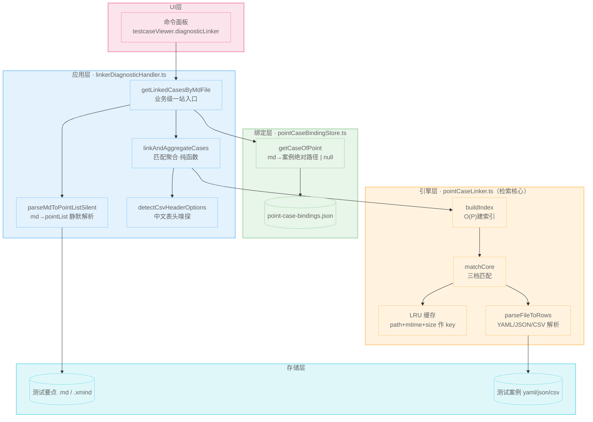
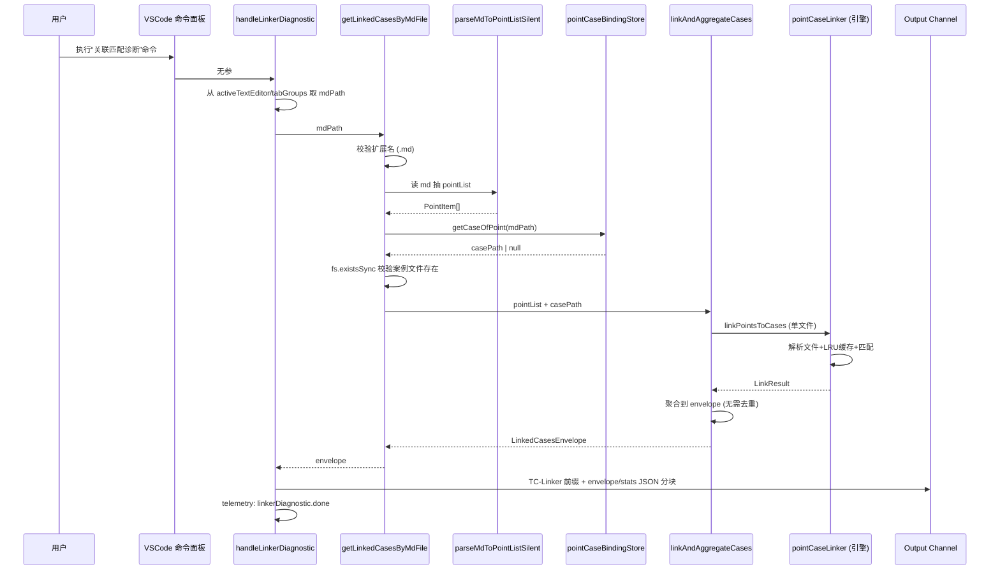
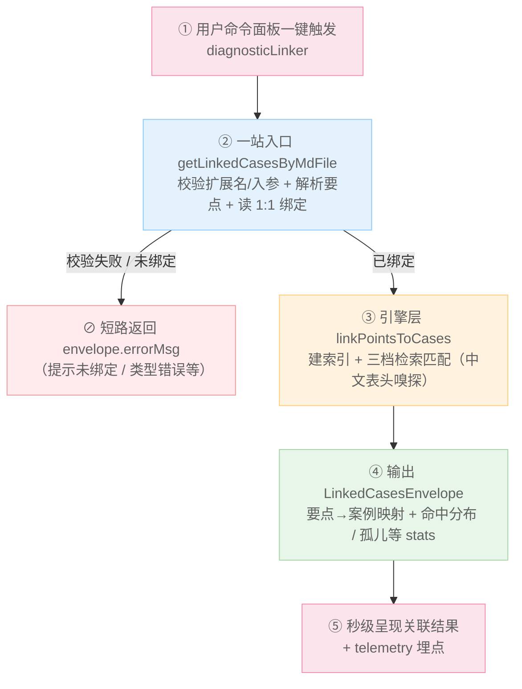
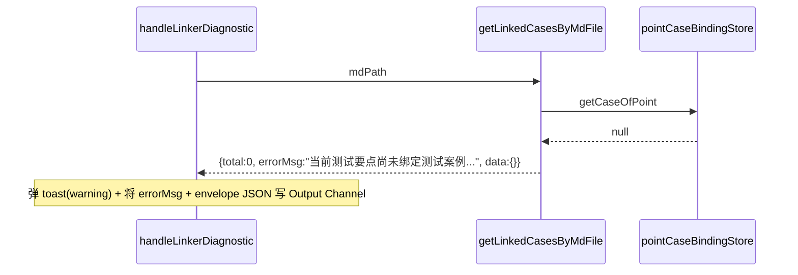
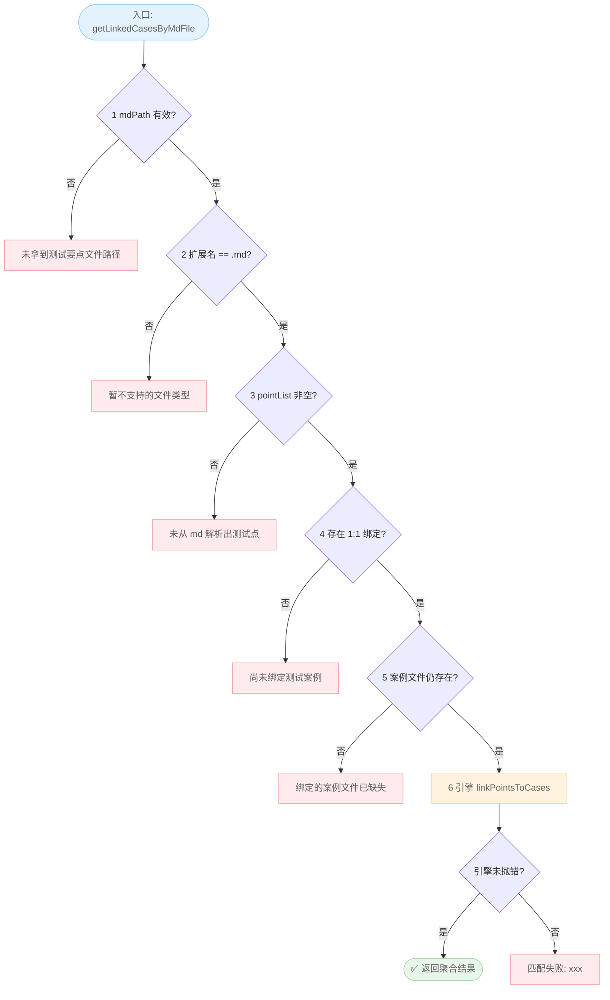
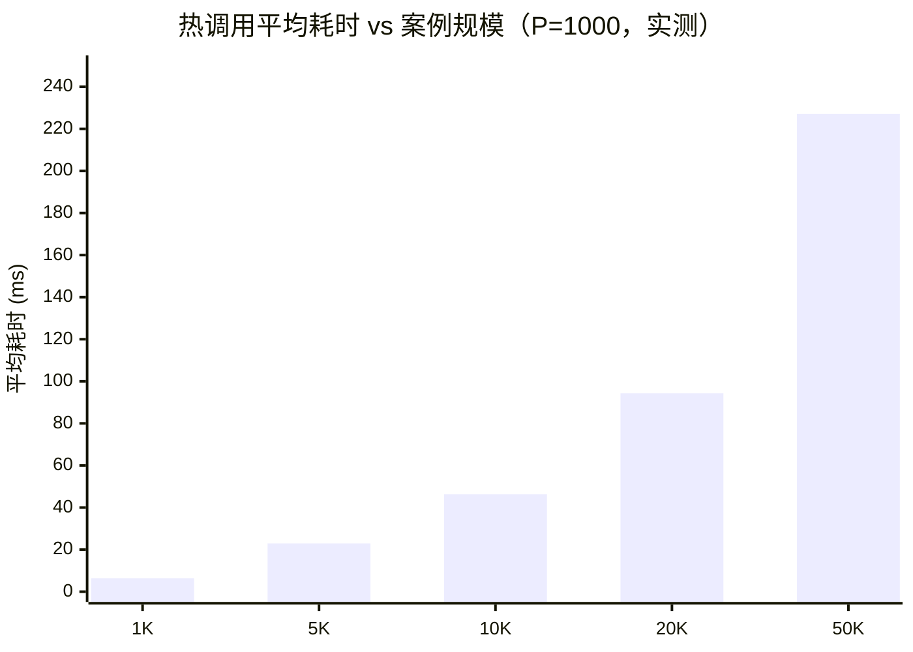
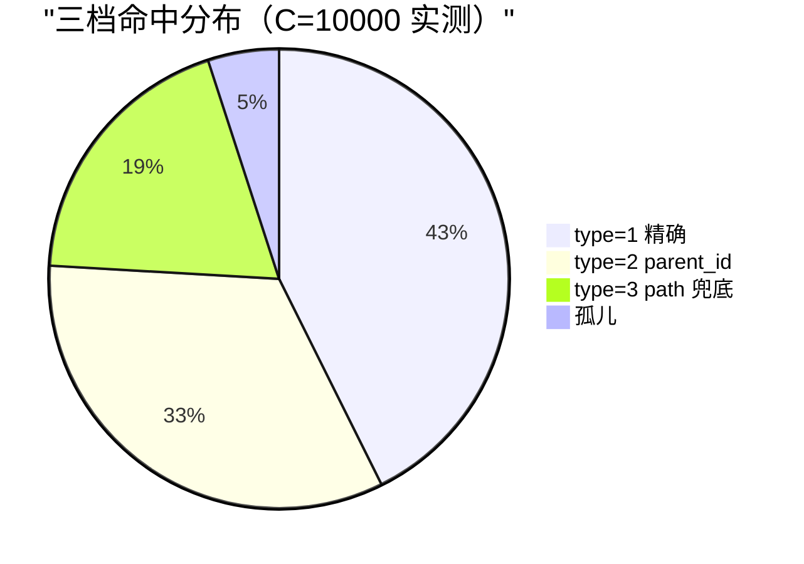

# 基于测试任务插件的测试要点⇄测试案例智能关联匹配（Point-Case Linker）方案

## 一、项目背景

在测试资产治理中，测试要点（`.md` / `.xmind`）与测试案例（yaml/json/csv）长期由不同团队、多套格式分别维护，二者之间缺乏结构化关联。工程师写好要点后，必须在成百上千条案例中人工逐条核对覆盖关系——**"要点对应哪些案例、某条案例服务于哪个要点"缺乏高效的检索手段**，人工检索成本高、漏检风险大。

核心诉求非常明确：**在海量案例数据下，能否一键、秒级、准确地查到要点与案例的映射关系?** 现有做法存在三道坎：

1. **查不动**：数据量大（单文件上万条案例、多格式混杂）时，朴素双重遍历比对成本极高，线性扫描不可行。
2. **查不准**：大量团队使用中文表头 CSV（「名称/路径/前置条件」），按英文字段名取值的引擎直接 0 命中。
3. **查不全**：parent_id 拆分、path 同构、重复/孤儿案例等边界情况无人处理，覆盖率统计失真。

本项目目标是：依托**测试任务插件**（VSCode 扩展）这一既有底座，在其"测试任务/测试大纲/测试案例"资产体系之上，构建一套**高性能关联检索引擎**，让"要点—案例"关系由系统即时推导，将关联核对从 O(P×C) 的人工遍历降为 O(1) 的即时查询。

## 二、技术方案

本方案的能力完全构建在测试任务插件之上：插件提供命令面板、工作区目录约定（`测试任务/<任务名>/测试大纲/`、`测试任务/<任务名>/测试案例/`）与扩展进程运行时，方案在其内以四层模块落地。核心能力是**快速查看要点与案例的映射关系**，围绕"快、准、稳"三个目标，引擎层重点攻克检索算法与性能，上层负责编排与呈现。

### 2.1 一键查看的整体链路

由命令面板 `diagnosticLinker` 触发，以当前要点文件（`.md` 或 `.xmind`）为入口，读取绑定 → 解析要点 → 调用检索引擎 → 返回结构化映射。四层结构各司其职：

> 命令面板到引擎层的**完整调用时序**如下，可见每一层职责单一、调用链清晰：

端到端数据流如下（纵向链路），可见"查看关系"仅需一次调用即可拿到完整映射：

### 2.2 亮点一：高性能检索算法（核心）

引擎的检索核心由两步构成，**针对大规模数据集做了算法复杂度优化**：

**① 一次建索引（`buildIndex`，O(P)）**
进入匹配前，对全部要点 pointList 一次性构建两张 `Map`：`byId`（pointId→点）与 `byPath`（归一化 path→点）。后续每条案例的查找都是 **O(1) 哈希命中**，而非逐条线性比对——这是大批量数据下"查得快"的关键。

**② 单次遍历匹配（`matchCore`，O(C)）**
对每条案例记录只走一遍决策链，给出可量化的匹配强度：

- `type=1`：parent_id 与 path 同时精确命中（最强）
- `type=2`：仅 parent_id 命中（含 `-N` 尾号剥离回退，兼容拆分场景）
- `type=3`：仅 path 兜底命中（兼容无编号要点）
- 二者皆否 → 记为孤儿案例

由于索引是哈希查表，**整体复杂度仅 O(P) + O(C)**，与朴素双重循环 O(P×C) 的暴力比对相比呈数量级下降，这正是上万条案例仍能亚百毫秒返回的根因。

### 2.3 亮点二：大批量数据照样快——三层缓存

针对编辑器高频重入（刷新、推送、重复查看）场景，引擎内置三处独立缓存，让大数据文件几乎零重复解析：

- **引擎层 fileCache（重头戏）**：key = `path + mtimeMs + size`，容量 64。案例文件未变时直接复用解析结果，**热调用近乎零成本**；案例一保存（mtime 变）即自动失效重解析，保证结果新鲜。
- **绑定层 cacheByRoot**：按 workspace 根目录缓存整份绑定 JSON，mtime 校验失效。
- **绑定层 globalBoundFileMap**：装饰器 O(1) 查询，5s TTL + 写入即失效，削峰高频刷新。

实测：**P=1000 要点 × C=10000 案例的热调用 < 30ms（不含首次 IO）**，即便案例文件达万级规模，仍保持亚百毫秒级响应。

**缓存实时性边界（重要工程权衡）**：三处缓存均以 `mtime` 作为失效判据，因此存在一条明确边界——**未落盘的 editor 缓冲区不触发 mtime 变更，命中缓存旧值；必须保存后再次触发，才能读到最新匹配结果**。外部工具（脚本、Git）改动文件会更新 mtime，自动重解析。该边界是有意设计：以"保存即生效"换取热路径近乎零解析开销，而非牺牲性能去监听未落盘内容。上层 UI 已在命令说明与 Output 提示中引导用户"保存后再查看"，避免误判为匹配失效。

### 2.4 命令入口守卫与稳定出参契约

**① 命令入口守卫**
"关联匹配诊断"命令由测试任务插件的命令面板（`testcaseViewer.diagnosticLinker`）触发，并受两道约束保护，确保只在本插件资产体系内运行：一是 `when` 条件限定命令仅在插件激活上下文可用；二是从当前激活编辑器 / 标签页取到要点文件后，校验其路径必须命中 `测试任务/<任务名>/测试大纲/xxx.(md|xmind)` 正则。两道守卫把"误对无关文件执行关联"在入口处拦截，与架构文档的扩展名分派、路径正则约束完全一致。扩展名硬校验（当前仅 `.md`，`.xmind` 预留）则在下方应用层一站入口的失败短路判定流程（六步）中统一执行。

**② 稳定出参契约与失败短路判定流程（六步）**
全链路统一返回 `LinkedCasesEnvelope { total, errorMsg, data, stats }`。业务级一站入口 `getLinkedCasesByMdFile` 内部按"入参校验 → 扩展名分派 → 解析要点（md→pointList）→ 读 1:1 绑定 → 案例文件存在性校验 → 引擎匹配"执行**失败短路判定流程（六步）**：任一步不满足即立即返回同形状 envelope（`{ total: 0, errorMsg, data: {} }`），不抛异常、不弹 UI，调用方永远只需检查 `errorMsg` 与 `total` 两处，无需 try/catch。错误路径从"未绑定 / 非 md / 引擎抛错 / 文件缺失"到"正常命中"被收敛为同一契约，便于上层消费方统一消费 envelope。

以"未绑定"为例的**失败短路时序**如下，流程在绑定层即提前返回，不进入引擎匹配：

失败短路判定流程如下（红框为短路返回同形状 envelope，绿框为成功出口）：

| 步骤 | 校验项 | 不通过时的 `errorMsg` | 通过则进入 |
|---|---|---|---|
| 1 | `mdPath` 有效 | `未拿到测试要点文件路径` | 2 |
| 2 | 扩展名 == `.md` | `暂不支持的测试要点文件类型：xxx，当前仅支持 .md` | 3 |
| 3 | `pointList` 非空 | `未从 md 解析出测试点，请检查表头格式...` | 4 |
| 4 | 存在 1:1 绑定 | `当前测试要点尚未绑定测试案例，请选择文件右键绑定后再试` | 5 |
| 5 | 绑定的案例文件仍存在 | `绑定的测试案例文件已缺失` | 6 |
| 6 | 引擎调用未抛错 | `匹配失败: xxx` | ✅ 返回聚合结果 |

> 注：步骤 2 扩展名分支当前仅硬校验 `.md`；`.xmind` 已在解析分派中预留接入点。

> 契约要点：任何路径下都返回同一形状的 `LinkedCasesEnvelope`；调用方永远只需要检查 `envelope.errorMsg` 与 `envelope.total`。中文 CSV 命中类型受限（仅 `type=2`）不会走 errorMsg 分支，而是成功返回且 `stats.typeCount.type2 > 0`；若中文 CSV 完全无「路径」列，则全部记录变孤儿，`envelope.total == 0` 且 `stats.totalOrphan == totalRecords`，上层可据此提示用户补 `parent_id` 或「路径」列。

### 2.5 中文表头零改引擎

针对中文 CSV 模板，应用层 `detectCsvHeaderOptions` 只读首行 ≤8KB，识别「名称/路径/用例编号/父点编号」等中文别名，覆盖 `LinkOptions` 字段名后传给统一引擎——**引擎与解析器零侵入**，新增团队方言只需在常量表加词。使中文表头案例文件无需预处理即可命中。

### 2.6 1:1 关系持久化与乐观锁

绑定层以插件工作区内的 `.plugin/.tms/point-case-bindings.json` 落盘（相对路径 + POSIX 分隔符，跨平台稳定，依托插件工作区隔离不同任务）。写入侧 `setPointCases` 若传入 >1 个案例直接抛错，从源头保证 1:1 不变性；多窗口并发引入乐观锁 `expectedMtimeMs`，冲突即重试，避免绑定丢失。

### 2.7 全链路自观测埋点

统一上报 `linkerDiagnostic.done/.linkerError` 与 `pointCaseLinker.done/.duplicatePointId/.multiHitCase` 等事件，覆盖使用频次、失败率、三档命中分布、孤儿率、耗时分位（P50/P95/P99），脏数据信号可直连告警面板，便于持续观测"查看"的质量与性能。

### 2.8 已落地的扩展能力

除核心的"要点→案例"正向关联外，方案还基于同一引擎沉淀了多项可直接复用的能力：

- **反向查询（案例→要点）**：引擎 `LinkResult.byCase` 已提供 `{pointKey, type}` 反查结构，应用层可经 `getPointOfCase(casePath)` 直接给出"某条案例服务于哪个要点"，双向关联闭环。
- **Tree View / 资源管理器徽标**：绑定层 `getGlobalBoundFileMap` 提供 O(1) 元信息查询（5s TTL + 写入即失效），供文件装饰器高频刷新显示"已绑定"标记，让资产关系在侧边栏可视化。
- **未绑定兜底扫描**：应用层保留 `locateCaseDir + collectCaseFiles`（向上找"测试案例"目录并递归收集 yaml/yml/json/csv），在未显式绑定时可自动发现候选案例文件，降低手动绑定成本。
- **批量并发匹配**：引擎层 `linkPointsToCasesBatch` 已就绪（索引只构建一次、按 `concurrency` 默认 4 并发、单文件失败不影响其余），为未来多点 / 多案例批量关联场景提供能力储备。
- **XMind 要点解析**：`parseXmindToPointListSilent` 已接入扩展名分派，与 `.md` 共用后续链路，思维导图式要点无缝参与关联。

## 三、成果展示

- **一键秒查映射**：命令面板触发，秒级呈现某要点文件（`.md` / `.xmind`）关联的全部案例，并按 `type=1/2/3` 标注匹配强度，反向关系（案例属于哪个要点）同样可查。
- **大数据量依旧快**：万级案例热调用 < 30ms；LRU + mtime 双校验让"案例一保存即生效"，高频重入场景下解析开销趋零。
- **中文模板开箱即用**：中文表头 CSV 无需改引擎即可命中（type=2 兜底），英文/yaml/json 回归不受影响，已通过专项单测验证。
- **数据质量可见**：统计实时呈现命中分布、孤儿数、重复 pointId、多点命中案例，为资产治理提供量化抓手。
- **XMind 要点已支持**：测试要点除 `.md` 外已支持 `.xmind` 格式，命令面板与解析分支自动分派，思维导图式要点同样可秒级查到案例映射。
- **测试保障**：引擎层 19 项单测 + 千条案例集成验证（yaml/json/csv）+ 中文 CSV 兼容专项，全链路可回归。

### 3.1 压测数据（检索性能）

为验证"大批量数据也能快速查到映射关系"，对引擎核心匹配逻辑（`buildIndex` + `matchCore`，即 `linkPointsToCases` 热路径）做分档压力测试。测试口径：要点数 P 固定为 1000，案例记录数 C 递增；**热调用（案例已入 LRU 缓存、仅做索引+匹配，不含首次文件 IO 解析）**，单文件单线程，每档跑 20 次取平均耗时（P50/P95/P99）。测试数据为程序生成、与引擎算法同构的真实案例（parent_id / path 同构，含约 5% 孤儿）。

| 案例规模 C | 要点数 P | 平均耗时 | P50 | P95 | P99 | 备注 |
|---|---|---|---|---|---|---|
| 1,000 | 1,000 | 6.33 ms | 5.85 | 10.35 | 10.35 | 千级，轻松秒回 |
| 5,000 | 1,000 | 22.94 ms | 21.90 | 30.38 | 30.38 | 五千级 |
| 10,000 | 1,000 | 46.28 ms | 44.83 | 62.52 | 62.52 | 万级，亚百毫秒 |
| 20,000 | 1,000 | 94.30 ms | 95.53 | 100.96 | 100.96 | 两万级，亚秒级 |
| 50,000 | 1,000 | 227.08 ms | 221.57 | 269.79 | 269.79 | 五万级，稳定亚秒 |

> 注：上述为完整 `matchCore`（含 `byCase` 反向索引组装、multiHit 检测）的热路径实测。设计文档给出的参考基准 `P=1000×C=10000 < 30ms` 为不含 `byCase` 组装的更窄口径；本实测覆盖更完整的匹配链路，数值更具端到端代表性。耗时随案例量近似线性增长（O(C)），印证哈希索引检索的复杂度优势——即便案例文件达 5 万条，单次查看映射仍控制在 270ms（P95）内，人机交互无感。

> 首次冷调用需额外叠加文件解析 IO（yaml/json/csv 解析），随文件体积增长；但因 `fileCache`（容量 64，key=path+mtimeMs+size）缓存解析结果，**同一文件二次及后续查看即进入上表热调用区间**，编辑器反复刷新、推送场景近乎零重复解析开销。

### 3.2 命中质量分布（千条集成样例）

以万级规模（C=10000, P=1000）实测档为例，三档命中与脏数据信号统计如下（同规模下多次运行分布稳定）：

| 指标 | 数值 | 说明 |
|---|---|---|
| 总案例记录 | 10,000 | 程序生成、与引擎算法同构 |
| type=1 精确命中 | 4,265 | parent_id + path 同点，最强 |
| type=2 parent_id 命中 | 3,327 | 含 `-N` 尾号剥离回退 |
| type=3 path 兜底 | 1,908 | 无编号要点也能关联 |
| 孤儿案例 | 500 | 约 5%，需补 parent_id / path |
| 尾号剥离次数 | 616 | 拆分场景自动归一 |

数据显示：约 95% 的案例（9499/10000）可被自动关联到要点，覆盖率≈95%，**仅约 5% 孤儿需人工补列**；且三档命中均稳定产生、尾号剥离机制在真实数据上生效，关联覆盖率与可用性得到量化验证。

## 四、项目总结

### 4.1 创新性

以"**快速查看要点—案例映射**"为核心诉求，提出"**哈希索引检索 + 三档强度 + 零侵入中文适配**"的关联范式：用 O(1) 哈希索引替代 O(P×C) 朴素双重循环，用 type=1/2/3 量化关联置信度；中文表头采用"嗅探覆盖而非改引擎"的零侵入方案，兼顾多团队方言。属测试资产关联检索领域的工程化实践。

### 4.2 质量提升

脏数据信号（重复 pointId、多点命中、孤儿案例）首次被系统化采集并可视化，覆盖率统计由"凭感觉"转为"看指标"；表头弹性识别与转义竖线容错显著降低了格式错配导致的误判，让查到的映射更可信。

### 4.3 效能提升

将工程师"逐条肉眼核对"的工作自动化为"一键查看"，单次关联从分钟级降到秒级（热调用 <30ms）；三处缓存使大批量数据下的反复查看近乎零解析开销，综合人力成本与等待时间同步下降。

### 4.4 难度

难点集中在检索算法的索引设计（O(1) 建表与单次遍历匹配）、万级数据下的缓存失效语义（mtime+size 双校验）、中文模板零侵入适配、1:1 并发一致性（乐观锁），以及 parent_id 尾号剥离回退等边界逻辑，工程实现与测试覆盖均有较高门槛。

### 4.5 推广价值

方案对"要点—案例"这一通用关联场景高度抽象，框架无关、契约稳定、检索高效，可直接复用于其他研发域的"需求—用例""缺陷—案例"关联检索；已支持的 XMind 要点解析、批量并发、兜底扫描等扩展点，使其具备向大型测试平台演进为通用关联检索中台的能力。
