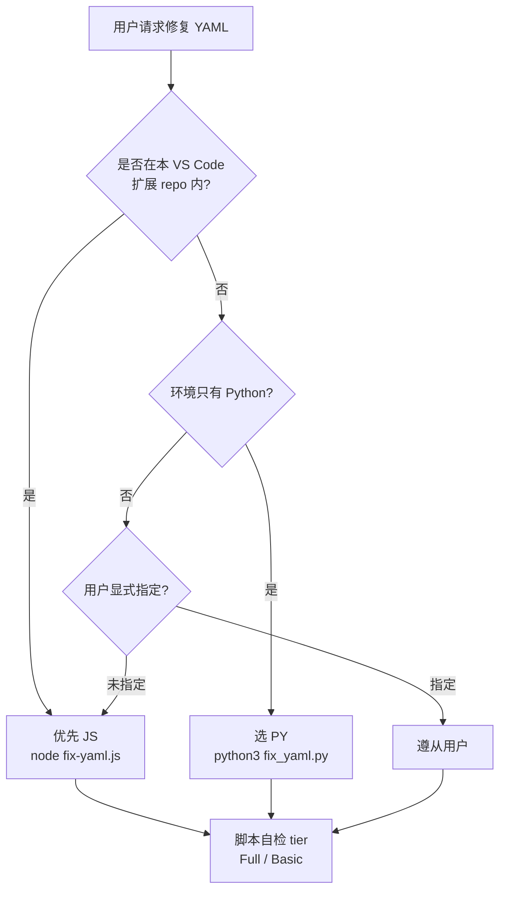

# YAML Format Fix Skill · 完整说明文档

> 一个**零 LLM Token 消耗**的 YAML 语法/格式修复 skill —— 检测和修复逻辑完全封装在确定性脚本中，LLM 只负责"调脚本 + 转述结果"。

---

## 1. 概述（Overview）

| 项目 | 值 |
|---|---|
| Skill 名称 | `yaml-format-fix` |
| 位置 | `skills/yaml-format-fix/` |
| 核心承诺 | **Zero-token contract** —— 修复过程不把 YAML 内容加载进模型上下文 |
| 实现语言 | Node.js（`fix-yaml.js`）+ Python 3.8+（`fix_yaml.py`），行为完全对齐 |
| 覆盖规则 | **12 条**（BOM + R1~R8 + F1 + P*/W*） |
| 硬依赖 | **零**。`yaml` / `PyYAML` 均为软可选，未安装时自动降级到 Basic tier |
| 兼容平台 | Cursor / CodeBuddy / Claude Code 等所有支持 Skill 协议的 IDE |

---

## 2. 目录结构（Directory Layout）

```
skills/yaml-format-fix/
├── SKILL.md                          # Skill 主入口（含 frontmatter + 使用契约）
├── README.md                         # 本文档
├── scripts/
│   ├── fix-yaml.js                   # Node.js 版本
│   └── fix_yaml.py                   # Python 版本
└── references/
    ├── detection-rules.md            # 12 条检测规则详解
    └── fix-strategies.md             # 修复算法与批量修复策略
```

> **刻意不放** `package.json` / `requirements.txt`：解析器库为软可选，装了自动启用 Full tier，没装也能跑 Basic tier。

---

## 3. 触发条件（When to Trigger）

Skill 检测到用户提到以下任一意图时自动触发：

- "修复这个 yaml 文件"
- "检查这个 yaml 的格式问题"
- "这个 yaml 解析报错，帮我修一下"
- "格式化 yaml"
- "fix / lint / clean / validate yaml"

---

## 4. 硬性契约（HARD RULE）

Skill 有一条**不可协商**的核心契约（写在 `SKILL.md` frontmatter 里）：

> **Always run one of the bundled scripts** — do NOT read the YAML content into the model context, do NOT attempt manual fixes with LLM reasoning.

**LLM 绝不允许**做的事：
1. ❌ 读取 YAML 内容到对话上下文后自己"推理"修复
2. ❌ 用 `edit_file` / `replace_in_file` 手改 YAML 文件
3. ❌ 对脚本输出做"总结"或"paraphrase"（会丢失关键位置信息）

**LLM 应该**做的事：
1. ✅ 选 JS 还是 PY（依据下文规则）
2. ✅ 调用对应 CLI
3. ✅ **原样转述**脚本输出的表格和 summary
4. ✅ 若剩余 `P*` 问题 > 0，**重跑 1~2 次**直到收敛

---

## 5. 运行时分层（Runtime Tiers）

脚本运行时会**自检**解析器库是否可用，动态启用规则：

| Tier | JS 判据 | PY 判据 | 启用规则 | 覆盖率 |
|---|---|---|---|---|
| **Full**  | `require('yaml')` 成功 | `import yaml` 成功 | BOM + R1~R8 + F1 + **P1~P4** = **12 条** | ~99% |
| **Basic** | `yaml` 未安装 | `PyYAML` 未安装 | BOM + R1~R8 + F1 = **9 条** | ~85% |

`--verbose` 首行会明确打印当前 tier：

```
YAML parser: available (P1~P4 enabled)
```

或

```
YAML parser: NOT AVAILABLE (line-rules only)
```

### 解锁 Full tier 的一次性命令

```bash
# Node 侧
npm i yaml

# Python 侧
python3 -m pip install pyyaml
```

---

## 6. 规则清单（Rule Coverage · 12 条）

| Rule | ID | 分类 | 严重级 | 自动修复策略 |
|---|---|---|---|---|
| BOM 头 | `BOM` | file-level | warning | 去除首行 `U+FEFF` |
| Tab 缩进 | `R1` | line, `stopOnHit` | **error** | `\t` → 2 空格（命中则跳过该行其他规则） |
| 行内 Tab | `R2` | line | warning | 引号外 `\t` → 1 空格 |
| 行尾空格 | `R3` | line | warning | `rstrip` |
| `:` 后缺空格 | `R4` | line | warning | 插入 1 空格；遇歧义/保留字符时委派 R5/R7 |
| `-` 后缺空格 | `R8` | line | warning | 插入 1 空格；排除 `--` / `---` |
| Boolean/null 歧义 | `R5` | line | warning | 值加引号（智能选择 `"` / `'` / 转义） |
| Value 含 `#` | `R6` | line | warning | 整段 value + 注释 一起包引号 |
| 保留字符 `{}[]&*!>\|,` | `R7` | line | warning | 值加引号 |
| Duplicate key | `F1` | file-level | warning | 后出现行改写为 `# [duplicate key removed] <原文>` |
| Parser 错误 | `P1~P4` | parser | **error** | 分四类：嵌套 map / 未闭合引号 / 同列冲突 / 重复键 |
| Parser 警告 | `W*` | parser | warning | 仅报告，不自动改 |

### 六大典型场景示例

| 输入 | 输出 | 触发规则 |
|---|---|---|
| `name:张三` | `name: 张三` | R4 |
| `active: yes` | `active: "yes"` | R5 |
| `desc: 需求 #12345` | `desc: "需求 #12345"` | R6 |
| `key: value{}` | `key: "value{}"` | R7 |
| `-value` | `- value` | R8 |
| `\tkey: v` | `··key: v` （`·` 表示空格） | R1 |

---

## 7. 使用方式（How to Use）

### 7.1 Node.js（在本仓库内首选）

```bash
node skills/yaml-format-fix/scripts/fix-yaml.js <file>            # 修复并写回
node skills/yaml-format-fix/scripts/fix-yaml.js <file> --dry-run  # 仅预览
node skills/yaml-format-fix/scripts/fix-yaml.js <file> --json     # 机器可读输出
node skills/yaml-format-fix/scripts/fix-yaml.js <file> --verbose  # 每条规则详细日志
```

### 7.2 Python

```bash
python3 skills/yaml-format-fix/scripts/fix_yaml.py <file>            # 修复并写回
python3 skills/yaml-format-fix/scripts/fix_yaml.py <file> --dry-run
python3 skills/yaml-format-fix/scripts/fix_yaml.py <file> --json
python3 skills/yaml-format-fix/scripts/fix_yaml.py <file> --verbose
```

### 7.3 通用参数

| 参数 | 简写 | 语义 |
|---|---|---|
| `--dry-run` | `-n` | 不写文件，只打印将要修复的内容 |
| `--json` | | 输出单个 JSON 对象，方便下游工具消费 |
| `--verbose` | `-v` | 每条规则命中都打印 `BEFORE` / `AFTER` |
| `--help` | `-h` | 打印用法 |

### 7.4 退出码（Exit Code）

| Code | 含义 |
|---|---|
| `0` | 修复后无剩余问题（clean） |
| `2` | 修复后仍有 error 级别问题 |
| `1` | 脚本自身 fatal（读文件失败/内部异常） |

---

## 8. JS vs PY 决策树



**三条硬规则**（写在 `SKILL.md` 的 "Choosing between JS and Py" 章节）：

| 优先级 | 规则 | 依据 |
|---|---|---|
| ① | **本 repo 内 → 优先 JS** | `yaml` 库通常已在 `node_modules`，零安装 |
| ② | **服务器/CI 只有 Python → 选 PY** | 免装 Node |
| ③ | **用户显式指定** | 直接覆盖前两条 |

### JS 与 PY 效果等价性

| 规则组 | 等价性 | 说明 |
|---|---|---|
| BOM + R1~R8 + F1 | ✅ **完全等价** | 纯字符串算法，两版逐字节输出一致 |
| P1~P4 | ⚠️ **语义等价，措辞可能不同** | `yaml`（一次报全部错误）vs `PyYAML`（一次报一个错误），需要重跑 1~2 次收敛 |

**用户可见结果（YAML 是否合法）在两版之间是一致的。**

---

## 9. 使用 Playbook

1. **Detect** — 运行任一脚本
2. **Relay verbatim** — 脚本输出的表格 + summary 是权威结果，**原样转述**，不总结、不改写
3. **Iterate if needed** — 若 summary 显示 `修复后剩余问题 > 0` 且残余是 `P*`，**重跑 1~2 次**（YAML 语法错误的级联特性决定单次通常修不完）
4. **On demand** — 用户追问某条规则为何触发时，查：
   - `references/detection-rules.md` —— 12 条规则模式详解
   - `references/fix-strategies.md` —— 修复算法与批量修复策略

---

## 10. 输出契约（Logging Guarantee）

### 默认输出

```
文件: examples/yaml-scenarios/01-tab-indent.yaml
─────────────────────────────────────────────
第 3 行  R1  error    行首使用 Tab 缩进...
第 7 行  R4  warning  ":" 后缺少空格...
...
─────────────────────────────────────────────
总问题数: 5 / 可自动修复: 5 / 应用修复行数: 5 / 跳过行数: 0 / 修复后剩余问题: 0
```

### `--verbose` 额外输出

```
[RULE R1] L3: leading tab indentation
  BEFORE: "\tname: 张三"
  AFTER:  "  name: 张三"
[DEBUG] APPLY L3: "\tname: 张三" → "  name: 张三"
```

### `--json` 输出

```json
{
  "file": "...",
  "tier": "full",
  "issues": [{ "line": 3, "rule": "R1", "severity": "error", "message": "..." }],
  "fixed": 5,
  "remaining": 0,
  "exitCode": 0
}
```

---

## 11. 与 VS Code 扩展的关系

Skill 是本 VS Code 扩展（`src/utils/yamlRules.ts` + `src/utils/yamlValidator.ts`）的 **1:1 端口**：

- **扩展** = 编辑器内实时诊断 + 一键 Fix All（GUI 场景）
- **Skill** = 命令行批量修复（CI / 无 IDE / Cursor / CodeBuddy 场景）

两者**规则集完全一致**，共用同一套 detection-rules & fix-strategies 文档。修改规则时必须同步 3 处：

1. `src/utils/yamlRules.ts`
2. `skills/yaml-format-fix/scripts/fix-yaml.js`
3. `skills/yaml-format-fix/scripts/fix_yaml.py`

---

## 12. FAQ

**Q1：为什么不放 `package.json` / `requirements.txt`？**

解析器库是**软可选**。放依赖清单会引导用户以为"必须安装才能用"，与"零硬依赖"设计相悖。安装引导写在 `SKILL.md` 的 Dependencies 章节。

**Q2：JS 和 PY 输出不一致算 bug 吗？**

R1~R8 + F1 不一致 = bug，必须修。P1~P4 的**措辞/行号偏移 ≤1** 是可接受的（底层库差异），只要最终 YAML 合法即视为等价。

**Q3：为什么必须"原样转述"脚本输出？**

脚本输出包含精确行号、规则 ID、BEFORE/AFTER 文本，是修复审计的一手证据。LLM 一旦"总结"就会丢位置、丢规则 ID、可能引入幻觉。

**Q4：能否让 LLM 在个别边界场景手动修一行？**

不能。所有边界场景（引号嵌套、`\r` / `\u00A0` 处理、sequence-item 优先匹配、第一个 vs 最后一个冒号）都已写进 `fix-strategies.md` 并在脚本里实现。任何"LLM 觉得能修的"都必须先加进脚本。

---

## 13. 一句话总结

> 一个把"YAML 格式修复"从"LLM 问题"降维成"确定性脚本问题"的 skill：**LLM 只按按钮，不搬砖**。

---

## 14. 授权与防护（Anti-Copy / Anti-Tamper）

本 skill 采用 **专有内部使用许可**（见 [`LICENSE`](./LICENSE)），未授权复制、修改、再分发均被禁止。运行期集成了三重防护：

| 机制 | 生效方式 | 触发效果 |
|---|---|---|
| **版权声明** | 每个源文件顶部 header + `LICENSE` 文件 | 法律追责的举证前提 |
| **完整性校验** | 启动时读 `manifest.json`，逐文件比对 SHA256 | 命中不一致 → 告警；`YAML_FIX_STRICT=1` → 退出码 97 |
| **运行时水印** | `--verbose` 日志打印 `author · license · machine-fingerprint` | 泄露后可溯源到具体机器 |

### 14.1 严格模式

默认情况下，即使 manifest 校验失败也**只打印告警**、继续运行（避免开发态误伤）。生产/受控环境请显式启用严格模式：

```bash
YAML_FIX_STRICT=1 node scripts/fix-yaml.js foo.yaml
YAML_FIX_STRICT=1 python3 scripts/fix_yaml.py foo.yaml
```

一旦校验失败，脚本会打印 `[integrity] SKILL FILES TAMPERED …` 并以退出码 **97** 终止。

### 14.2 发版流程（维护者操作）

**修改任何被保护文件后，必须重新生成 manifest**，否则用户端会看到 tamper 告警：

```bash
cd skills/yaml-format-fix
node scripts/gen-manifest.js
git add manifest.json
git commit -m "chore: refresh manifest"
```

`scripts/gen-manifest.js` 会把以下文件的 SHA256 写入 `manifest.json`：

- `SKILL.md`
- `README.md`
- `LICENSE`
- `scripts/fix-yaml.js`
- `scripts/fix_yaml.py`
- `references/detection-rules.md`
- `references/fix-strategies.md`

如需新增受保护文件，编辑 `gen-manifest.js` 里的 `PROTECTED_FILES` 数组即可。

### 14.3 用户端如何验证

`--verbose` 输出的**第一行**会显示校验结果：

```
[INFO ] [integrity] OK — verified 7 file(s) against manifest v1.0.0
[INFO ] [yaml-format-fix v1.0.0] © 2026 myronliu · Proprietary · fingerprint=d1726a6d
```

若看到：

```
[WARN ] [integrity] SKILL FILES TAMPERED (N file(s) mismatch):
  - scripts/fix-yaml.js: expect abcd1234… got 9876fedc…
```

说明当前 skill 目录已被篡改，请从官方仓库重新拉取。

