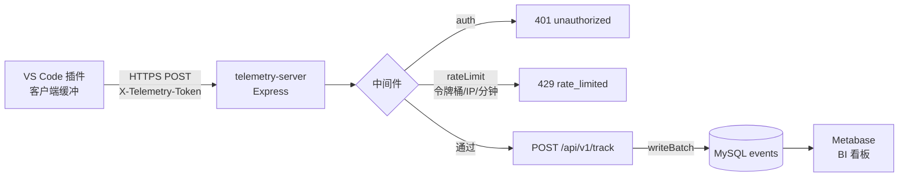

# 埋点核心分析 SQL 速查（Workbench Telemetry）

> 适用对象：`workbench_telemetry.events` 表
> 配套工具：Metabase（详见同目录 [README.md](./README.md)）
> 维护人：@myronliu

本手册分两部分：

1. **第 1~5 节**：链路总览、接口契约、命名规范、索引说明、表结构 —— 上手必读
2. **第 6~11 节**：6 条核心分析 SQL —— 全部基于真实表结构编写，复制即可在 Metabase「SQL 查询」中运行

建议把第 6~11 节每条 SQL 都保存为 Metabase「问题（Question）」并加入同一个仪表盘 `埋点总览（Workbench Telemetry）`。

---

## 1. 端到端链路总览



- 客户端：插件本地缓冲事件，到达批量阈值或定时窗口后批量上报
- 服务端：[src/server.js](../src/server.js) 加载配置 → `ensureSchema` 建表 → 监听端口
- 落盘：单条 `INSERT ... VALUES (...),(...),...` 批量入库（[src/sinks/mysqlSink.js](../src/sinks/mysqlSink.js)）
- 分析：Metabase 直连 `workbench_telemetry` 库的 `events` 表

---

## 2. 上报接口契约（`POST /api/v1/track`）

> 实现：[src/routes/track.js](../src/routes/track.js)

**请求头**

| Header              | 必填 | 说明                                         |
| ------------------- | ---- | -------------------------------------------- |
| `Content-Type`      | 是   | `application/json`                           |
| `X-Telemetry-Token` | 是   | 固定 Token 鉴权，支持多 Token 并存便于灰度 |

**请求体**

```json
{
  "sessionId": "sess-xxxx",
  "common": {
    "extName": "workbench",
    "extVersion": "1.2.3",
    "vscodeVersion": "1.90.0",
    "platform": "darwin",
    "arch": "arm64",
    "nodeVersion": "20.11.0",
    "osRelease": "23.5.0",
    "language": "zh-cn",
    "machineId": "hash-of-device"
  },
  "events": [
    {
      "name": "cmd.invoke",
      "level": "info",
      "props":    { "cmd": "workbench.openSettings" },
      "measures": { "durationMs": 32 },
      "ts": 1717153920000
    }
  ]
}
```

**约束**

- `events` 长度：`1 ~ MAX_BATCH_SIZE`（详见 `config.server.maxBatchSize`）
- 单事件 `name`：必填，长度 1~128
- `level`：仅允许 `info` / `warn` / `error`，缺省视为 `info`
- 单条非法事件**自动丢弃**，不影响整批；全部非法才返回 400
- `props` / `measures` 单字段序列化后**最大 16KB**，超过会被截断（[mysqlSink.js](../src/sinks/mysqlSink.js)）

**响应**

| 状态码 | body                                              | 说明                       |
| ------ | ------------------------------------------------- | -------------------------- |
| 200    | `{ ok:true, accepted:N, dropped:M }`              | 成功；`dropped` 为非法丢弃数 |
| 400    | `{ ok:false, error:'invalid_body' \| 'empty_events' \| 'no_valid_events' }` | 请求体不合法 |
| 401    | `{ ok:false, error:'unauthorized' }`              | Token 无效                 |
| 413    | `{ ok:false, error:'batch_too_large', max }`      | 批量超限                   |
| 429    | `{ ok:false, error:'rate_limited' }` + `Retry-After` | 触发 IP 限流（默认 60s 窗口） |
| 500    | `{ ok:false, error:'sink_error' }`                | 入库失败，**客户端可重试** |

**健康检查**：`GET /healthz`（不走鉴权，详见 [src/routes/health.js](../src/routes/health.js)）

---

## 3. 事件命名与字段规范

**`event_name` 命名格式**：`<domain>.<action>`，全小写、点分隔，长度 ≤ 128

| 示例              | 含义                  |
| ----------------- | --------------------- |
| `cmd.invoke`      | 用户触发命令          |
| `ext.activate`    | 插件激活              |
| `error.report`    | 客户端异常上报        |
| `view.open`       | 视图/页面打开         |

**`level` 三档判定**

| level   | 用途                                          |
| ------- | --------------------------------------------- |
| `info`  | 默认。常规行为埋点（点击、打开、命令）        |
| `warn`  | 业务异常但用户可继续（降级路径、重试成功等） |
| `error` | 影响主流程的异常，需要监控告警                |

**`props` vs `measures` 怎么选？**

- `props`（JSON）：**字符串/枚举/分类**类属性，用于分组和过滤。例：`cmd`、`fileType`、`source`
- `measures`（JSON）：**数值型指标**，用于求和/平均/分位。例：`durationMs`、`bytes`、`retryCount`

> 一条原则：**会进 `GROUP BY` 的放 `props`，会进 `SUM/AVG` 的放 `measures`**。

**维度字段从哪取？**（[mysqlSink.js](../src/sinks/mysqlSink.js#L48)）

`extName / extVersion / platform / machineId` 等通用维度优先从 `common` 读取，单事件 `props` 中同名字段**会覆盖**（少用，仅特殊场景）。

---

## 4. 索引与 SQL 性能

`events` 表上的索引（[src/db.js](../src/db.js) `SCHEMA_SQL`）：

| 索引名                | 字段                            | 命中场景                           |
| --------------------- | ------------------------------- | ---------------------------------- |
| `PRIMARY`             | `id`                            | 明细回查                           |
| `idx_event_created`   | `(event_name, created_at)`      | 按事件名 + 时间范围聚合（最常用） |
| `idx_machine_created` | `(machine_id, created_at)`      | 用户/设备维度的留存、行为序列     |
| `idx_created`         | `(created_at)`                  | 全表按时间范围扫描的兜底          |

**SQL 编写要点**

1. **WHERE 必须带 `created_at` 时间范围**——否则极易全表扫，本手册所有 SQL 都遵循
2. 按事件名查询时优先写 `event_name = 'xxx' AND created_at >= ?`，命中复合索引最左前缀
3. `machine_id` 维度的查询（如留存）同理：`machine_id = ? AND created_at >= ?`
4. JSON 字段（`props` / `measures`）**没有索引**，下钻分析时务必先用上面索引收敛数据集再 `JSON_EXTRACT`
5. 大时间范围 + `GROUP BY` 较慢时，考虑先按天预聚合（后续可加物化视图或定时任务）

---

## 5. 表结构速览

`events` 表关键字段（来源：[src/db.js](../src/db.js) `SCHEMA_SQL`）：

| 字段              | 类型             | 含义                              |
| ----------------- | ---------------- | --------------------------------- |
| `id`              | BIGINT           | 自增主键                          |
| `event_name`      | VARCHAR(128)     | 事件名（如 `cmd.invoke`）         |
| `level`           | VARCHAR(16)      | 等级：`info` / `warn` / `error`   |
| `ext_name`        | VARCHAR(64)      | 插件名                            |
| `ext_version`     | VARCHAR(32)      | 插件版本                          |
| `vscode_version`  | VARCHAR(32)      | 宿主 VS Code 版本                 |
| `platform`        | VARCHAR(32)      | 操作系统（darwin/win32/linux）    |
| `arch`            | VARCHAR(16)      | CPU 架构（x64/arm64）             |
| `node_version`    | VARCHAR(32)      | Node 版本                         |
| `os_release`      | VARCHAR(64)      | OS 详细版本                       |
| `language`        | VARCHAR(16)      | 语言环境                          |
| `machine_id`      | VARCHAR(128)     | **用户/设备唯一标识**（去重用）   |
| `session_id`      | VARCHAR(64)      | 会话 ID                           |
| `client_ip`       | VARCHAR(64)      | 上报 IP                           |
| `props`           | JSON             | 业务自定义属性                    |
| `measures`        | JSON             | 数值型指标（耗时、计数等）        |
| `client_ts`       | BIGINT           | 客户端时间戳（毫秒）              |
| `created_at`      | DATETIME(3)      | **服务端入库时间（核心时间字段）** |

> ⚠️ 注意：本表**没有** `event_time` 与 `user_id` 字段，统一使用 `created_at` 与 `machine_id`。

---

## 6. 每日事件量 / UV 趋势（折线图）

**用途**：观察整体活跃趋势、版本发布前后量级变化。

```sql
SELECT
  DATE(created_at)               AS day,
  COUNT(*)                       AS events,
  COUNT(DISTINCT machine_id)     AS uv,
  COUNT(DISTINCT session_id)     AS sessions
FROM events
WHERE created_at >= NOW() - INTERVAL 7 DAY
GROUP BY DATE(created_at)
ORDER BY day;
```

**可视化**：Line。X = `day`，Y 同时勾 `events` / `uv` / `sessions`。

---

## 7. Top 事件类型排行（条形图）

**用途**：看哪些功能被高频触发；按 `level` 拆分可快速定位错误事件占比。

```sql
SELECT
  event_name,
  level,
  COUNT(*)                       AS cnt,
  COUNT(DISTINCT machine_id)     AS uv
FROM events
WHERE created_at >= NOW() - INTERVAL 7 DAY
GROUP BY event_name, level
ORDER BY cnt DESC
LIMIT 20;
```

**可视化**：Bar 横向。X = `event_name`，Y = `cnt`，可用 `level` 做颜色分组。

---

## 8. 小时活跃热力图（Heatmap）

**用途**：识别用户使用高峰时段，辅助灰度发布与运维窗口规划。

```sql
SELECT
  DAYNAME(created_at)            AS weekday,
  HOUR(created_at)               AS hour,
  COUNT(*)                       AS cnt
FROM events
WHERE created_at >= NOW() - INTERVAL 14 DAY
GROUP BY weekday, HOUR(created_at)
ORDER BY FIELD(weekday,'Monday','Tuesday','Wednesday','Thursday','Friday','Saturday','Sunday'), hour;
```

**可视化**：Pivot Table 或 Heatmap。行 = `weekday`，列 = `hour`，值 = `cnt`。

---

## 9. 活跃用户（机器）排行 Top 20

**用途**：发现核心用户与异常高频客户端（可能是脚本/CI 误上报）。

```sql
SELECT
  machine_id,
  ext_version,
  platform,
  COUNT(*)                       AS events,
  COUNT(DISTINCT event_name)     AS distinct_events,
  MIN(created_at)                AS first_seen,
  MAX(created_at)                AS last_seen
FROM events
WHERE created_at >= NOW() - INTERVAL 7 DAY
  AND machine_id IS NOT NULL
GROUP BY machine_id, ext_version, platform
ORDER BY events DESC
LIMIT 20;
```

**可视化**：Table。

---

## 10. 次日留存率（核心健康指标）

**用途**：衡量产品粘性。`new_users`（柱）+ `d1_retention_pct`（线）组合最直观。

```sql
WITH first_day AS (
  SELECT machine_id, MIN(DATE(created_at)) AS d0
  FROM events
  WHERE machine_id IS NOT NULL
  GROUP BY machine_id
),
returns AS (
  SELECT DISTINCT f.machine_id, f.d0
  FROM first_day f
  JOIN events e
    ON e.machine_id = f.machine_id
   AND DATE(e.created_at) = DATE_ADD(f.d0, INTERVAL 1 DAY)
)
SELECT
  f.d0                                                                   AS cohort_day,
  COUNT(DISTINCT f.machine_id)                                           AS new_users,
  COUNT(DISTINCT r.machine_id)                                           AS d1_returned,
  ROUND(COUNT(DISTINCT r.machine_id) * 100.0 / COUNT(DISTINCT f.machine_id), 2)
                                                                         AS d1_retention_pct
FROM first_day f
LEFT JOIN returns r ON r.machine_id = f.machine_id
WHERE f.d0 >= CURDATE() - INTERVAL 14 DAY
GROUP BY f.d0
ORDER BY cohort_day;
```

**可视化**：Combo（组合图）。柱 = `new_users`，线 = `d1_retention_pct`。

---

## 11. 版本分布（饼图）

**用途**：发布后观察升级率，判断旧版本是否仍需兼容支持。

```sql
SELECT
  COALESCE(ext_version,'unknown') AS version,
  COUNT(DISTINCT machine_id)      AS uv
FROM events
WHERE created_at >= NOW() - INTERVAL 7 DAY
GROUP BY ext_version
ORDER BY uv DESC;
```

**可视化**：Pie。

---

## 12. 操作流程（每条 SQL 通用）

1. Metabase 顶部 **+ → SQL 查询**，选数据库 `Workbench Telemetry`
2. 粘贴上面的 SQL → ▶️ 运行
3. 左下 **Visualization** 切到对应图表类型
4. 右上 **保存** → 第一次保存时**新建仪表盘** `埋点总览（Workbench Telemetry）`
5. 后续条目保存时直接选这个仪表盘即可
6. 全部完成后，把仪表盘链接补充到上层 [README.md](../README.md) 的「本地联调」章节

---

## 13. 进阶建议

- **时间范围参数化**：将 `INTERVAL 7 DAY` 改为 Metabase 变量 `{{date_range}}`，仪表盘顶部即可统一切换时间窗口。
- **错误事件单独看板**：基于 `level = 'error'` 过滤建一个错误监控看板，配合 Metabase **Alerts** 实现阈值报警。
- **JSON 字段下钻**：使用 `JSON_EXTRACT(props, '$.xxx')` 对业务自定义属性进一步分析，如：
  ```sql
  SELECT JSON_EXTRACT(props,'$.cmd') AS cmd, COUNT(*) AS cnt
  FROM events
  WHERE event_name = 'cmd.invoke'
    AND created_at >= NOW() - INTERVAL 7 DAY
  GROUP BY cmd
  ORDER BY cnt DESC
  LIMIT 50;
  ```
- **数据归档**：超过 90 天的明细可通过 [scripts/cleanup.js](../scripts/cleanup.js) 清理，避免单表过大；如需长期分析，建议按月归档到独立表。

---

## 14. 排错速查

| 现象                              | 可能原因                                | 处置                                    |
| --------------------------------- | --------------------------------------- | --------------------------------------- |
| `Unknown column 'event_time'`     | 误用了示例字段名                        | 改为 `created_at`                       |
| `Unknown column 'user_id'`        | 误用了示例字段名                        | 改为 `machine_id`                       |
| 折线图全为 0                      | 时区不一致                              | 数据库设置 `time_zone='+08:00'` 或在 SQL 中用 `CONVERT_TZ()` |
| 留存率结果为 NULL                 | `first_day` 没有数据                    | 检查 `machine_id IS NOT NULL` 是否过滤过严 |
| Pie 图分类过多                    | 版本号未规范                            | 在客户端统一 `ext_version` 上报格式     |

