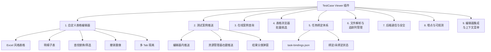

# TestCase Viewer 插件 · 完整功能清单

> 一句话定位：在 VS Code 内**浏览 / 编辑 / 推送测试案例文件（CSV / YAML / JSON）**，并对接后端任务管理系统的工作台型扩展。

---

## 一、功能总览



---

## 二、命令清单（package.json `contributes.commands`）

| 命令 ID | 入口位置 | 功能 |
|---|---|---|
| `testcaseViewer.viewOnline` | 编辑器标题栏图标（仅合规文件激活时显示） | 打开「在线测试案例」侧边面板 |
| `testcaseViewer.openWithEditor` | 命令面板 | 强制使用自定义表格编辑器打开当前文件 |
| `testcaseViewer.openWithText` | 命令面板 | 强制使用纯文本编辑器打开当前文件 |
| `testcaseViewer.pushTestCaseFromExplorer` | 资源管理器右键菜单 `2_workspace` 分组 | 不打开文件直接推送测试案例（支持单文件） |
| `tableBrowser.open` | 内部命令 | 打开「表格浏览器」面板（左侧文件树+右侧 CSV） |

---

## 三、自定义编辑器（`testcaseViewer.unifiedEditor`）

### 3.1 注册与触发

| 维度 | 说明 |
|---|---|
| ViewType | `testcaseViewer.unifiedEditor` |
| 文件 selector | `**/测试任务/*/测试案例/**/*.(csv\|yaml\|yml\|json)` |
| 优先级 | `default`（双击即用） |
| 多 Tab 支持 | `supportsMultipleEditorsPerDocument: true` |
| 隐藏不销毁 | `retainContextWhenHidden: true` |
| 防预览覆盖 | 打开时立刻 `workbench.action.keepEditor` 把预览 Tab 固化为永久 Tab |

### 3.2 表格编辑能力（媒体层 `media/pages/table-editor`）

#### 单元格 / 行 / 列操作
- **编辑**：双击进入 textarea，Enter 提交、Esc 取消；行被拖高时自动启用多行换行
- **冻结列**：`tsId` 列只读，禁止编辑
- **数组列**：双击触发"多项编辑弹窗"（数字列表 / 文本列表，支持上移下移删除）
- **明细列**：YAML/JSON 嵌套子表，双击进入"明细弹窗"独立编辑

#### 选区（Excel 风格）
- 行号格点击 / Shift 区间扩展 / Ctrl+Cmd 离散追加
- 单元格矩形选区拖选、跨列拖选、左上角 `#` 一键全选可见行
- 列头点击横扫选列
- 选区状态实时显示（行数 / 单元格数）

#### 行/列编辑
- 在上方 / 下方插入行
- 删除行 / 删除选中多行
- 在下方复制此行（克隆）
- 插入列（左 / 右）/ 删除列 / 重命名列
- 复制 / 粘贴 / 清空 单元格 或 选区
- 复制行 / 粘贴行（剪贴板）

#### 视图与体验
- 列宽拖拽调整、行高拖拽调整
- 顶部搜索框（关键字过滤行）
- **Excel 风格列筛选**（漏斗按钮，支持多列联动统计、值列表勾选）
- **仅看失败行** 切换按钮（推送失败后定位错误行）
- **查找/替换面板**（`Ctrl/Cmd+F`，支持上一个/下一个、当前替换、全部替换、高亮）
- **撤销 / 重做**（`Ctrl/Cmd+Z` / `Ctrl+Y`）

#### 数据流
- 自动保存（前端发 `save` 消息 → 扩展端 `parser.save` 落盘）
- 文件外部修改自动重载（FileSystemWatcher + onDidSaveTextDocument 双保险，150ms 去抖）
- 自身落盘 3 秒守护期，防止 watcher 自反弹
- Tab 切回可见时强制 reparse，保证看到磁盘最新内容
- 未保存修改时收到外部变更 → 弹"冲突合并"对话框，避免静默覆盖

#### 表头展示
- 顶部"已绑定任务 / 未绑定任务"状态标签
- 显示三项：`testTaskNo` / `subTestTaskName` / `testTaskName`，未命中时占位 `-`

---

## 四、推送测试案例

### 4.1 两种入口

| 入口 | 触发位置 | 数据来源 |
|---|---|---|
| **编辑器内推送** | 编辑器顶部"推送"按钮 | 当前选中行（按筛选/搜索后的显示顺序） |
| **资源管理器右键** | 右键 `测试任务/*/测试案例/**/*` 文件 | 整个文件（解析所有行） |

### 4.2 推送流程

1. **任务绑定校验**：`getHeaderTaskInfoByFilePath` 查 `task-bindings.json`，**未绑定一律拒绝推送**
2. **解析为推送结构**（`parseFileToRows`：CSV/YAML/JSON 透明，保留嵌套结构原貌）
3. **HTTP 调用** `services/http.pushTestCase` → `POST /test-task/push-testcase`
4. **结果分类**：`type=1` 成功（写回 `testCaseNo`）/ `type=2` 失败（记录原因）
5. **回写**：成功项按 `tsId` 把后端返回的 `testCaseNo` 写回原文件
6. **结果弹窗**：通过对应 webview `pushResult` 消息展示

### 4.3 结果展示策略

| 场景 | 视觉 | 交互 |
|---|---|---|
| 全部成功 | information toast | 自动消失 |
| 部分成功 | warning 模态对话框 | 列出失败明细，可一键复制 |
| 全部失败 | error 模态对话框 | 同上 |
| 失败 > 50 条 | 弹窗只列前 50 | 全量明细写入 OutputChannel |

### 4.4 网络异常引导
- ECONNREFUSED / ETIMEDOUT / ENOTFOUND / ECONNRESET 翻译为可读中文
- 自动弹出"打开配置 / 查看帮助"按钮，引导启动 mock-server 或修改 `apiUrl`

---

## 五、在线案例查询（TestCaseProvider）

| 能力 | 说明 |
|---|---|
| 查询参数初始化 | 已绑定 → 取后端真实 `testTaskNo` / `subTestTaskName` + 文件 `testPhaseName`；未绑定 → 路径解析兜底 |
| 查询接口 | `services/http.queryTestCases`，支持分页 |
| 查询条件 | `testCaseNo` / `testCaseName` / `testCasePath` / `testCasePriority` / `testType` / `type` 等 7 个可选过滤条件 |
| 任务树 | `fetchTaskTree` 拉取后端任务树 |
| 缓存 | 查询参数写入 `<globalStorage>/query-params.json`，下次自动回填 |

---

## 六、表格浏览器（TableBrowserProvider）

| 能力 | 说明 |
|---|---|
| 工作区文件树 | 左侧展示工作区下所有 `测试任务/*/测试案例/**/*.csv` 文件 |
| 文件预览 | 点击 CSV 文件 → 右侧表格展示内容 |
| 多选 | 行级 checkbox，支持「全选 / 取消全选」 |
| 批量发送 | "发送勾选数据"按钮 → `services/http.batchImportData` |

---

## 七、任务绑定体系（核心约束）

### 7.1 task-bindings.json
- 位置：`<globalStorageUri>/task-bindings.json`（跨工作区共享）
- 自动创建空模板（首次激活时输出绝对路径到日志）
- 内存缓存 + mtime 校验，外部修改自动感知

### 7.2 绑定数据结构

```jsonc
{
  "version": 1,
  "bindings": {
    "C001_测试/测试任务/TT001_测试任务1": {
      "testTaskNo": "TT_2024_0001",
      "testTaskName": "测试任务系统",
      "subTestTaskId": 378789,
      "subTestTaskName": "测试任务1",
      "phaseBindings": {
        "ST阶段": { "phaseId": 89988 }
      }
    }
  }
}
```

### 7.3 绑定语义

| 调用场景 | 函数 | 命中条件 |
|---|---|---|
| 推送测试案例 | `getTaskInfoByFilePath` | 必须 6 字段 + `phaseId` 全齐才 `bind=true` |
| 表头展示 | `getHeaderTaskInfoByFilePath` | 仅命中 binding 即可，宽松判断 |
| 在线查询 | 同上 | 已绑定取后端真值；未绑定回退路径解析 |

---

## 八、文件解析与追踪列（parsers/）

### 8.1 三种解析器

| Parser | 文件 | 特点 |
|---|---|---|
| `csv-parser` | `*.csv` | 标准 CSV（基于 `udsv`），自动处理引号 / 转义 |
| `yaml-parser` | `*.yaml` / `*.yml` | 支持嵌套对象 + 多明细子表，扁平化为表格后还能重建 |
| `json-parser` | `*.json` | 同上，支持嵌套 |

### 8.2 追踪列管理

| 列名 | 写入时机 | 作用 |
|---|---|---|
| `tsId` | 第一次打开文件 → `ensureTrackingColumns` 自动生成 v4 UUID 并立即落盘 | 行的稳定唯一 ID，推送匹配回写 |
| `testCaseNo` | 推送成功后 → `applyTestCaseNos` 按 `tsId` 回写 | 后端返回的案例编号 |

- `tsId` 列固定在最前；`testCaseNo` 紧随其后
- YAML / JSON 同步写回 `sourceData`，避免 save 重建嵌套时丢失

---

## 九、后端通信与安全（services/http）

| 能力 | 说明 |
|---|---|
| 统一 HTTP 封装 | `pushTestCase` / `queryTestCases` / `fetchTaskTree` / `batchImportData` |
| **SM2 时间戳签名** | 读 `app-config.json` 的 `sm2PublicKey`，加密时间戳后注入 `X-Timestamp` / `X-Signature` Header |
| 签名可选 | 未配置公钥则跳过（mock 调试友好） |
| 日志脱敏 | 自动脱敏 `Authorization` / `X-Signature` |
| 错误中文化 | Node 网络错误码翻译为可读文案 |
| API 配置 | `testcaseViewer.apiUrl`（默认 `http://localhost:8081`） |

### 配置文件
- `<globalStorage>/app-config.json`：`authToken` / `userId` / `userName` / `sm2PublicKey` / `telemetryUrl` / `telemetryToken`
- `<globalStorage>/query-params.json`：在线查询参数缓存

---

## 十、埋点与可观测（services/telemetry）

### 10.1 上报机制

| 维度 | 说明 |
|---|---|
| 通道 | `${telemetryUrl ?? apiUrl}/api/v1/track` |
| 鉴权 | `X-Telemetry-Token` Header（用户配置 > 内置兜底 Token） |
| 队列 | 节流批量上报，5s 间隔，单批 ≤ 20，队列上限 200 |
| 退避 | 连续失败 ≥ 3 次后间隔拉长到 30s |
| 单事件上限 | 8KB（超出截断） |
| 用户开关 | 严格遵循 `vscode.env.isTelemetryEnabled` |
| 开发模式 | NODE_ENV=development 或地址未配置时仅 console，不真实上报 |

### 10.2 通用上下文

自动注入：`extName` / `extVersion` / `vscodeVersion` / `platform` / `arch` / `nodeVersion` / `osRelease` / `language` / `machineId` / `sessionId`

### 10.3 关键埋点事件

- `extension.activated` / `extension.deactivated`
- `extension.activate.done`（含 `activateMs` 度量）
- `command.executed`（含命令名）
- `editor.saved`（含 rows / cols / durationMs）
- `editorPush.start` / `editorPush.complete` / `editorPush.failed` / `editorPush.rejected`
- `explorerPush.start` / `explorerPush.complete` / `explorerPush.failed` / `explorerPush.rejected`
- `bindings.initFailed` / `extension.unhandledRejection`（异常类）
- Webview 透传埋点（`handleWebviewTelemetry`）

### 10.4 API
`trackEvent` / `trackError` / `trackException` / `trackTiming`（自动包裹耗时与成功失败）/ `flushTelemetry`

---

## 十一、编辑器集成与上下文菜单

| 集成点 | 行为 |
|---|---|
| 编辑器标题栏图标 | 在合规文件 Tab 上显示「查看测试案例」图标（`testcaseViewer:showIcon` Context） |
| Tab 切换监听 | `onDidChangeTabs` 实时更新图标显隐 |
| 资源管理器右键 | 仅匹配 `测试任务/*/测试案例/**/*.(csv\|yaml\|yml\|json)` 时展示「推送测试案例」 |
| 双击打开 | 自定义编辑器作为默认编辑器接管合规文件 |
| 错误页兜底 | 不合规文件渲染错误页 + 「用文本编辑器打开」按钮 |
| Panel 注册表 | `BaseEditorProvider.panelMap` 全局跟踪已打开 Tab，右键推送可定位到对应 webview 弹窗 |

---

## 十二、激活与生命周期

| 阶段 | 动作 |
|---|---|
| 激活时机 | `onStartupFinished` |
| 激活步骤 | ① 初始化埋点 → ② 注册全局未捕获异常上报 → ③ ensureBindingsFile → ④ 注册 customEditor → ⑤ 注册 5 条命令 → ⑥ 监听 Tab 切换 |
| 注销 | 触发 `extension.deactivated` 埋点并尽力 flush |

---

## 十三、配置项汇总

### 13.1 VS Code Settings

| 配置项 | 默认值 | 说明 |
|---|---|---|
| `testcaseViewer.apiUrl` | `http://localhost:8081` | 后端 API 地址 |

### 13.2 globalStorage 文件

| 文件 | 内容 |
|---|---|
| `task-bindings.json` | 任务身份绑定（用户/团队全局共享） |
| `app-config.json` | `authToken` / `userId` / `userName` / `sm2PublicKey` / `telemetryUrl` / `telemetryToken` |
| `query-params.json` | 在线查询参数缓存 |

---

## 十四、强约束（业务规则）

1. **目录约束**：`<project>/测试任务/<TTxxx_subName>/测试案例/[...]/<file>.<csv|yaml|yml|json>`
2. **格式白名单**：CSV / YAML / YML / JSON 四种
3. **任务身份唯一来源**：`services/utils.resolveTaskInfo`（路径解析）+ `task-bindings.json`（真实后端值）
4. **未绑定不推送**：保护后端数据
5. **tsId 系统列**：自动生成、禁止编辑、固定首列
6. **多 Panel 隔离**：每个 Tab 独享 `EditorSession`，状态绝不共享

---

## 模块体量速览

| 模块 | 文件数 | 大致代码量 |
|---|---|---|
| 扩展端 src/ | ~20 个 TS 文件 | ~3500 行 |
| 编辑器前端 media/pages/table-editor | 9 个 JS + HTML/CSS | ~25000 行（最重的 `05-modals.js` 单文件 54KB） |
| 表格浏览器 / 工作台 / 测试案例 webview | 3 套 HTML+JS | ~1500 行 |
| 单测 | 3 个 vitest 文件 | ~400 行 |
| 总计 | **~50 个源文件** | **~30000 行** |
