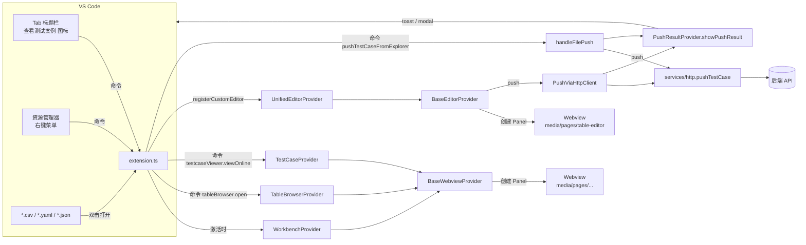
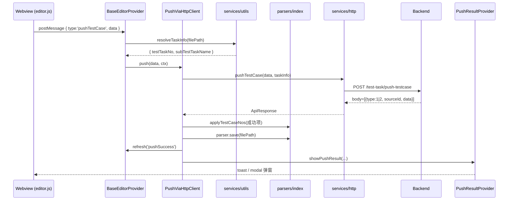
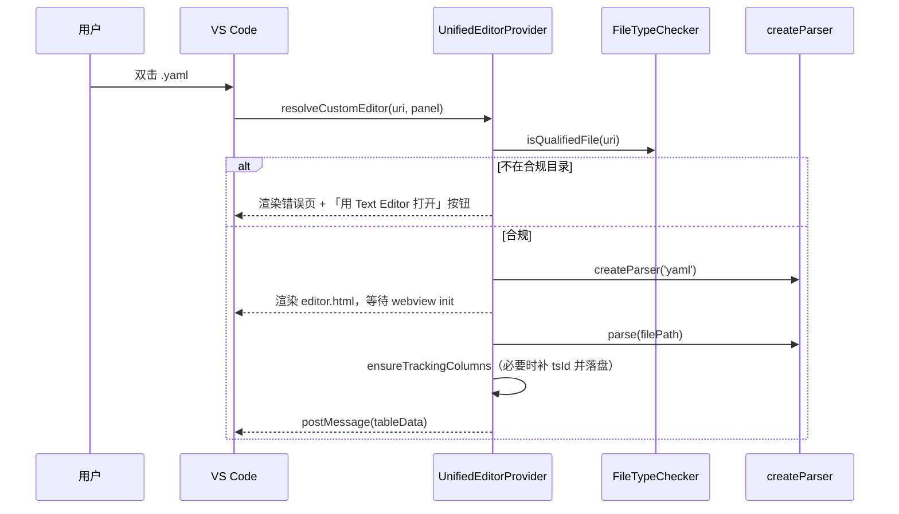

# TestCase Viewer 项目说明文档

> VS Code 扩展：在工作区内浏览 / 编辑 / 推送测试案例文件（CSV / YAML / JSON），并对接后端任务管理系统。

---

## 1. 项目概览

| 维度 | 说明 |
|---|---|
| 扩展名 | `testcase-viewer` |
| 主入口 | `out/extension.js`（由 `src/extension.ts` 编译） |
| 激活时机 | `onStartupFinished`（VS Code 启动完成后） |
| 注册的自定义编辑器 | `testcaseViewer.unifiedEditor`（CSV / YAML / YML / JSON 四类） |
| 后端通信 | HTTP + 可选 SM2 时间戳签名 |
| 单元测试 | `vitest` |

### 核心能力
1. **自定义编辑器**：表格化展示与编辑 CSV / YAML / JSON 测试案例；保存即落盘。
2. **测试案例推送**：把当前文件 / 选中行推送到后端，按 `tsId` 回写 `testCaseNo`。
3. **在线案例查询**：从后端拉取已推送案例，配合本地文件做对比浏览。
4. **批量浏览/导入**：通过「表格浏览器」批量选取多个 CSV 中的行后导入。

---

## 2. 目录结构

```
workbench/
├─ src/                                # 扩展端 (Node.js / TypeScript)
│  ├─ extension.ts                     # ⭐ 扩展入口：activate / 命令注册 / 文件推送
│  ├─ providers/                       # 各类 Provider
│  │  ├─ BaseEditorProvider.ts         # 自定义编辑器基类（含 PushStrategy）
│  │  ├─ UnifiedEditorProvider.ts      # 统一编辑器（CSV/YAML/JSON 全用它）
│  │  ├─ BaseWebviewProvider.ts        # 独立 Webview Panel 基类
│  │  ├─ WorkbenchProvider.ts          # 工作台首页
│  │  ├─ TableBrowserProvider.ts       # 表格浏览器
│  │  ├─ TestCaseProvider.ts           # 在线测试案例查看
│  │  ├─ PushResultProvider.ts         # 推送结果统一弹窗
│  │  └─ common/
│  │     └─ FileTreeService.ts         # 合规目录文件树构建
│  ├─ parsers/                         # 文件解析器
│  │  ├─ file-parser.ts                # 接口定义
│  │  ├─ csv-parser.ts                 # CSV 实现
│  │  ├─ yaml-parser.ts                # YAML 实现（支持明细子表）
│  │  ├─ json-parser.ts                # JSON 实现（支持明细子表）
│  │  └─ index.ts                      # 工厂 + tsId/testCaseNo 处理
│  ├─ services/
│  │  ├─ http.ts                       # 后端 HTTP 封装 + SM2 签名
│  │  ├─ storage.ts                    # 本地配置/查询参数读写
│  │  └─ utils.ts                      # 路径合规校验 / TaskInfo 解析 / UUID
│  ├─ types/index.ts                   # 全局类型定义
│  └─ test/                            # vitest 单测
│
├─ media/                              # 前端资源（webview 加载）
│  ├─ common/                          # 通用组件 / 样式 / 工具
│  └─ pages/                           # 各业务页面 (workbench/table-browser/table-editor/testcase)
│
├─ package.json                        # 扩展声明：commands / customEditors / configuration
├─ tsconfig.json
├─ vitest.config.ts
└─ mock-server.js                      # 本地 mock 后端，便于离线调试
```

> 工作区内还存在 `C001_测试/测试任务/...` 等示例目录，仅作演示数据。

---

## 3. 模块协作图

### 3.1 总体协作



### 3.2 推送链路（关键路径）



### 3.3 文件打开链路



---

## 4. 关键约定

### 4.1 目录约定（强约束）

| 层级 | 名称（中文 / 英文） |
|---|---|
| L1 | `测试任务` / `testtask` |
| L2 | `<testTaskNo>_<subTestTaskName>`（半角下划线分隔） |
| L3 | `测试案例` / `testcase` |
| L4 | `*.csv` / `*.yaml` / `*.yml` / `*.json` |

> 仅在该结构下的文件会被识别为合规文件，才能进入自定义编辑器、参与推送、出现在表格浏览器中。

### 4.2 推送追踪列

| 列名 | 含义 | 写入时机 |
|---|---|---|
| `tsId` | 行的稳定唯一 ID（v4 UUID） | 第一次打开文件时由 `ensureTrackingColumns` 生成并立即落盘 |
| `testCaseNo` | 后端返回的案例编号 | 推送成功后由 `applyTestCaseNos` 按 `tsId` 回写 |

- `tsId` 列固定插在最前；`testCaseNo` 列固定插在 `tsId` 右侧。
- YAML / JSON 同时把这两个字段写回 `sourceData`，避免 save 重建嵌套结构时丢失。

### 4.3 任务信息（`testTaskNo` / `subTestTaskName`）唯一来源

- 解析函数：`services/utils.ts` 内私有的 `parseTaskInfoFromPath`
- 业务入口：`services/utils.resolveTaskInfo(filePath)` —— 所有调用方应使用本函数。
- **后续若调整解析规则（例如改 `_` 分隔符、引入 `.meta` 文件等），只需改这一处。**

### 4.4 后端响应约定

`pushTestCase` 接口返回结构：

```jsonc
{
  "returnCode": "SUC0000",
  "body": [
    { "type": 1, "sourceId": "<tsId>", "data": "<testCaseNo>" }, // 成功
    { "type": 2, "sourceId": "<tsId>", "data": "<errorMsg>" }    // 失败
  ]
}
```

- `type === '1'` → 成功，`data` 即为 `testCaseNo`
- `type === '2'` → 失败，`data` 是错误描述

---

## 5. 设计要点

### 5.1 自定义编辑器：每个 Panel 独立 Session

- `BaseEditorProvider.resolveCustomEditor` 内部为每个 panel 创建独立的 `EditorSession`：
  ```ts
  interface EditorSession {
      type: FileType;
      parser: FileParser;
      originalSourceData: any;
      cachedTableData: any;
  }
  ```
- 避免 Provider 单例下多 panel 共享缓存而互相覆盖。

### 5.2 预览 Tab 防覆盖

VS Code 单击文件默认进入「预览 Tab」，相同位置只有 1 个 tab 槽位。多文件相继打开时会出现“tab 互相覆盖”的现象。
扩展端通过 `workbench.action.keepEditor` 立即将当前 tab 固化为永久 tab：

```ts
await vscode.commands.executeCommand('workbench.action.keepEditor');
```

### 5.3 退化策略：失败明细的展示

`PushResultProvider.showPushResult` 决策表：

| 场景 | 视觉 | 交互 |
|---|---|---|
| 全部成功 | `information` toast | 自动消失 |
| 部分成功 | `warning` 模态对话框 | Esc 关闭；可一键复制失败明细 |
| 全部失败 | `error` 模态对话框 | 同上 |
| 失败 > 50 条 | 弹窗只列前 50；提供「查看输出面板」按钮 | 全量明细写入 `测试案例推送` OutputChannel |

### 5.4 SM2 签名

- `services/http.addSm2Signature` 读取 `app-config.json` 的 `sm2PublicKey`，对当前时间戳加密，注入 `X-Timestamp` / `X-Signature` 请求头。
- 若未配置公钥则跳过签名（不影响 mock 调试）。
- 日志输出会自动脱敏 `Authorization` / `X-Signature`。

### 5.5 错误页与按钮事件

`services/utils.buildErrorHtml` 支持注入按钮事件：

```ts
buildErrorHtml(message, title, [{ label: '用文本编辑器打开', action: 'openTextEditor', primary: true }]);
```

按钮点击后会通过 `vscode.postMessage({ type: action })` 派发到扩展端，扩展端通常调用 `vscode.openWith` 改用其他编辑器打开文件，避免用户陷入死锁。

### 5.6 网络错误中文化

`services/http.makeRequest` 把 Node 的 `ECONNREFUSED` / `ETIMEDOUT` / `ENOTFOUND` / `ECONNRESET` 翻译为可读文案，并在编辑器内推送时配合「打开配置 / 查看帮助」按钮一键引导用户启动本地 mock-server。

---

## 6. 命令与配置

### 6.1 命令

| 命令 ID | 入口 | 作用 |
|---|---|---|
| `workbench.open` | 启动时自动打开 | 打开「工作台」首页 |
| `tableBrowser.open` | 内部 | 打开「表格浏览器」 |
| `testcaseViewer.viewOnline` | 编辑器标题栏图标 | 查看在线测试案例 |
| `testcaseViewer.openWithEditor` | — | 强制使用自定义编辑器打开 |
| `testcaseViewer.openWithText` | — | 强制使用文本编辑器打开 |
| `testcaseViewer.pushTestCaseFromExplorer` | 资源管理器右键 | 推送测试案例（支持多选） |

### 6.2 配置项

| 配置项 | 默认值 | 说明 |
|---|---|---|
| `testcaseViewer.apiUrl` | `http://localhost:8081` | 后端 API 地址 |

> 此外 `<globalStorage>/app-config.json` 中可放：`authToken` / `userId` / `userName` / `sm2PublicKey`，由扩展运行时读取。

---

## 7. 本地开发

```bash
# 安装依赖
npm i

# 编译
npm run compile

# 监听
npm run watch

# 单元测试
npm test

# 启动本地 mock 后端（另起终端）
node mock-server.js
```

按 F5 在 VS Code 内启动 Extension Development Host 调试。

---

## 8. 扩展指引（FAQ）

### Q1. 想新增一种文件格式（例如 XML）？
1. `src/parsers/` 下新增 `xml-parser.ts`，实现 `FileParser` 接口。
2. `src/parsers/index.ts` 的 `createParser` / `detectFileType` 增加分支。
3. `src/services/utils.ts` 的 `FILE_PATTERNS` 增加正则。
4. `package.json` 的 `customEditors.selector` 与右键菜单 `when` 增加扩展名匹配。
5. `UnifiedEditorProvider.FileTypeChecker.isQualifiedFile` 增加分支。

### Q2. 想换 `testTaskNo` 的解析规则？
**只改一个地方：** `src/services/utils.ts` 的 `parseTaskInfoFromPath`。所有调用方都通过 `resolveTaskInfo` 间接调用，不需要任何同步改动。

### Q3. 想新增一个独立 Webview Panel？
1. 在 `src/providers/` 下继承 `BaseWebviewProvider`，实现 6 个抽象方法（getPanelId / getPanelTitle / getViewColumn / getHtmlPath / getScriptPath / handleMessage）。
2. 在 `media/pages/<your-page>/` 下放对应 `index.html` + `main.js`。
3. 在 `extension.ts` 中实例化并注册一个 `vscode.commands.registerCommand` 调用 `provider.show()`。

### Q4. 想增加新的推送策略（例如经过另一服务）？
- 实现 `PushStrategy.push`，让 `UnifiedEditorProvider.pushStrategy` 指向新实现即可，`BaseEditorProvider` 调用方不动。

---

## 9. 文件级速查表（每个 TS 文件已带文件头注释，详见源码）

| 文件 | 一句话职责 |
|---|---|
| `extension.ts` | 扩展入口；注册 customEditor / commands；处理资源管理器右键推送 |
| `providers/BaseEditorProvider.ts` | 自定义编辑器骨架 + PushStrategy 接口 + PushViaHttpClient |
| `providers/UnifiedEditorProvider.ts` | 唯一的编辑器子类（兼容 CSV/YAML/JSON）+ FileTypeChecker |
| `providers/BaseWebviewProvider.ts` | 独立 Webview Panel 基类（HTML 模板替换 / 消息派发 / disposables） |
| `providers/WorkbenchProvider.ts` | 工作台首页 Webview |
| `providers/TableBrowserProvider.ts` | 表格浏览器 Webview，配合 `FileTreeService` |
| `providers/TestCaseProvider.ts` | 在线测试案例 Webview；负责 testTaskNo/testPhaseName 准备 |
| `providers/PushResultProvider.ts` | 推送结果统一弹窗（toast / modal / 输出面板） |
| `providers/common/FileTreeService.ts` | 合规目录下的 CSV 文件树构建 |
| `parsers/file-parser.ts` | FileParser 接口与 FileParseResult 类型 |
| `parsers/csv-parser.ts` | CSV 解析 / 写回 |
| `parsers/yaml-parser.ts` | YAML 解析 / 写回（多明细子表） |
| `parsers/json-parser.ts` | JSON 解析 / 写回（多明细子表） |
| `parsers/index.ts` | 解析器工厂 + ensureTrackingColumns / applyTestCaseNos / parseFileToRows |
| `services/http.ts` | 后端 HTTP 封装 / SM2 签名 / 错误中文化 |
| `services/storage.ts` | 全局存储 (`app-config.json` / `query-params.json`) 读写 |
| `services/utils.ts` | nonce / escapeHtml / buildErrorHtml / 路径合规 / `resolveTaskInfo` / UUID |
| `types/index.ts` | 全局共享类型定义 |
| `test/*.test.ts` | vitest 单元测试 |

---

## 10. 路线图（Roadmap，非强约束）

- [ ] WorkbenchProvider 各业务模块的真实跳转
- [ ] 推送结果输出面板支持「重新推送失败项」入口
- [ ] 编辑器内增加列校验提示
- [ ] mock-server 同步真实后端字段约束
